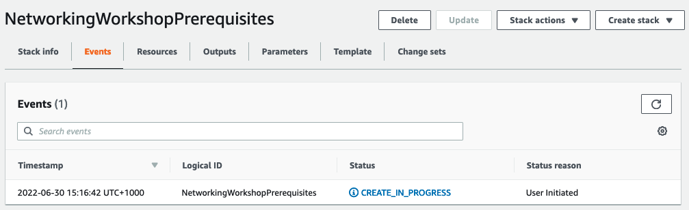

# Networking Immersion Day - Laboratórios Terraform

Este repositório contém a implementação em Terraform dos laboratórios do workshop **AWS Networking Immersion Day**, organizados como uma landing zone reutilizável seguindo as melhores práticas do Well-Architected Framework.

## Estrutura

- `modules/`: Módulos compartilhados e reutilizáveis.
- `labs/`: Laboratórios independentes para cada capítulo do workshop.
- `global/`: Recursos compartilhados entre laboratórios (IAM, etc.).
- `scripts/": Scripts utilitários (deploy/destroy em lote).
- `docs/": Documentação adicional, checklists de boas práticas.

## Pré-requisitos

- Terraform >= 1.3
- AWS CLI configurado
- Bucket S3 e tabela DynamoDB para state remoto (veja cada lab)

## Como usar

1. Navegue até o laboratório desejado: `cd labs/01-vpc-fundamentals`
2. Copie `terraform.tfvars.example` para `terraform.tfvars` e preencha as variáveis.
3. Execute `terraform init`, `terraform plan`, `terraform apply`.
4. Use os scripts em `scripts/` para testar a conectividade.

---

## Pré-requisitos

Antes de iniciar os laboratórios, certifique-se de que sua conta AWS atende aos requisitos abaixo.

### Conta AWS

Você pode executar este workshop em **sua própria conta AWS** ou em um ambiente fornecido pelo **AWS Workshop Studio**.

> ⚠️ **Atenção:** Se estiver usando sua própria conta, **custos serão incorridos** pelos recursos criados. Lembre-se de executar o `terraform destroy` ao final de cada laboratório para evitar cobranças indesejadas.

**Permissões necessárias na conta AWS:**
- Capacidade de criar novas **funções IAM** (IAM roles) e **perfis de instância** (instance profiles).
- As permissões específicas para cada recurso serão criadas pelos próprios laboratórios.

### Limites de Serviço (Quotas)

Verifique se você possui **cota disponível** para os seguintes recursos na região usada (recomendamos **us-east-1**):

| Recurso | Consumo total nos laboratórios | Limite padrão |
|---------|--------------------------------|---------------|
| VPCs | 4 | 5 por região |
| Elastic IPs | 4 | 5 por região |

Se você já possui recursos consumindo Elastic IPs na região, poderá atingir o limite de 5. As opções são:

1. **Solicitar aumento de cota** para Elastic IPs na página [Amazon VPC Quotas](https://console.aws.amazon.com/servicequotas/home/services/vpc/quotas).
2. **Excluir recursos existentes** que estejam usando Elastic IPs, se não forem mais necessários.
3. Se você tiver **apenas 1 Elastic IP** em uso, pode **excluir o NAT Gateway** criado na VPC C durante a seção "Multiple VPCs" (isso será detalhado no laboratório).

### Recursos que serão criados

Cada laboratório criará recursos específicos, mas globalmente serão provisionados:

- **Função IAM para instâncias EC2** com as políticas:
  - `AmazonS3FullAccess` (necessária para testar VPC Endpoints)
  - `AmazonSSMManagedInstanceCore` (para conexão via Session Manager, sem necessidade de SSH)
- **Perfil de instância** associado à função acima.
- **Função IAM para VPC Flow Logs**.
- **Bucket S3** com o nome `networking-day-${AWS::Region}-${AWS::AccountId}` (usado para testar VPC Endpoints).

> 💡 **Recomendação:** Utilize a região **us-east-1** para que as capturas de tela deste workshop correspondam ao seu ambiente. Não é obrigatório, mas facilita o acompanhamento.

### Pré-configuração com CloudFormation (opcional)

Se preferir, você pode criar os recursos de pré-requisito automaticamente usando um modelo CloudFormation. Isso não é obrigatório para o Terraform, pois os laboratórios já criarão tudo, mas pode ser útil para agilizar.

**Passos:**
1. Faça o download do arquivo [`pre-requisites.yaml`](link-para-o-arquivo) (clique com o botão direito e escolha "Salvar como").
2. Acesse o console do [AWS CloudFormation](https://console.aws.amazon.com/cloudformation).
3. Clique em **Create stack** → **With new resources (standard)**.
4. Em **Specify template**, selecione **Upload a template file**, escolha o arquivo baixado e clique em **Next**.
5. Defina um nome para a stack, por exemplo: `NetworkingWorkshopPrerequisites`.
6. Mantenha as configurações padrão nas próximas telas e avance.
7. Reconheça a criação de recursos IAM marcando a caixa de seleção e clique em **Submit**.

A criação levará alguns minutos. O status final deve ser **CREATE_COMPLETE**.



Aguardando conclusão com sucesso antes de prosseguir para o primeiro laboratório.

---

### Próximos passos

Após validar os pré-requisitos, navegue até o laboratório desejado (ex: `labs/01-vpc-fundamentals`) e siga as instruções específicas.

---

### 📌 Observações sobre as imagens

Para manter a organização, coloque as imagens referenciadas (`img001.png`, etc.) na pasta `img/` localizada na raiz do projeto. Exemplo:
```
network-immersion-day-tf/
├── img/
│   └── img001.png
├── labs/
├── README.md
...
```

---

Se precisar de ajustes no texto ou quiser adicionar algo mais, é só falar! Depois podemos avançar para o primeiro laboratório.


Ótimo! Vamos adicionar uma seção essencial ao README principal para ajudar qualquer pessoa (inclusive você) a confirmar que está usando a conta AWS correta antes de começar os laboratórios.

Adicione o seguinte conteúdo após a seção de Pré-requisitos (ou onde achar mais adequado):

---

## 🔐 Verificando sua conta AWS

Antes de executar qualquer laboratório, é fundamental garantir que você está autenticado na **conta AWS correta** e com as permissões adequadas.

### 1. Verifique sua identidade

Execute o comando abaixo para exibir os detalhes da conta que você está usando:

```bash
aws sts get-caller-identity
```

A saída será semelhante a:

```json
{
    "UserId": "AIDAXXXXXXXXXXXXX",
    "Account": "123456789012",
    "Arn": "arn:aws:iam::123456789012:user/seu-usuario"
}
```

Confirme se o número em **`Account`** corresponde à conta desejada.

> 💡 **Dica:** Se você possui múltiplas contas ou perfis configurados, pode especificar o perfil com a flag `--profile`, por exemplo:
> ```bash
> aws sts get-caller-identity --profile nome-do-perfil
> ```

### 2. Verifique a região configurada

Os laboratórios são projetados para a região **us-east-1** (Norte da Virgínia). Para ver qual região está configurada como padrão no seu perfil:

```bash
aws configure list
```

Procure pela linha que mostra o valor de `region`. Se não estiver definida, você pode configurá-la com:

```bash
aws configure set region us-east-1
```

Ou simplesmente definir a região em cada comando usando a flag `--region`.

### 3. (Opcional) Liste as regiões disponíveis

Para confirmar que suas credenciais têm permissão para descrever regiões:

```bash
aws ec2 describe-regions --region us-east-1
```

Isso retornará a lista de regiões disponíveis para sua conta.

### 4. Configure um perfil específico (se necessário)

Se você precisar usar uma conta diferente sem alterar o perfil padrão, crie um perfil nomeado no arquivo `~/.aws/credentials` e utilize a flag `--profile` em todos os comandos do Terraform (ou defina a variável de ambiente `AWS_PROFILE`). Exemplo:

```bash
export AWS_PROFILE=meu-perfil-workshop
```

Depois, execute `aws sts get-caller-identity` novamente para confirmar a troca.

---

### ⚠️ Importante

- **Nunca execute os laboratórios em uma conta de produção** que contenha recursos críticos.
- Sempre verifique a conta antes de cada `terraform apply`.
- Considere usar uma conta dedicada para estudos e laboratórios.

---
