# Laboratório 01: VPC Fundamentals

Neste laboratório, você irá criar os componentes fundamentais de uma VPC na AWS utilizando Terraform. O objetivo é entender na prática os conceitos de VPC, sub-redes, tabelas de rota, Internet Gateway, NAT Gateway, VPC Endpoints e instâncias EC2, seguindo as melhores práticas do Well-Architected Framework.

## Objetivos

- Criar uma VPC com bloco CIDR `10.0.0.0/16`.
- Provisionar sub-redes públicas e privadas em duas zonas de disponibilidade.
- Configurar tabelas de roteamento para sub-redes públicas e privadas.
- Implementar um Internet Gateway para acesso à internet nas sub-redes públicas.
- Implementar um NAT Gateway para saída de internet das sub-redes privadas.
- Criar VPC Endpoints (Interface para KMS e Gateway para S3).
- Lançar instâncias EC2 em sub-redes pública e privada.
- Testar a conectividade entre as instâncias e com a internet.
- Comparar o funcionamento dos endpoints de interface e gateway.

## Pré-requisitos

Antes de iniciar, certifique-se de que:

- Você concluiu a configuração da conta AWS e verificou as credenciais conforme o [README principal](../../README.md#-verificando-sua-conta-aws).
- O Terraform está instalado (versão >= 1.3).
- Você tem as permissões necessárias para criar os recursos (VPC, subnets, EC2, IAM, etc.).
- Recomendamos usar a região **us-east-1** para que as imagens e os exemplos correspondam ao seu ambiente.

## Recursos que serão criados

O Terraform irá provisionar automaticamente:

- 1 VPC (`10.0.0.0/16`)
- 4 sub-redes (2 públicas, 2 privadas) em duas AZs
- 1 Internet Gateway
- 1 NAT Gateway (com Elastic IP)
- 2 tabelas de roteamento (pública e privada)
- 1 Network ACL customizada (inicialmente configurada para permitir todo tráfego – depois você pode ajustar)
- 2 VPC Endpoints (KMS - Interface, S3 - Gateway)
- 2 instâncias EC2 (uma pública, uma privada) com grupos de segurança apropriados
- Perfis IAM para permitir acesso via Session Manager

## Executando o Laboratório com Terraform

### 1. Navegue até o diretório do laboratório

```bash
cd labs/01-vpc-fundamentals
```

### 2. Configure as variáveis

Copie o arquivo de exemplo de variáveis e edite conforme necessário:

```bash
cp terraform.tfvars.example terraform.tfvars
```

Edite o arquivo `terraform.tfvars` com seus valores, por exemplo:

```hcl
environment = "dev"
region      = "us-east-1"
vpc_cidr    = "10.0.0.0/16"
public_subnet_cidrs  = ["10.0.0.0/24", "10.0.2.0/24"]
private_subnet_cidrs = ["10.0.1.0/24", "10.0.3.0/24"]
availability_zones   = ["us-east-1a", "us-east-1b"]
instance_type        = "t2.micro"
key_name             = ""  # Opcional, pois usaremos Session Manager
tags = {
  Project     = "NetworkingImmersionDay"
  Environment = "dev"
}
```

### 3. Inicialize o Terraform

```bash
terraform init
```

### 4. Revise o plano de execução

```bash
terraform plan
```

### 5. Aplique a configuração

```bash
terraform apply -auto-approve
```

A criação levará alguns minutos. Ao final, o Terraform exibirá os outputs com os IPs públicos e privados das instâncias, IDs dos recursos criados, etc.

## Passo a Passo Conceitual e Validação

Abaixo, descrevemos cada etapa do laboratório e como validar que os recursos estão funcionando conforme esperado. As imagens ilustram o resultado esperado no console, mas lembre-se de que você está usando Terraform – os recursos já foram criados.

### 1. Amazon VPC
- A Amazon Virtual Private Cloud (Amazon VPC) permite que você execute recursos da AWS em uma rede virtual definida por você. Essa rede virtual se assemelha bastante a uma rede tradicional que você operaria em seu próprio data center, com os benefícios de usar a infraestrutura escalável da AWS. Para começar, acesse a guia ("Suas VPCs)[https://console.aws.amazon.com/vpc/home?#vpcs]" na seção VPC do console e clique no botão "Criar VPC".
Uma VPC foi criada com o bloco CIDR `10.0.0.0/16` e com a opção **DNS hostnames** habilitada.
Vamos ver os passos manuais para facilitar o entendimento

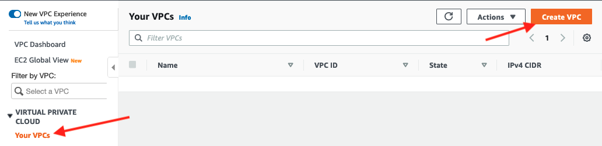
- Selecione somente VPC em Recursos para criar 
* Digite VPC A como a tag Nome 
* Especifique 10.0.0.0/16 como bloco CIDR IPv4. 
* Não habilite IPv6. 
* Deixe a opção Padrão selecionada como Locação. 
* Aceite as tags propostas Clique em Criar VPC

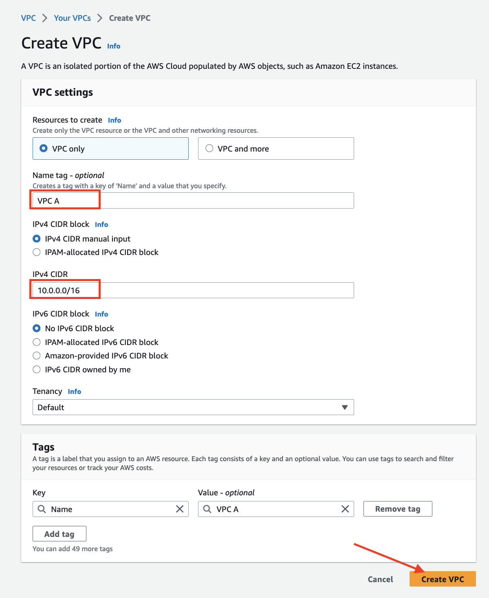
* Após concluir esses passos, você deverá ter uma nova VPC listada em Suas VPCs.
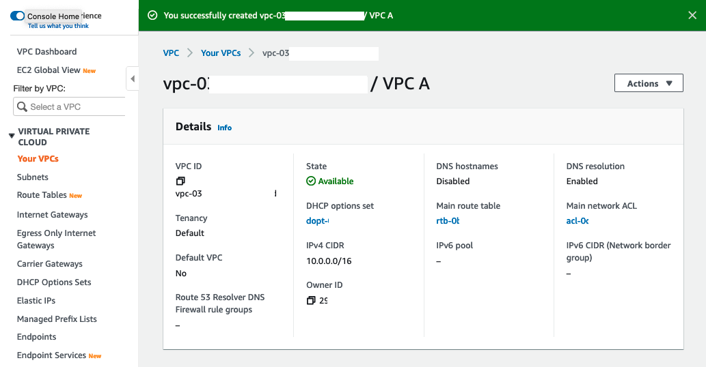

* Clique em Ações e selecione Editar configurações da VPC no menu suspenso.
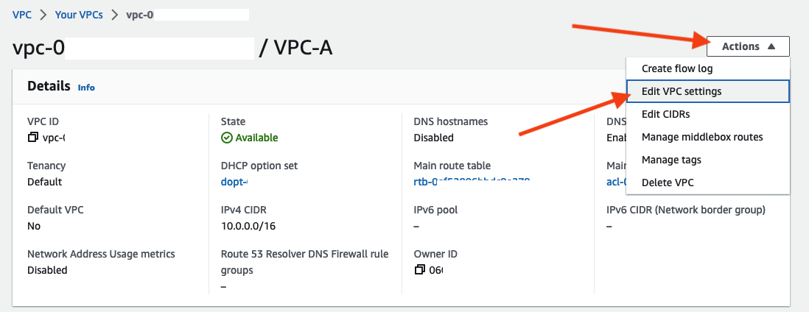
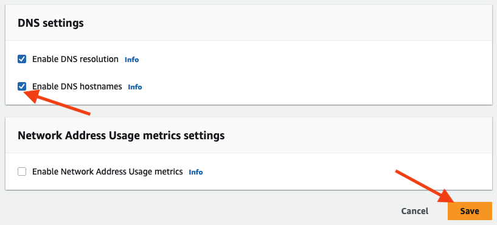
* Marque a caixa para ativar os nomes de host DNS e selecione Salvar.
### 2. Subnets

Foram criadas quatro sub-redes: duas públicas e duas privadas, distribuídas nas AZs `us-east-1a` e `us-east-1b`.

| Nome                     | Tipo    | AZ          | CIDR        |
|--------------------------|---------|-------------|-------------|
| VPC A Public Subnet AZ1  | Pública | us-east-1a  | 10.0.0.0/24 |
| VPC A Private Subnet AZ1 | Privada | us-east-1a  | 10.0.1.0/24 |
| VPC A Public Subnet AZ2  | Pública | us-east-1b  | 10.0.2.0/24 |
| VPC A Private Subnet AZ2 | Privada | us-east-1b  | 10.0.3.0/24 |

# Passos manuais para compreenção do que foi gerado automaticamente com terraform!
- Uma sub-rede é um intervalo de endereços IP em sua VPC. Você pode executar recursos da AWS em uma sub-rede específica. Sub-redes públicas são para recursos que precisam estar conectados à internet, e sub-redes privadas são para recursos que não serão expostos à internet. Nesta seção, criaremos duas sub-redes públicas e duas privadas em cada uma das duas zonas de disponibilidade dentro da sua VPC.

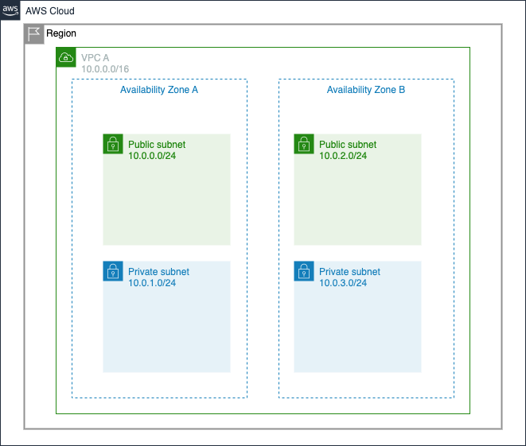

* No painel VPC à esquerda, clique em Sub-redes. 
Clique no botão Criar sub-rede no canto superior direito.

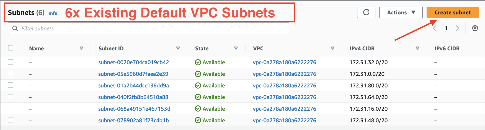

* Selecione VPC A na lista suspensa de ID da VPC.

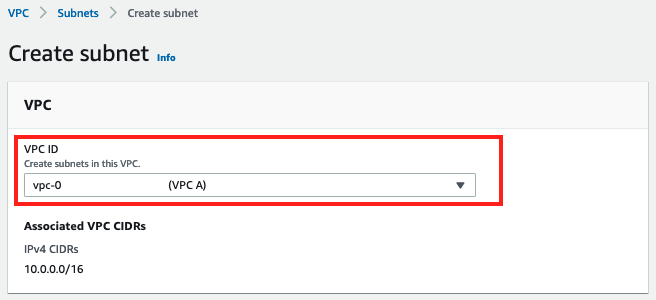

## Na seção Configurações de subnets: 
- Insira o nome como VPC A Public Subnet AZ1 
- Selecione a Zona de Disponibilidade us-east-1a 
- Insira um bloco CIDR de 10.0.0.0/24: 
- Clique em Criar subnet

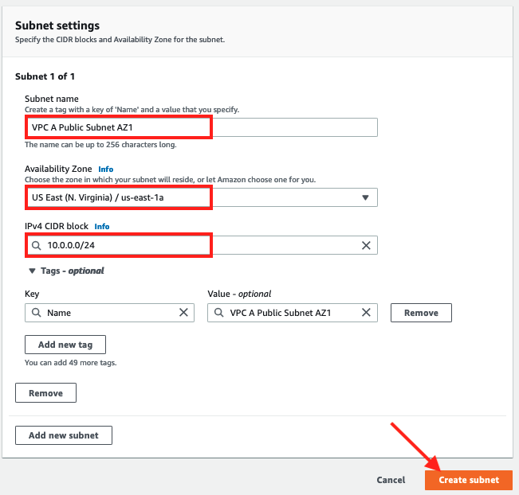

- You should have a new subnet listed under Subnets.

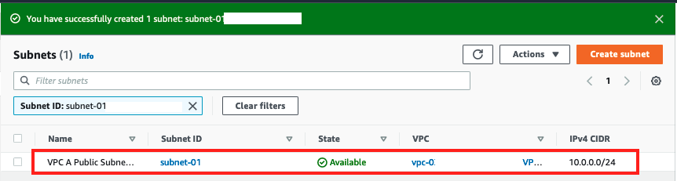

# Clique em Criar subnet novamente 
# Em Configurações de subnet: 

- Selecione VPC A 
- Digite o nome da subnet privada da VPC A: AZ1
- Selecione a Zona de Disponibilidade: us-east-1a 
- Digite o bloco CIDR: 10.0.1.0/24 
- Clique em Criar sub-rede


## Clique em Criar sub-rede novamente 
- Selecione VPC A 
- Digite um nome: VPC A Sub-rede Pública AZ2 
- Selecione a Zona de Disponibilidade: us-east-1b 
- Digite um bloco CIDR: 10.0.2.0/24

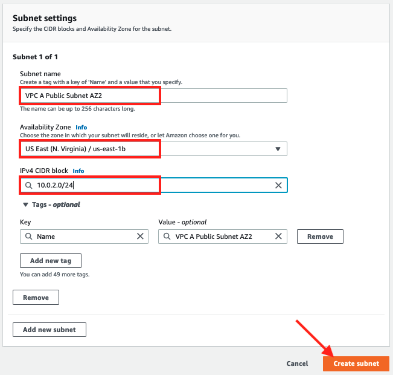

## Clique em Criar sub-rede novamente 
- Selecione VPC A 
- Digite o nome da sub-rede privada da VPC A: AZ2 
- Selecione a Zona de Disponibilidade: us-east-1b 
- Digite o bloco CIDR: 10.0.3.0/24

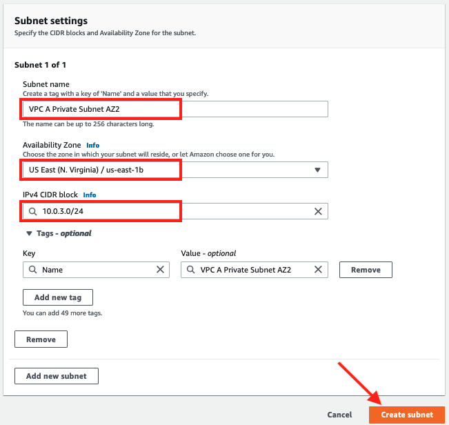

## Após concluir a tarefa, na tela Sub-redes resultante: 
- Limpe o filtro de sub-redes. 
- Classifique por nome. 
- Confirme se quatro novas sub-redes estão disponíveis com os nomes, blocos CIDR e zonas de disponibilidade abaixo.

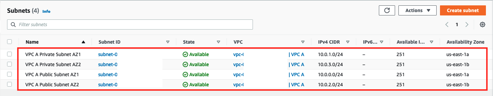
### 3. Network ACLs

Uma Network ACL personalizada (`VPC A Workload Subnets NACL`) foi criada e associada a todas as quatro sub-redes. Por padrão, configuramos regras que permitem **todo o tráfego inbound e outbound** para fins de aprendizado. Em um cenário real, você restringiria essas regras.

Uma lista de controle de acesso à rede (ACL) é uma camada opcional de segurança para sua VPC, que controla o tráfego de entrada e saída de uma ou mais sub-redes.

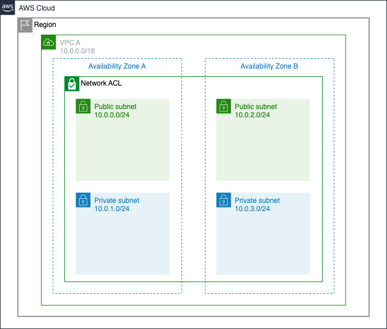  

Selecione qualquer uma das sub-redes e role para baixo até a guia ACL de Rede para visualizar as regras ACL de Rede padrão. As regras são avaliadas em ordem crescente de restrição. Se o tráfego não corresponder a nenhuma regra, a regra * será aplicada e o tráfego será bloqueado. As ACLs de Rede padrão permitem todo o tráfego de entrada e saída, conforme mostrado abaixo, a menos que sejam personalizadas.

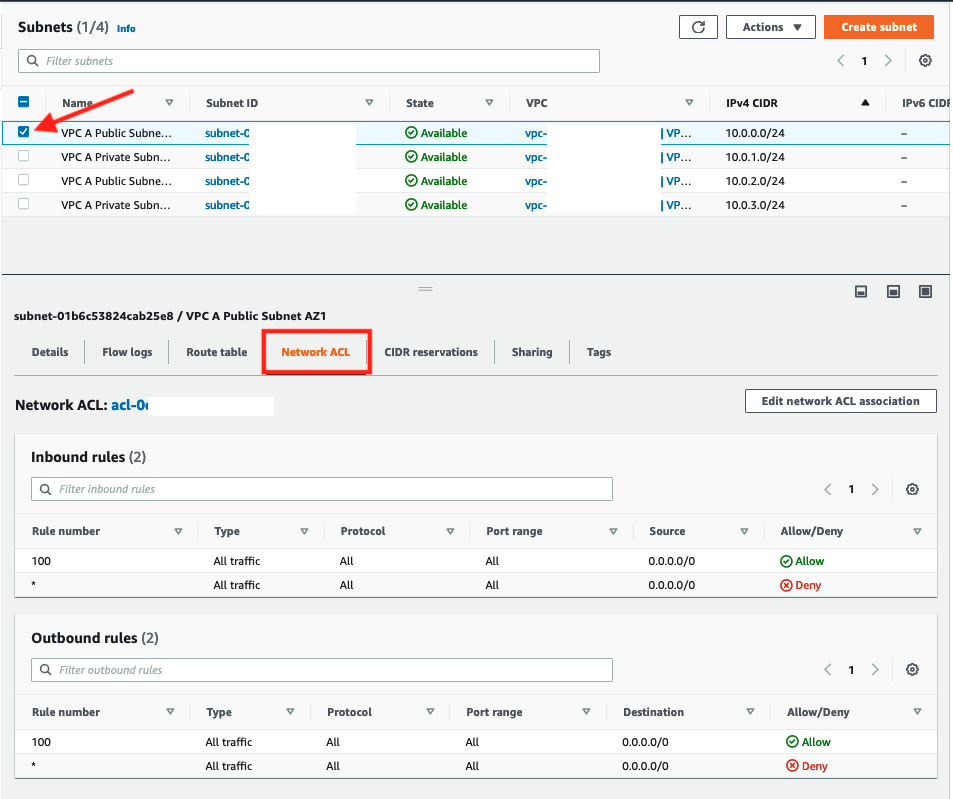

Crie uma nova ACL de rede para sub-redes de carga de trabalho na VPC A.
No painel de controle da VPC, clique em ACLs de rede. 

Clique em Criar ACL de rede

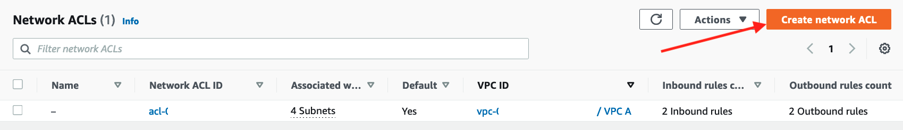

Na tela de configurações de ACL de rede

Digite o nome deVPC A Workload Subnets NACL
Selecione VPC Ana lista suspensa
Clique em Criar ACL de rede

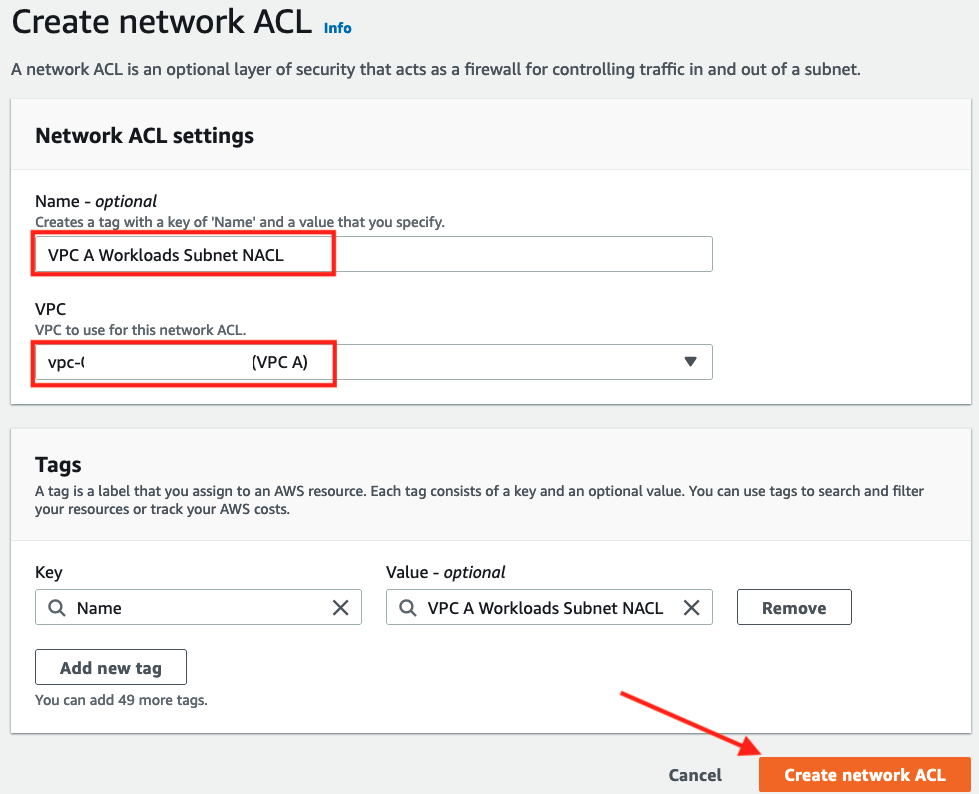

O resultado será uma nova NACL para a VPC A, além da NACL padrão criada quando a VPC foi criada.

Na tela de ACLs de rede resultante

Selecione a caixa de seleção paraVPC A Workload Subnets NACL
Desça até a guia Associações de sub-rede.
Clique em Editar associações de sub-rede

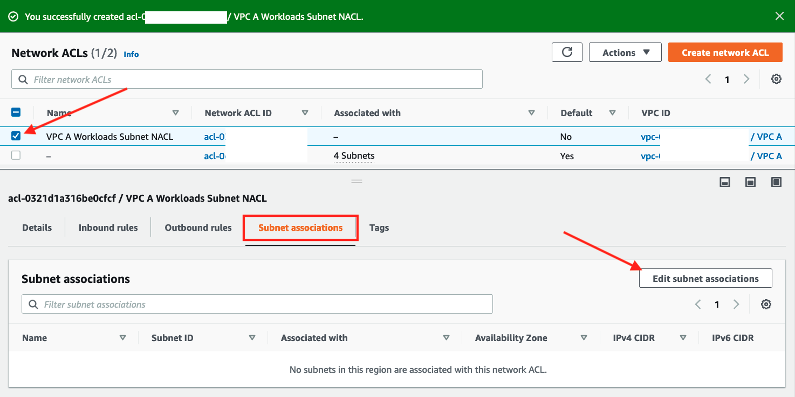

Na tela Editar associações de sub-rede

Selecione todas as quatro sub-redes da VPC A para associá-las à NACL.
Clique em Salvar alterações .

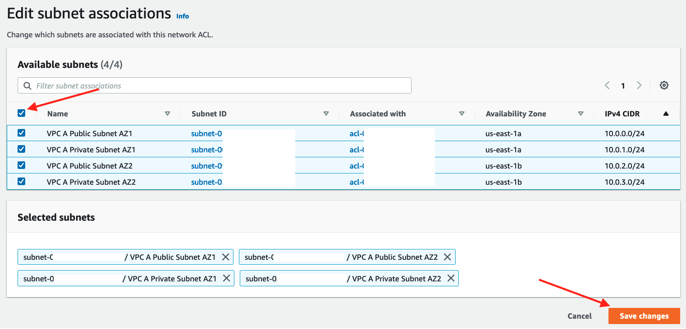

A NACL agora deve estar associada a quatro sub-redes na tela seguinte, mas como as NACLs são criadas apenas com uma regra de NEGAÇÃO para tráfego de entrada e saída, alteraremos as regras padrão da NACL para permitir todo o tráfego em ambas as direções.

Na tela de ACLs de rede

Selecione a caixa de seleção para VPC A Workload Subnets NACLVPC A
Role a página para baixo e selecione a guia Regras de Entrada abaixo.
Observe que temos apenas DENYtodas as regras.
Clique em Editar regras de entrada.

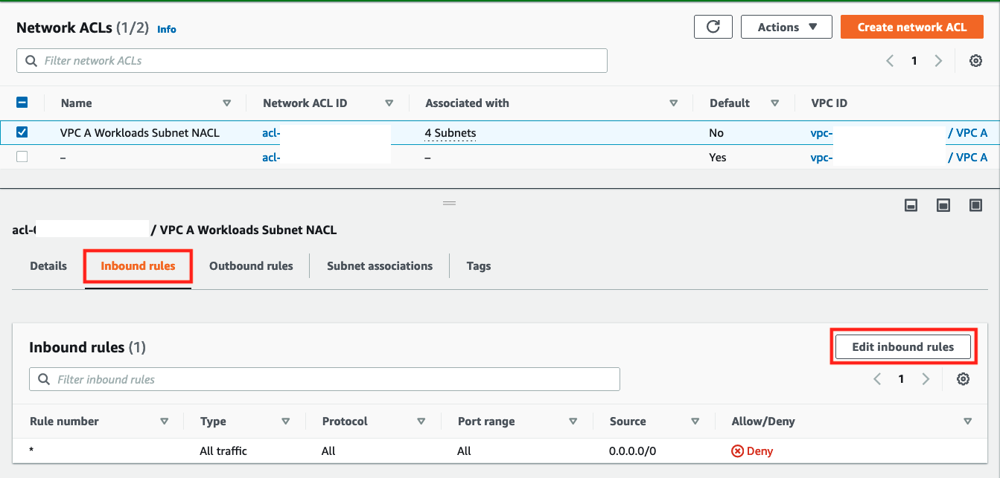

Na tela Editar regras de entrada

Clique em Adicionar nova regra
Insira 100o número da regra
Selecione All traffico tipo
Deixe a fonte como0.0.0.0/0
Clique em Salvar alterações.

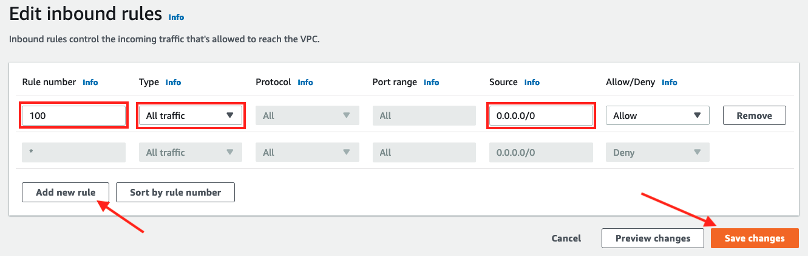

Na tela que aparecer, você deverá ver uma mensagem de sucesso e uma nova Allowregra na aba "Regras de entrada" :

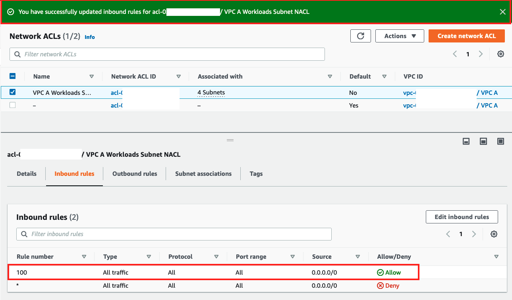

Agora, siga os mesmos passos descritos acima para Entrada, mas trabalhe na aba Regras de Saída das ACLs de Rede.

Na guia Regras de Saída

Observe que temos apenas DENYtodas as regras.
Clique em Editar regras de saída

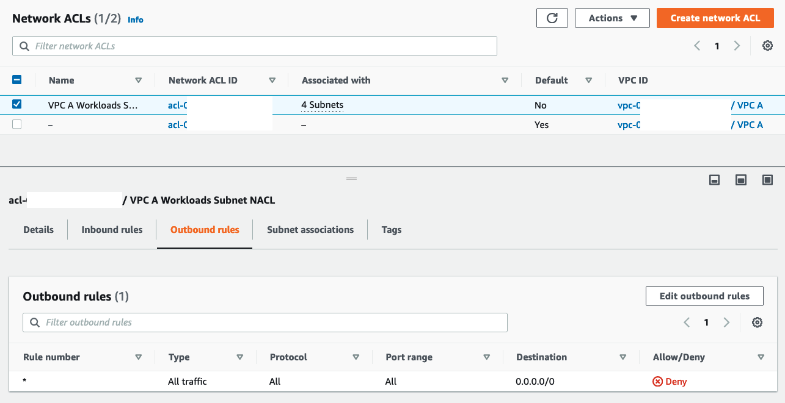

Na tela Editar regras de saída

Clique em Adicionar nova regra
Insira 100o número da regra
Selecione All traffico tipo
Deixe o destino como0.0.0.0/0
Clique em Salvar alterações.

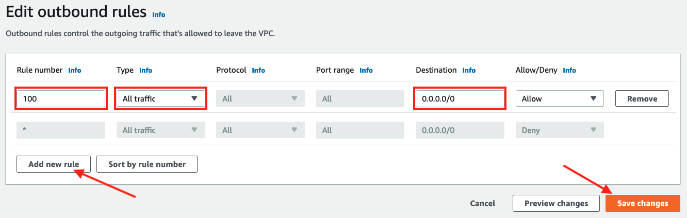

Na tela que aparecer, verifique se a regra foi adicionada na guia "Regras de saída".

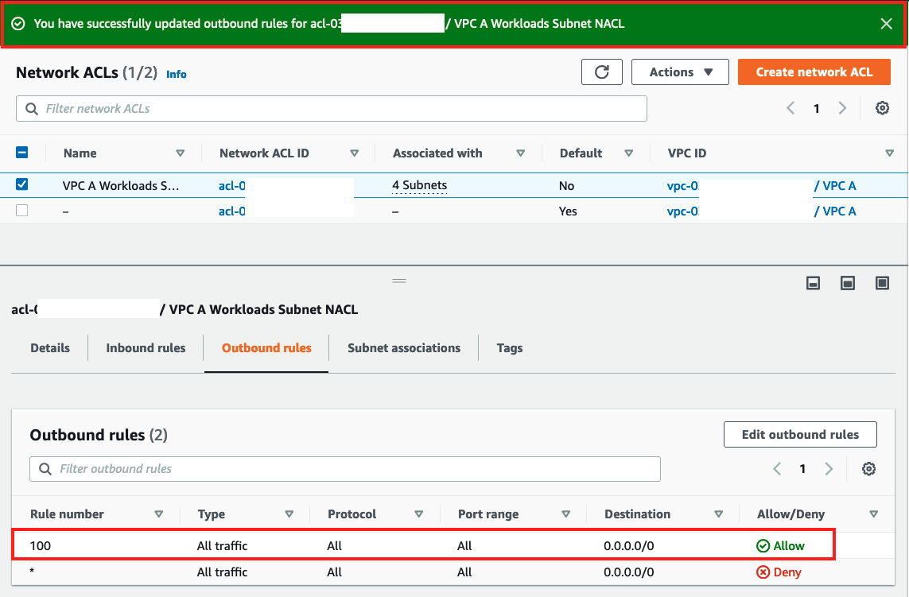

(!) Permitir todo o tráfego de entrada e saída de suas sub-redes não é uma boa prática de segurança. Você pode usar ACLs de rede (NACLs) para definir regras gerais e/ou regras de negação (DENY) e, em seguida, usar Grupos de Segurança (Security Groups) para criar regras mais específicas. Por exemplo, você pode negar o tráfego de IPs específicos com ACLs de rede, mas não com Grupos de Segurança.

- Exploraremos as ACLs de rede e os grupos de segurança com mais detalhes na seção de Segurança Básica .

### 4. Route Tables

Duas tabelas de roteamento foram criadas:

- **Pública**: associada às sub-redes públicas, com rota para o Internet Gateway (`0.0.0.0/0` → IGW).
- **Privada**: associada às sub-redes privadas, com rota para o NAT Gateway (`0.0.0.0/0` → NATGW).

Sua VPC possui um roteador implícito e você usa tabelas de roteamento para controlar o direcionamento do tráfego de rede. Cada sub-rede em sua VPC deve ser associada a uma tabela de roteamento, que controla o roteamento da sub-rede (tabela de roteamento da sub-rede). Você pode associar explicitamente uma sub-rede a uma tabela de roteamento específica. Caso contrário, a sub-rede é implicitamente associada à tabela de roteamento principal. Uma sub-rede só pode ser associada a uma tabela de roteamento por vez, mas você pode associar várias sub-redes à mesma tabela de roteamento da sub-rede.

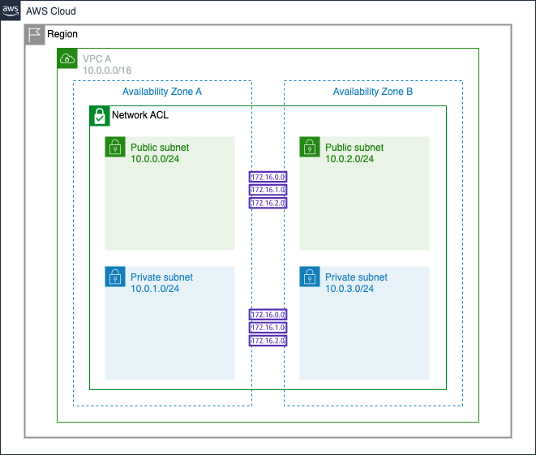

Criar tabela de rotas para sub-redes públicas
No painel esquerdo do Painel de Controle da VPC, clique em Tabelas de Rotas. 

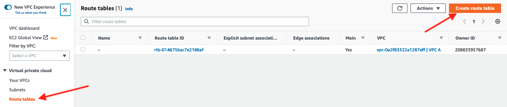

Você verá a tabela de rotas padrão que foi criada como parte da criação da VPC e, na guia Associações de Sub-rede, abaixo, as quatro sub-redes criadas anteriormente. Agora, criaremos uma nova tabela de rotas públicas para as sub-redes públicas com uma rota para a internet por meio do Gateway da Internet.

Adicione uma nova tabela de rotas públicas clicando em " Criar tabela de rotas" no canto direito.

Insira VPC A Public Route Tableo nome e selecione VPC Ana lista suspensa VPC.

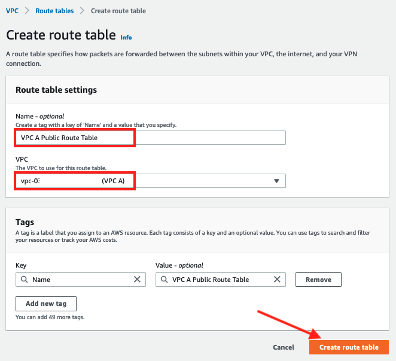

Clique em Criar tabela de rotas e uma nova tabela de rotas será criada.

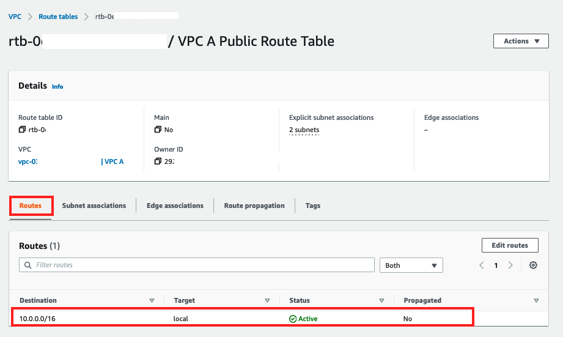

Como você pode ver, existe apenas uma rota local, então habilitaremos o acesso à internet adicionando uma rota para um Gateway de Internet em uma etapa posterior. Por enquanto, precisamos associar esta tabela de rotas públicas às sub-redes públicas que criamos anteriormente.

Role a página para baixo e clique na guia Associações de Sub-rede.

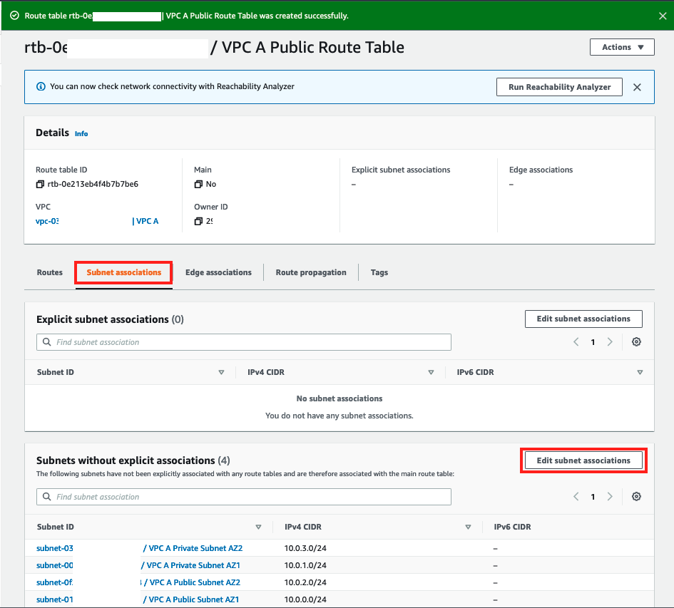

Clique em Editar associações de sub-rede

Selecione VPC A Public Subnet AZ1e VPC A Public Subnet AZ2clique em Salvar associação.

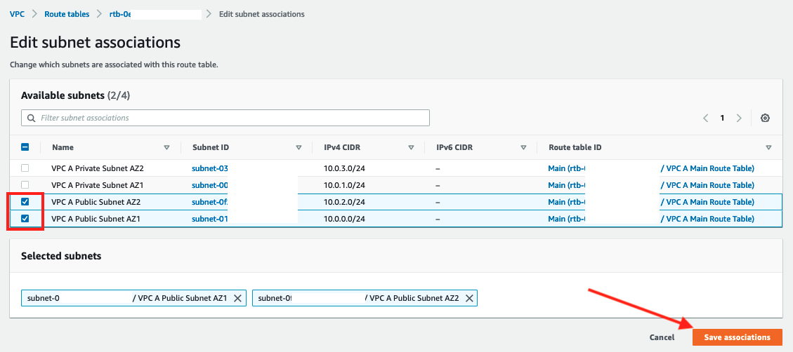

As duas sub-redes públicas serão agora associadas à tabela de rotas públicas em Associações de Sub-rede Explícitas, na aba Associações de Sub-rede .

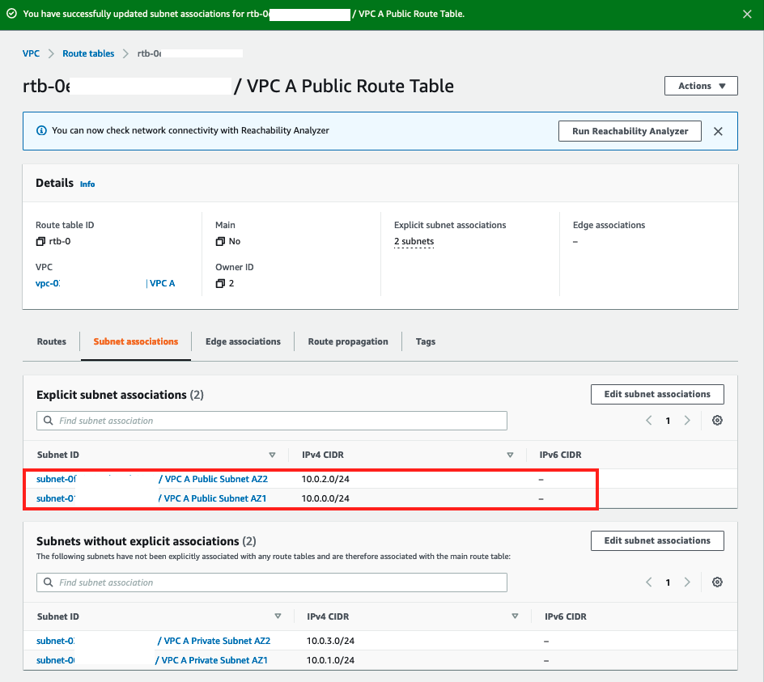

Criar tabela de rotas para sub-redes privadas
No painel esquerdo do Painel de Controle da VPC, clique em Tabelas de Rotas. e clique no botão Criar tabela de rotas no canto superior direito.

Na tela Criar tabela de rotas : * Insira VPC A Private Route Tableo nome * Selecione o ID da VPCVPC A na lista suspensa * Clique em Criar tabela de rotas

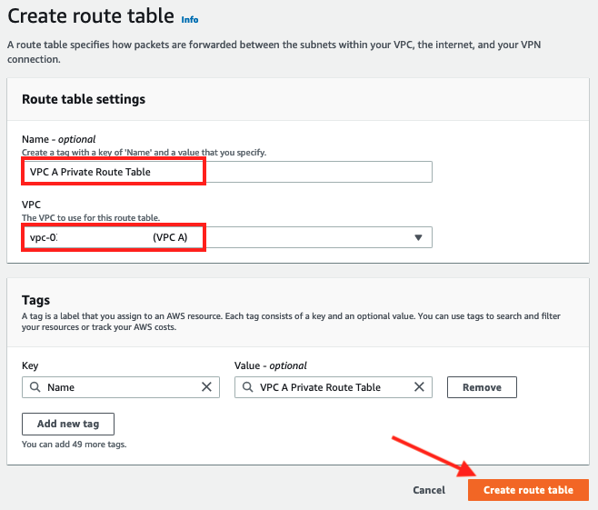

Uma nova tabela de rotas será criada com uma rota local.

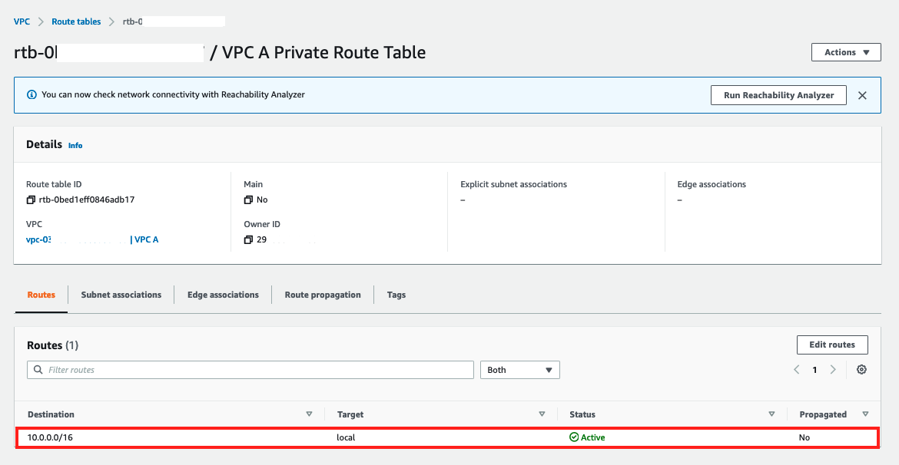

Na próxima etapa, habilitaremos o acesso de saída à internet adicionando uma rota para a internet por meio de um gateway NAT. Por enquanto, precisamos associar as sub-redes privadas à tabela de roteamento.

Na guia Associações de sub-rede, clique em Editar associações de sub-rede.

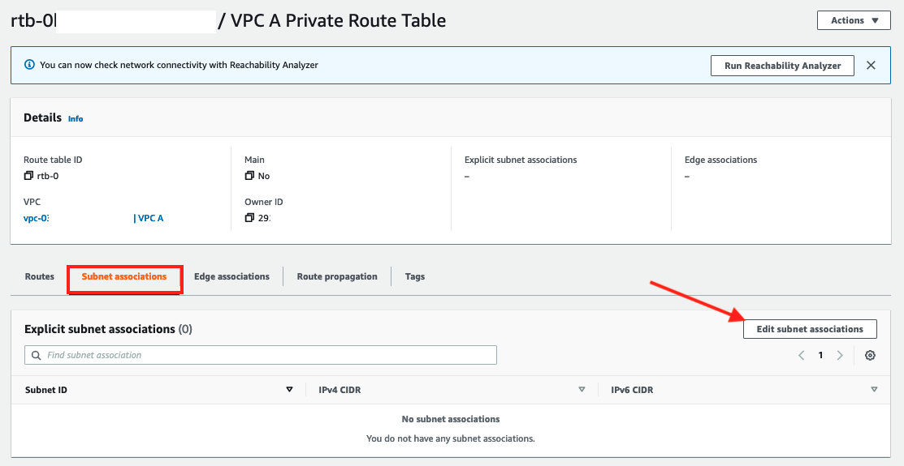

Selecione as duas sub-redes privadas VPC A Private Subnet AZ1e VPC A Private Subnet AZ2clique em Salvar associações.

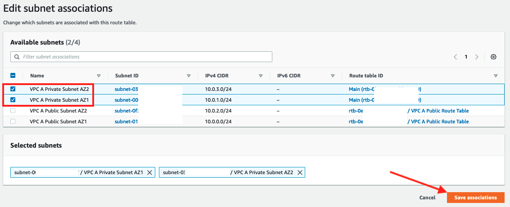

Na tela que aparecer, clique em " Tabelas de rotas" e confirme que existem três tabelas de rotas em VPC A: principal/padrão, pública e privada.

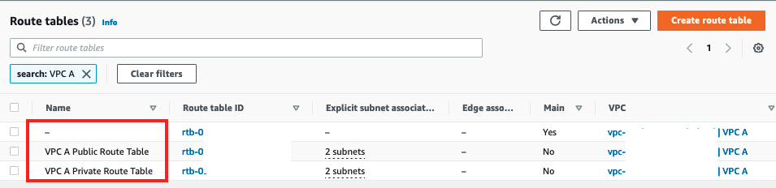

### 5. Internet Connectivity

- **Internet Gateway**: criado e anexado à VPC.
- **NAT Gateway**: implantado na sub-rede pública AZ1, com um Elastic IP associado.

Nesta seção, implantaremos um Gateway de Internet (IGW) e um Gateway NAT em nossa VPC.

Um Internet Gateway estabelece conectividade externa para instâncias EC2 que serão implantadas na VPC e fornece conectividade de entrada e saída para cargas de trabalho executadas em sub-redes públicas, enquanto um NAT Gateway fornece conectividade de saída para cargas de trabalho executadas em sub-redes privadas.

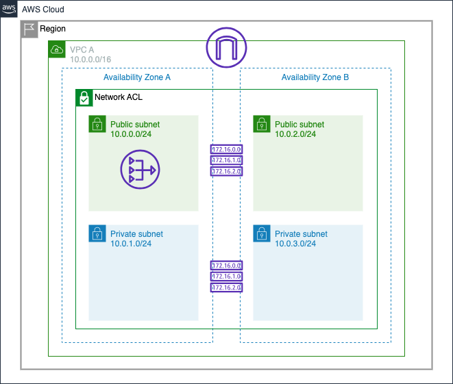  

Implantar um gateway de Internet
No painel esquerdo, clique em Gateways de Internet. e clique em Criar gateway de internet.

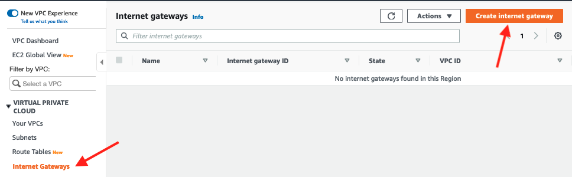 

Insira VPC A IGWo nome e clique em Criar gateway da Internet no canto inferior direito.

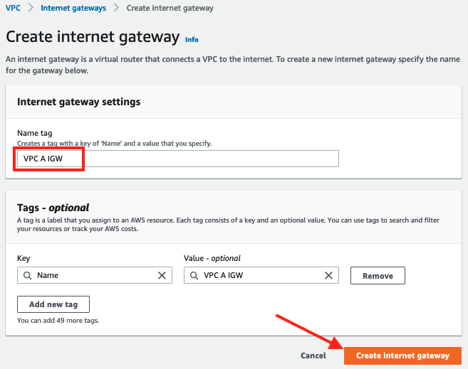 

Na tela de sucesso do IGW recém-criado, clique em " Anexar à VPC" :

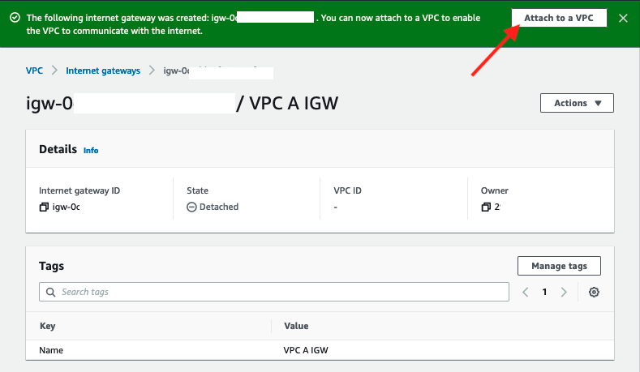 

Selecione VPC Ana lista suspensa "VPCs disponíveis" e clique em "Anexar gateway da Internet" .

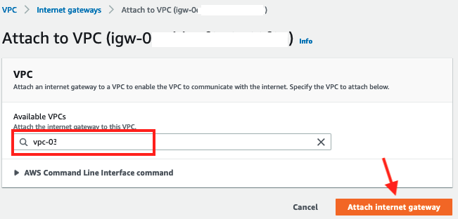 

O gateway da Internet deve ser conectado com sucesso.

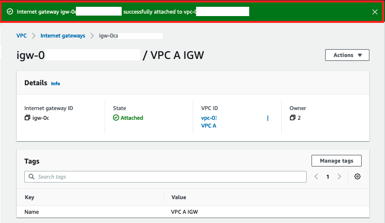 

Agora temos um ponto de acesso à internet para nossa VPC, mas para utilizar o Gateway de Internet recém-criado, precisamos atualizar as tabelas de roteamento da VPC para direcionar as rotas padrão de nossas sub-redes públicas para esse Gateway de Internet.

Atualizar tabela de rotas para sub-redes públicas
No painel esquerdo do Painel de Controle da VPC, clique em Tabelas de Rotas. e selecioneVPC A Public Route Table

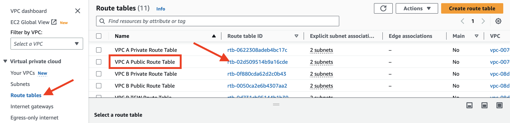 

Desça até a aba Rotas .

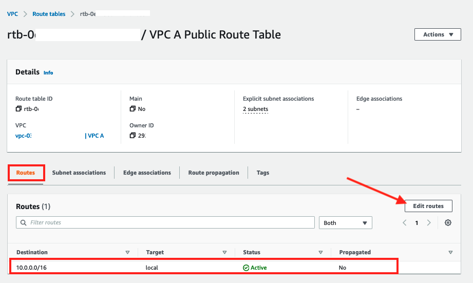

Como você pode ver, existe apenas uma rota local, então vamos habilitar o acesso à internet adicionando uma rota para o Gateway da Internet.

Clique em Editar rotas

Na tela resultante

Clique em Adicionar rota
Insira 0.0.0.0/0o destino.
Selecione Internet Gatewayno menu suspenso Destino

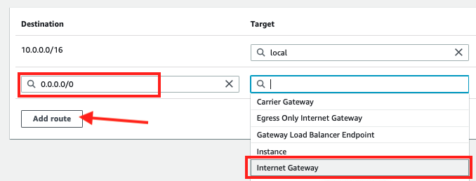

EscolherVPC A IGW

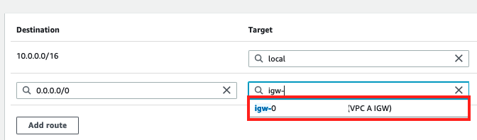

Clique em Salvar alterações e confirme que uma nova rota foi adicionada à aba Rotas.

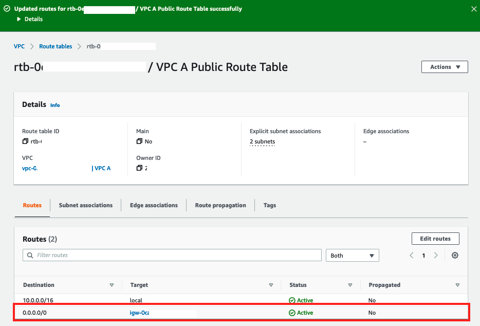

Em seguida, adicionaremos conectividade de saída das sub-redes privadas, implantando um gateway NAT em uma sub-rede pública para uso por cargas de trabalho que não devem ser expostas diretamente à internet.

Criar gateway NAT
No painel esquerdo do Painel de Controle da VPC, clique em Gateways NAT. e clique em Criar gateway NAT

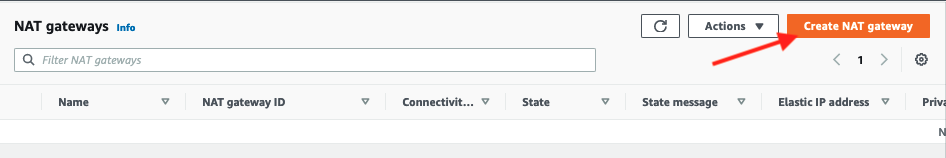

Na tela Criar gateway NATVPC A NATGW : * Insira o nome * Selecione VPC A Public Subnet AZ1 * Clique em Alocar IP elástico * Clique em Criar gateway NAT

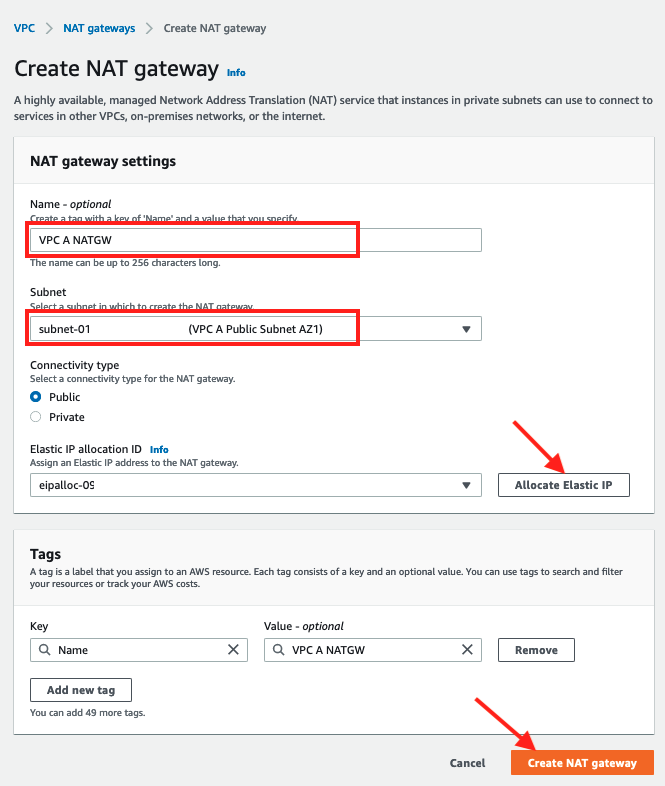

Após a criação, os detalhes do Gateway NAT são exibidos.

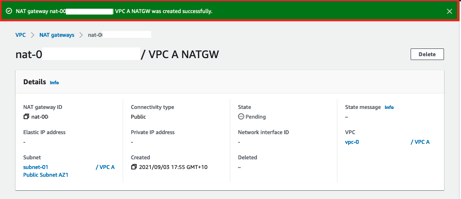

(i) Neste workshop, criamos apenas um gateway NAT na AZ1. A melhor prática é criar um gateway NAT em cada AZ utilizada.

Atualizar tabela de rotas para sub-redes privadas
Agora que temos um gateway NAT em uma sub-rede pública, precisamos criar uma rota para ele a partir das sub-redes privadas, e faremos isso adicionando uma entrada à tabela de rotas das sub-redes privadas.

No painel esquerdo do Painel de Controle da VPC, clique em Tabelas de Rotas. 

Selecione VPC A Private Route Table, role para baixo até a aba Rotas e clique em Editar rotas.

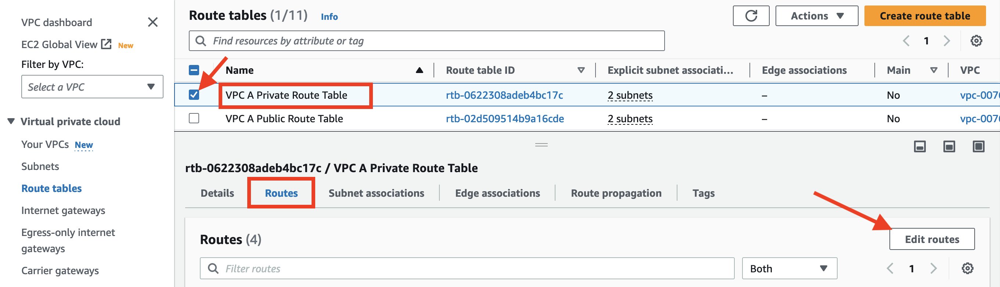

Na tela Editar rotas : * Clique em Adicionar rota * Insira 0.0.0.0/0o destino * Selecione NAT Gatewayno menu suspenso Destino

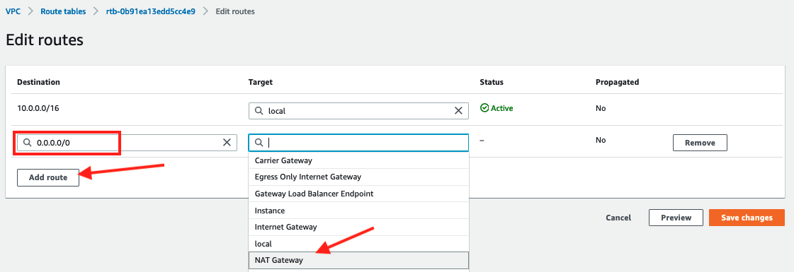

Selecione VPC A NATGWe clique em Salvar alterações.

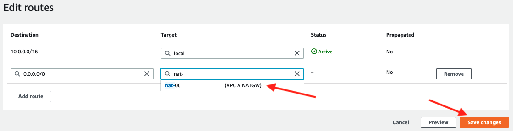

Confirme se a nova rota aparece na aba Rotas da tela resultante.

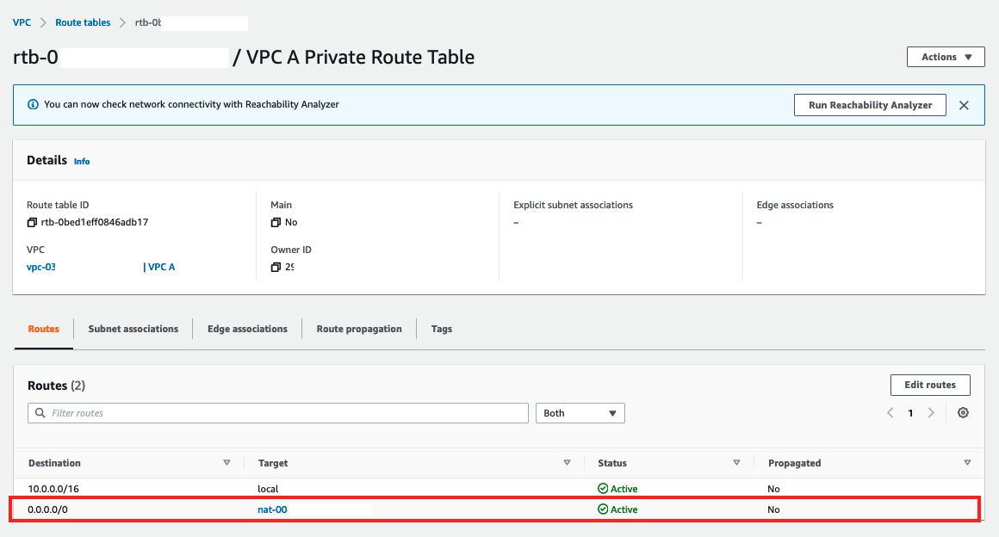

- Já abordamos os conceitos básicos de redes na AWS e construímos uma base de rede com sub-redes públicas e privadas em duas zonas de disponibilidade com acesso à internet.


### 6. VPC Endpoints

Dois endpoints foram criados:

- **Interface Endpoint para KMS**: associado às sub-redes privadas, com DNS privado habilitado.
- **Gateway Endpoint para S3**: associado às tabelas de roteamento pública e privada.

Os endpoints de VPC são links privados para serviços da AWS compatíveis, a partir de uma VPC, em vez de acessar os endpoints públicos do serviço pela internet. Existem dois tipos de endpoints de VPC: endpoints de gateway e endpoints de interface.

Os endpoints do gateway suportam apenas S3 e DynamoDB, e acessam esses serviços por meio de um gateway da VPC.

Os endpoints de interface criam uma interface de rede nas sub-redes da VPC, e todo o tráfego para o serviço flui através dessa interface.

Consulte a seção "O que são endpoints VPC?". Consulte o whitepaper " Acesso seguro a serviços por meio do AWS PrivateLink" se desejar saber mais sobre as diferenças.

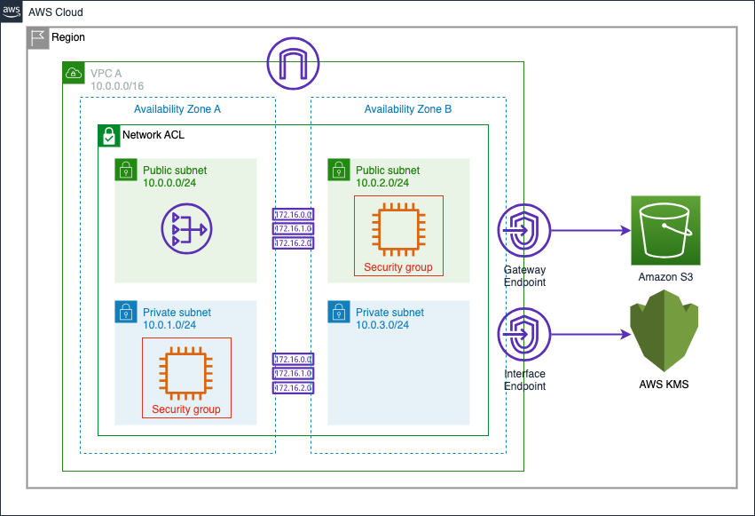  

Criar um ponto de extremidade de interface para o KMS
Navegue até os pontos de extremidade. No console da VPC, clique em Criar ponto de extremidade para começar a criar um ponto de extremidade da VPC.

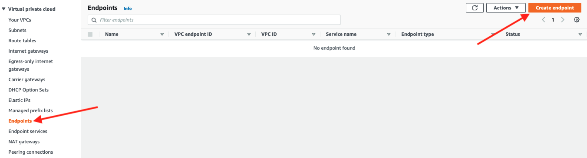 

Na tela de configurações do Endpoint

Insira VPC A KMS Endpointcomo etiqueta de nome
Pesquise por 'kms' em Serviços .

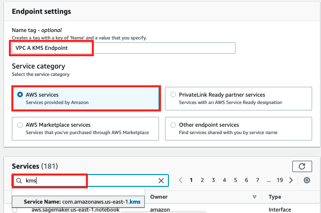 

Nos resultados, selecione o nome do serviço KMS sem o sufixo '-fips'.

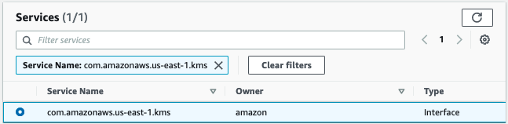 

Na seção VPC

Selecione VPC Ana lista suspensa
Expanda a seção Configurações adicionais
Certifique-se de que a opção "Ativar nome DNS" esteja marcada.
Selecione o botão de opção IPv4

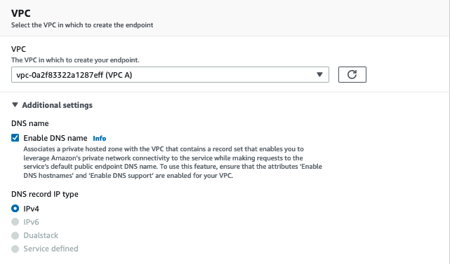 

Selecione VPC A Private Subnet AZ1a VPC A Private Subnet AZ2sub-rede desejada e marque a opção IPv4 .

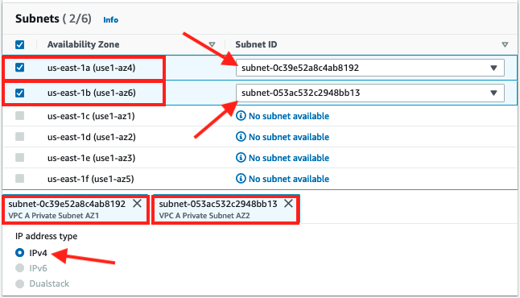 

Selecione o grupo de segurança padrão e deixe a Política como está.Full Access

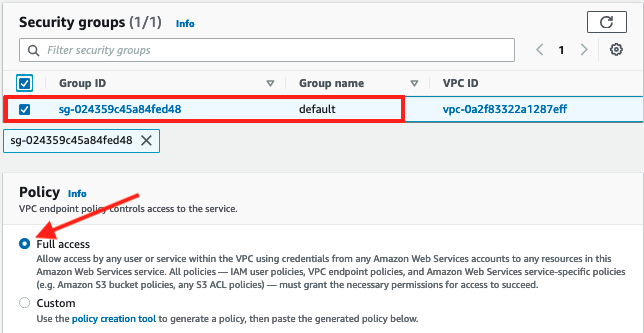 

Clique no botão Criar ponto de extremidade para criar o ponto de extremidade VPC para o KMS na VPC A.

Clique em Fechar para retornar à tela de Pontos de extremidade.

Criar um ponto de extremidade de gateway para o S3
Clique em 'Criar ponto de extremidade' para começar a criar outro ponto de extremidade VPC.

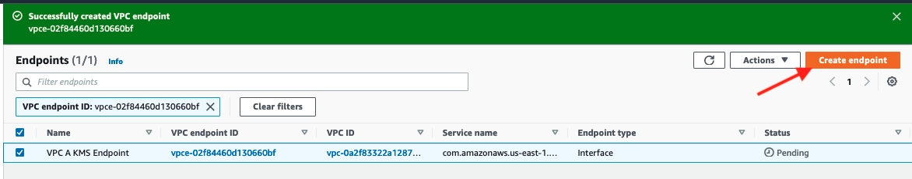 

Na tela Criar endpoint , digite " VPC A S3 Endpointpesquise por 'S3' pelo nome do serviço" e digite "pesquise por 'S3'".

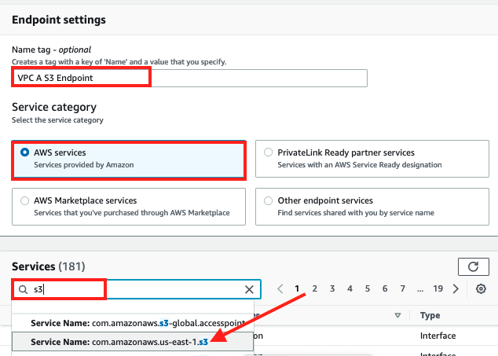 

Selecione o endpoint que tenha o "Tipo" definido como "Gateway" e, na caixa suspensa, selecione VPC.

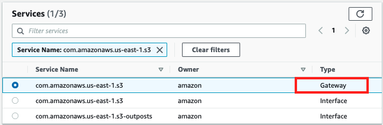 

Selecione VPC Acomo VPC e marque a caixa de seleção para todas as tabelas de roteamento.

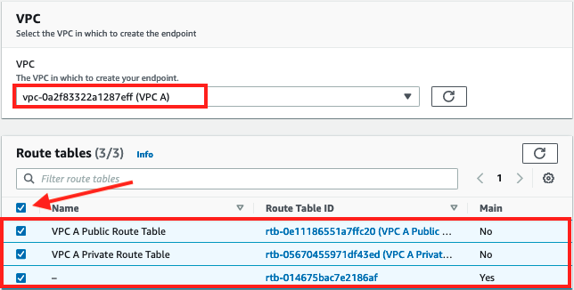 

Deixe a política como estáFull Access

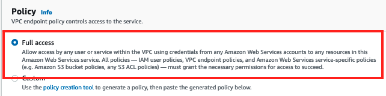 

Clique no botão Criar ponto de extremidade para criar o ponto de extremidade VPC para o S3 anexado à VPC A.

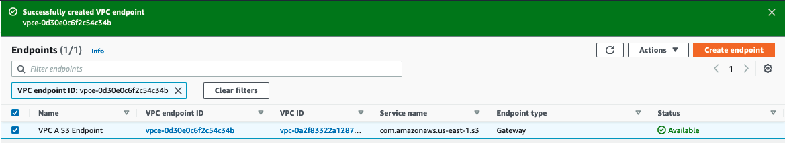 

- conectividade privada aos endpoints de serviço da AWS.

Na próxima seção, iniciaremos uma instância EC2 em uma sub-rede pública e em uma sub-rede privada para verificar a conectividade


### 7. EC2 Instances

Duas instâncias foram lançadas:

- **VPC A Public AZ2 Server** (IP privado `10.0.2.100`) na sub-rede pública AZ2, com IP público atribuído.
- **VPC A Private AZ1 Server** (IP privado `10.0.1.100`) na sub-rede privada AZ1, sem IP público.

Ambas utilizam o perfil IAM `NetworkingWorkshopInstanceProfile` (criado nos pré-requisitos) para permitir acesso via Session Manager.

Nesta seção, você criará instâncias EC2 em sua VPC e as protegerá com um grupo de segurança que permitirá apenas que o tráfego ICMP chegue aos hosts.

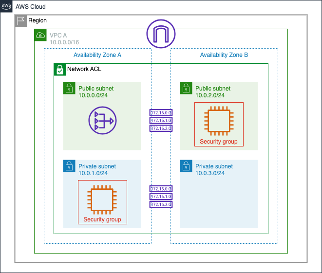  

# Iniciar uma instância EC2 em uma sub-rede pública

(i) Nesta seção, você criará uma instância EC2 na sub-rede pública da AZ2 (Zona de Disponibilidade B). A instância na AZ1 será criada na próxima seção.

Nos casos Na seção do console do EC2, clique em Iniciar instâncias.

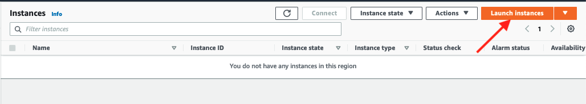  

Na tela resultante "Iniciar uma instância"

Digite VPC A Public AZ2 Servero nome
Certifique-se de que a AMI do Amazon Linux 2023 esteja selecionada e que o tipo de instância seja t2.micro.

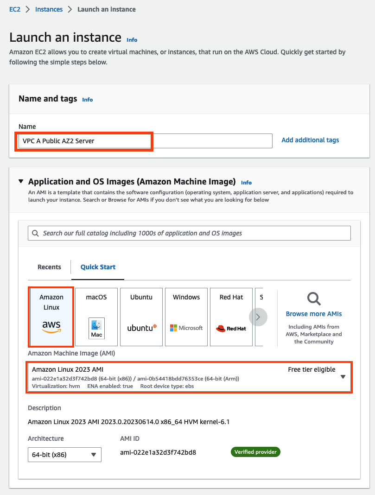 

Em Par de chaves (login), selecione Proceed without a key pair. Um par de chaves não é necessário, pois usaremos o Systems Manager para conectar às instâncias.

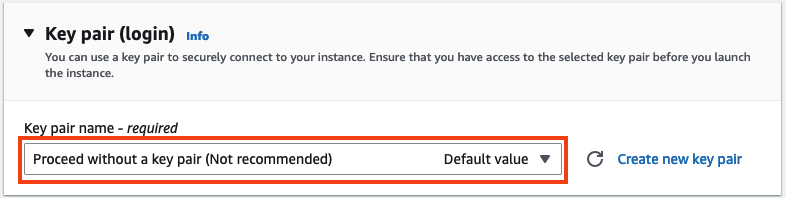 

Em Configurações de rede , clique em Editar e
Selecione VPC Ano menu suspenso do campo VPC
Selecione uma VPC A Public subnet AZ2opção no menu suspenso do campo Sub-rede .
Selecione a opção Enablecorrespondente no campo " Atribuir IP público automaticamente".

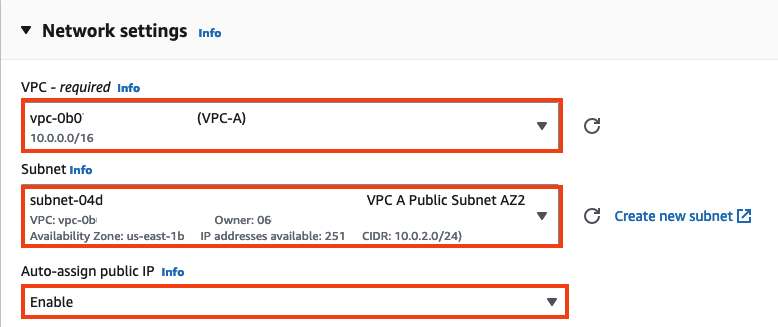 

Selecione Criar grupo de segurança com o nome VPC A Security Group, descrição deOpen-up ports for ICMP

Nas regras de grupos de segurança de entrada, em Tipo , selecione All ICMP - IPv4e insira 0.0.0.0/0 como Origem.

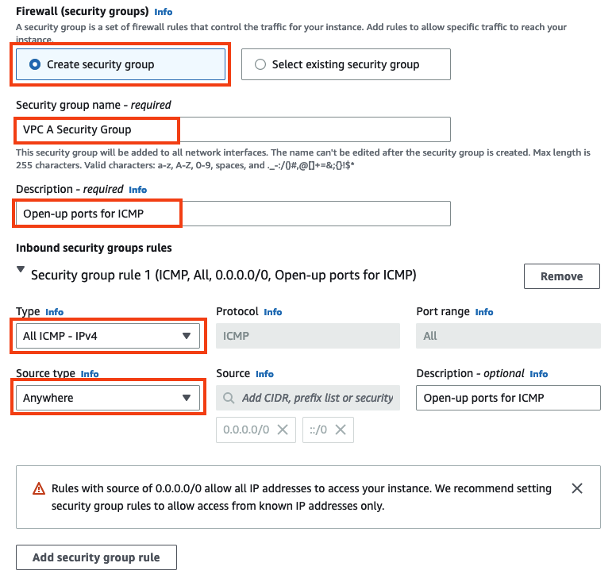 

Como os grupos de segurança mantêm estado, você não precisa editar as regras de saída. O grupo de segurança permitirá que a instância responda ao ping, pois detectou a chegada do ping à instância.

Expanda Configuração avançada de rede e, em IP primário, insira 10.0.2.100.

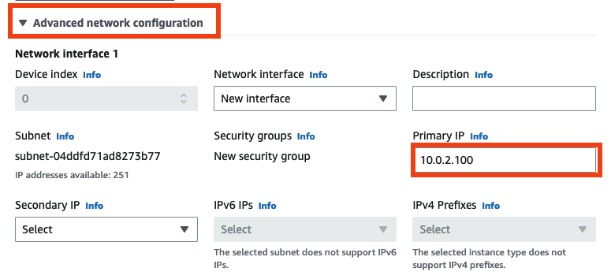 

Na parte inferior da seção
Expandir detalhes avançados
Em Perfil da instância IAM, selecione NetworkingWorkshopInstanceProfilequal foi criado na seção de pré-requisitos.
Clique em Iniciar instância

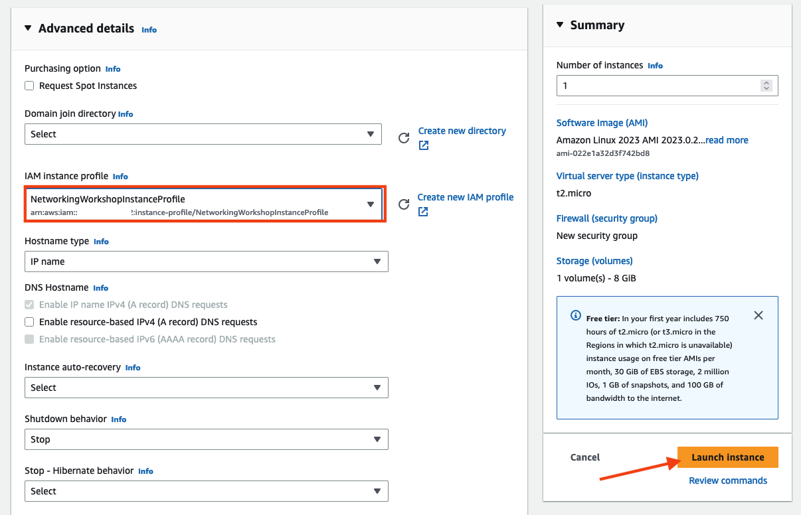 

(i) Se você acabou de concluir a última etapa, sua instância EC2 ainda pode estar sendo inicializada. Você pode verificar isso observando as colunas "Estado da Instância" e "Verificações de Status". Se você vir o estado "Pendente " ou o status " Inicializando ", a instância ainda não está pronta. Após alguns minutos, você deverá ter uma instância EC2 no estado "em execução".

Parabéns! Você acaba de iniciar um servidor virtual em sua sub-rede pública na AZ2.

Iniciar instância em sub-rede privada
Você pode seguir o mesmo processo das duas últimas seções para implantar uma instância EC2 em uma sub-rede privada; no entanto, também é possível iniciar uma nova instância usando as mesmas configurações anteriores.

Nos casos seção do console EC2
Selecione a instância pública em execução.VPC A Public AZ2 Server
Clique em Ações, depois em Imagem e modelos e, por fim, em Exibir mais conteúdo semelhante.

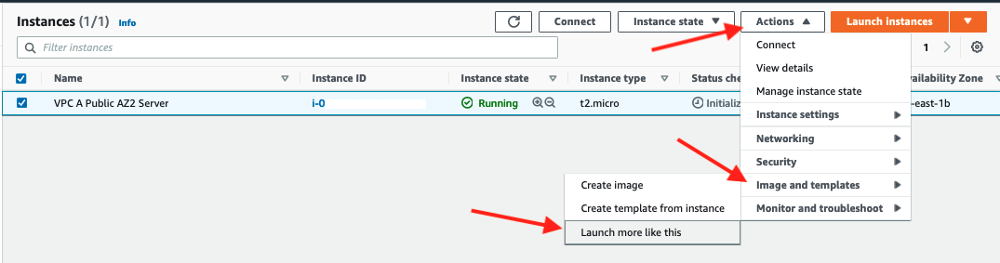 

Na tela de configurações
Atualize o nome paraVPC A Private AZ1 Server
Em Par de chaves (login), selecione Proceed without a key pair.
Atualize a sub-rede para serVPC A Private Subnet AZ1
Defina a configuração Atribuição automática de IP públicoDisable para .
Expanda Configuração avançada de rede e, em IP primário, insira 10.0.1.100.
Clique em Iniciar instância

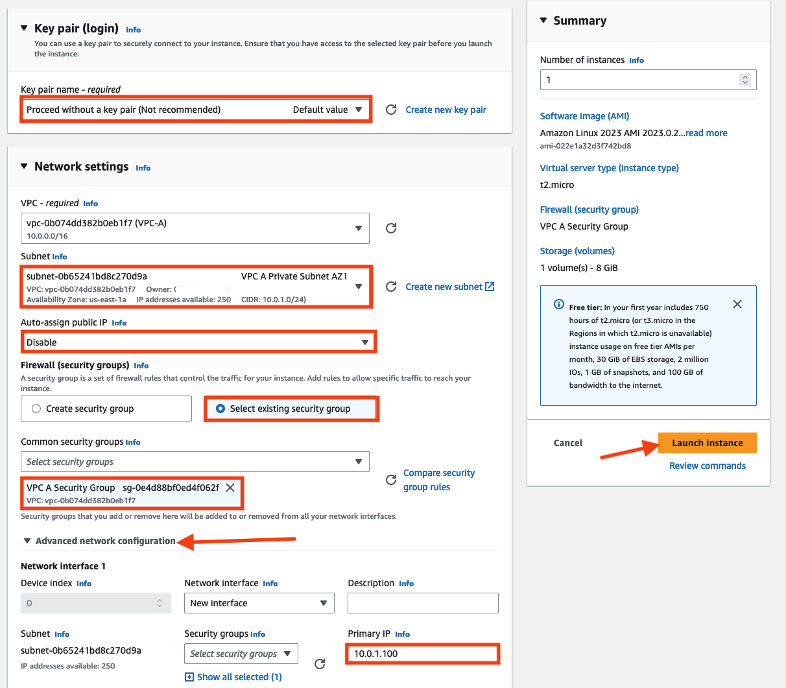 

Clique em " Ver todas as instâncias" . Agora devem existir duas instâncias EC2 em execução na VPC.

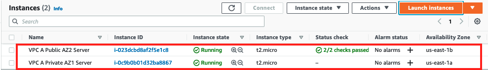 

Parabéns, agora você tem uma instância EC2 em execução tanto em uma sub-rede pública quanto em uma privada.


### 8. Teste de Conectividade

#### Conectividade da Instância Pública

1. No console EC2, selecione a instância `VPC A Public AZ2 Server` e copie seu **endereço IPv4 público**.
2. No seu terminal (CLI local), execute:

```bash
ping <IP_PUBLICO> -c 5
```

Você deve receber respostas, confirmando que a instância está acessível pela internet.

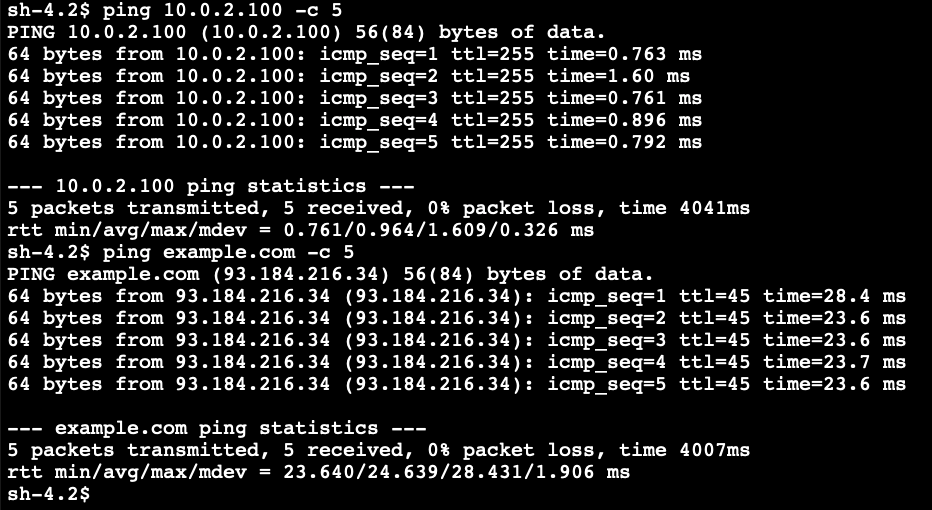

# Modelo Manual

Nesta seção, você usará as instâncias EC2 nas sub-redes públicas e privadas da sua VPC para testar a conectividade das bases de rede que você criou na seção anterior.

Nos casos seção do console EC2
Selecione a VPC A Public AZ2 Serverinstância
Deslize a tela para baixo até a aba Detalhes .
Copie o campo do endereço IPv4 público clicando no ícone de copiar à esquerda.

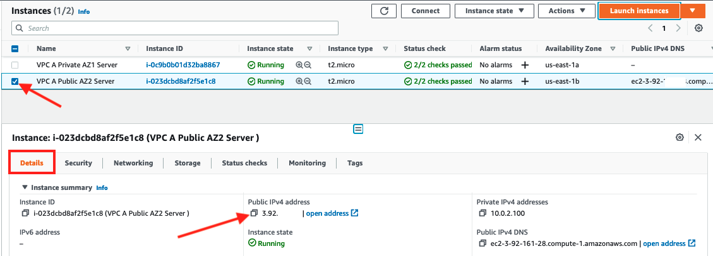

Para pingar a instância, você precisa abrir a sua CLI (linha de comando). No Windows, abra o Prompt de Comando. No Mac, abra o Terminal.

Digite pingum espaço, cole o endereço IP elástico acima, dê outro espaço -c 5e pressione Enter.

Se a instância estiver acessível, esperamos ver linhas como esta:

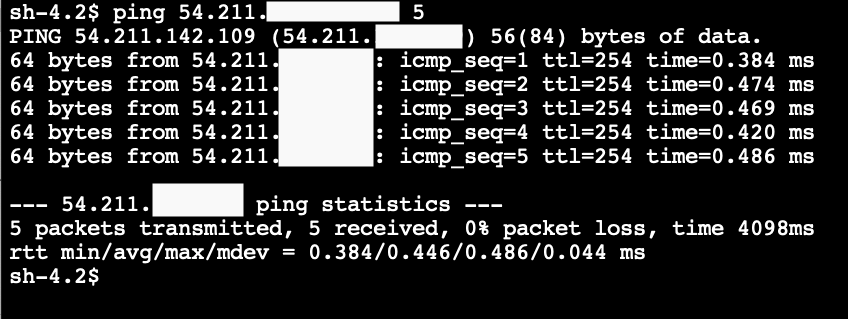

Ótimo trabalho! Você confirmou com sucesso a conectividade entre a instância EC2 pública e a internet.

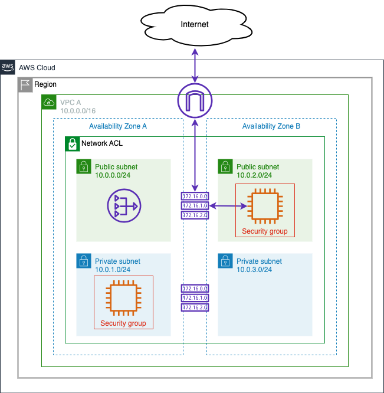

Testar a conectividade da instância privada
Nos casos seção do console EC2
Selecione a VPC A Private AZ1 Serverinstância
Clique no botão Conectar

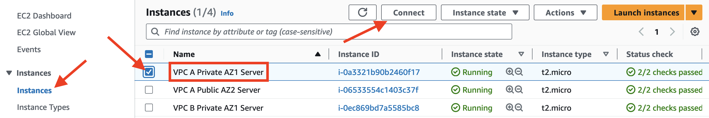

Na tela seguinte, selecione a guia Gerenciador de Sessões e clique em Conectar.

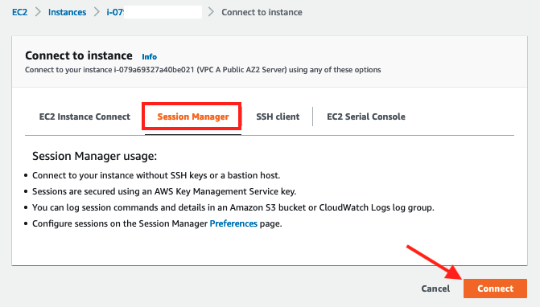

Isso abrirá um terminal a partir do qual você poderá testar a conectividade tanto com a instância pública quanto com 10.0.2.100a conectividade externa através example.comdo Gateway NAT.

Copie os seguintes comandos ping e cole-os no console do Gerenciador de Sessões.

```bash
ping 10.0.2.100 -c 5
ping example.com -c 5
```
Você deverá receber respostas tanto da instância EC2 pública quanto de example.com.


(i) Se o ping para 10.0.2.100 não for bem-sucedido, verifique se você configurou corretamente o endereço IP na seção Instâncias EC2.

Parabéns, você agora confirmou a conectividade de saída de ambas as instâncias.

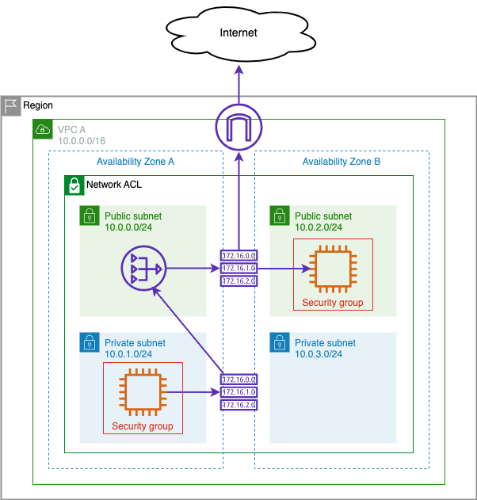

Comparação entre as abordagens de gateway e endpoint de interface.
DNS de endpoint de interface
Digite o seguinte para verificar o DNS do serviço KMS a partir da instância VPC A:

```bash
dig kms.us-east-1.amazonaws.com
```

A resposta deve apontar para dois endereços IP locais dentro dos blocos CIDR de uma sub-rede privada da VPC A 10.0.1.0/24e10.0.3.0/24


Como o DNS da VPC está retornando os endereços IP das Interfaces de Rede Elásticas colocadas nas sub-redes privadas pelo Endpoint da Interface, em vez do endereço IP público do KMS, o tráfego da VPC A para o KMS será roteado para o Endpoint da VPC, em vez de atravessar a internet para chegar ao KMS.

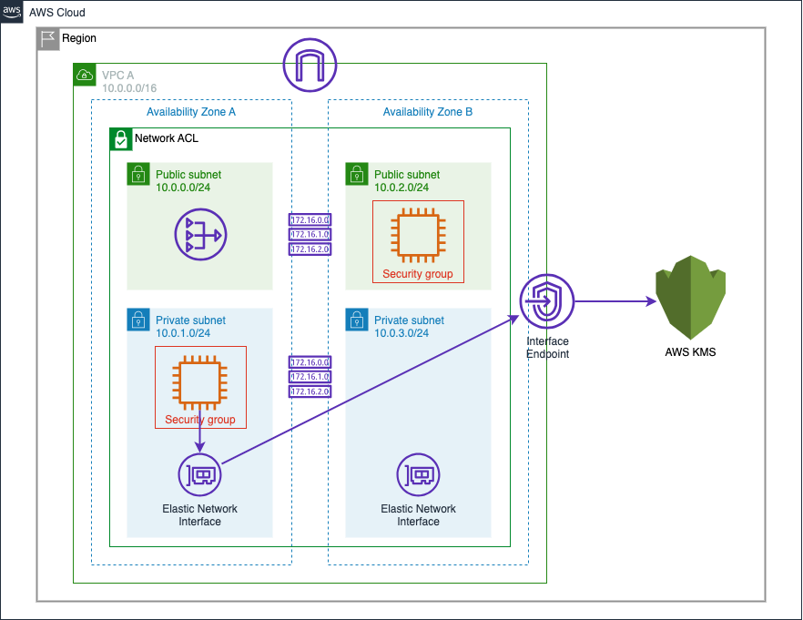

Encerre a sessão do Gerenciador de Sessões.
Roteamento de ponto final do gateway
Acesse o console da VPC e selecione Tabelas de Rotas. 

Selecione a caixa de seleção ao lado de VPC A Private Route Tablee role para baixo até a guia Rotas . Ela deverá exibir uma entrada apontando para o ID do ponto de extremidade da VPC para destinos na lista de prefixos.

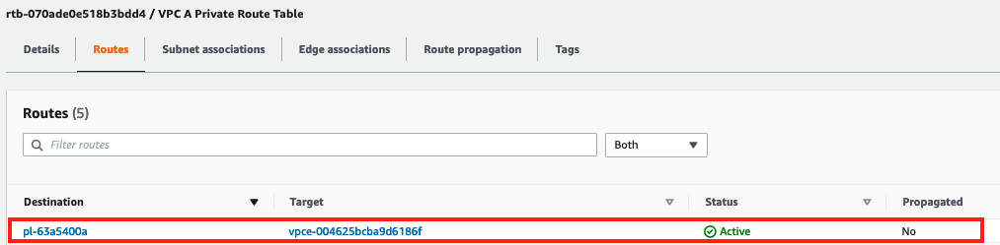

Como a lista de prefixos do S3 é uma rota mais específica para o S3 do que a rota padrão para a internet, o tráfego do VPC A para o S3 será roteado para o endpoint do VPC em vez de atravessar a internet até o endpoint público do S3

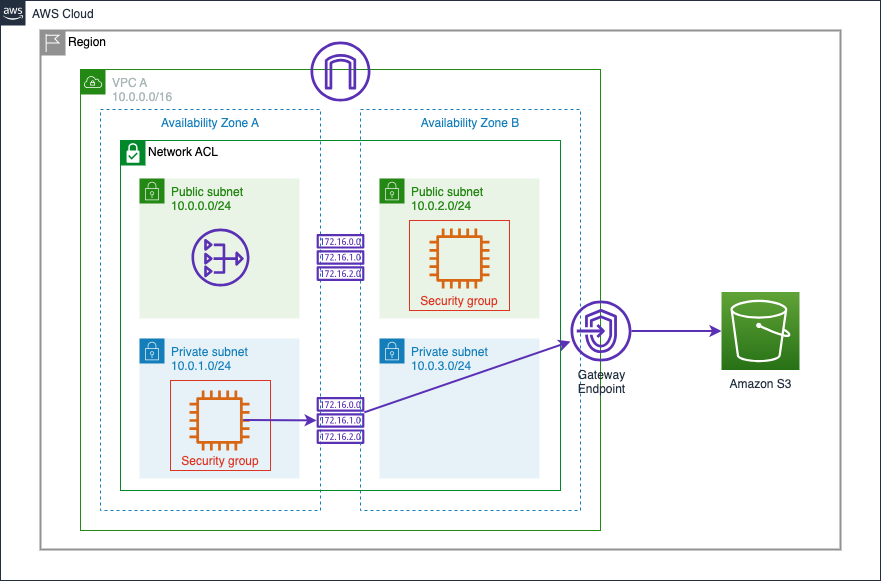


#### Conectividade da Instância Privada

1. No console EC2, selecione a instância `VPC A Private AZ1 Server` e clique em **Connect**.
2. Escolha a aba **Session Manager** e clique em **Connect**. Uma nova janela de terminal será aberta.
3. No terminal Session Manager, execute:

```bash
ping 10.0.2.100 -c 5
ping example.com -c 5
```

O primeiro comando testa a comunicação com a instância pública dentro da VPC (deve funcionar). O segundo testa a saída para a internet via NAT Gateway (também deve funcionar).

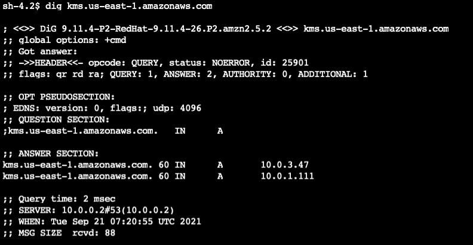

#### Comparação dos Endpoints

Ainda na sessão Session Manager da instância privada, execute:

```bash
dig kms.us-east-1.amazonaws.com
```

A resposta deve mostrar endereços IP dentro do range das sub-redes privadas (ex: `10.0.1.xx` ou `10.0.3.xx`), confirmando que o tráfego para KMS está usando o VPC Endpoint de interface.


Para o endpoint S3, verifique a tabela de roteamento privada no console VPC: ela deve conter uma rota para o prefix list do S3 apontando para o endpoint.


Criamos endpoints de VPC para S3 e KMS e confirmamos que a tabela de rotas local apontava para o endpoint de VPC do S3, enquanto a entrada de DNS local para o KMS agora apontava para ENIs nas sub-redes privadas em vez da interface pública.

### 9. Limpeza (Clean Up)

**Importante:** Para evitar custos recorrentes, destrua os recursos criados por este laboratório quando não estiver mais utilizando.

No diretório do laboratório (`labs/01-vpc-fundamentals`), execute:

```bash
terraform destroy -auto-approve
```

Confirme a destruição quando solicitado.

Se você criou os recursos de pré-requisito via CloudFormation e não vai mais utilizá-los, também pode deletar a stack pelo console CloudFormation.

## Conclusão

Parabéns! Você implementou com sucesso os fundamentos de rede na AWS usando Terraform. Agora você tem uma base sólida para os próximos laboratórios, que explorarão conectividade entre VPCs, segurança avançada, integração com ambientes on-premises e muito mais.

```

