Agora com a lista completa de imagens que você forneceu, vou reescrever o `README.md` do **Lab 02 – Multiple VPCs** utilizando **exatamente os nomes dos arquivos** existentes na pasta `../../img/`. Além disso, manterei o tutorial na íntegra, conforme o texto original, e incluirei as orientações Terraform no final.

Segue o README corrigido:

```markdown
# Laboratório 02: Multiple VPCs

## Visão Geral
```

Uma conexão de peering entre VPCs é uma conexão de rede entre duas VPCs que permite rotear tráfego entre elas usando endereços IPv4 privados ou IPv6. As instâncias em qualquer uma das VPCs podem se comunicar como se estivessem na mesma rede. Você pode criar uma conexão de peering entre suas próprias VPCs ou com uma VPC em outra conta AWS. As VPCs podem estar em regiões diferentes (conexão de peering entre regiões).

O VPC Peering é útil para conectar um pequeno número de pares de VPCs, porém gerenciar conectividade ponto a ponto entre muitas VPCs sem a capacidade de gerenciar centralmente as políticas de conectividade pode ser operacionalmente custoso e complicado. Para conectividade on-premises, você precisa anexar sua VPN AWS a cada VPC individualmente. Essa solução pode ser demorada de construir e difícil de gerenciar quando o número de VPCs cresce para centenas.

O AWS Transit Gateway é um serviço que permite conectar VPCs e redes on-premises a um único gateway. À medida que você aumenta o número de workloads em execução na AWS, você precisa ser capaz de escalar suas redes em várias contas e VPCs para acompanhar o crescimento.

Neste laboratório, você aprenderá como fazer peering de VPCs, e também criará um Transit Gateway, anexará VPCs, e configurará o roteamento com as tabelas de rotas do Transit Gateway.

Se você estiver executando este laboratório no AWS Workshop Studio, a região foi definida pelo seu facilitador. A região que você vê nas capturas de tela pode não corresponder ao seu ambiente. Isso não causará problemas.

Se você estiver executando este laboratório em sua própria conta AWS, é recomendado para todos os recursos do laboratório serem criados na região us-east-1 para que as capturas de tela correspondam ao seu ambiente. Isso não é obrigatório.

Para este laboratório, usaremos o CloudFormation para construir automaticamente as VPCs.

---

## Pré‑requisitos

Se você não concluiu a seção VPC Fundamentals, execute o template CloudFormation abaixo para criar os recursos iniciais. Se já concluiu, prossiga para a verificação das VPCs.

### Recursos Criados pelo CloudFormation

O template cria três VPCs (A, B, C) com os seguintes CIDRs:
- VPC A: `10.0.0.0/16`
- VPC B: `10.1.0.0/16`
- VPC C: `10.2.0.0/16`

Cada VPC possui duas subnets públicas e duas privadas, e uma instância EC2 na subnet privada da AZ us-east-1a.

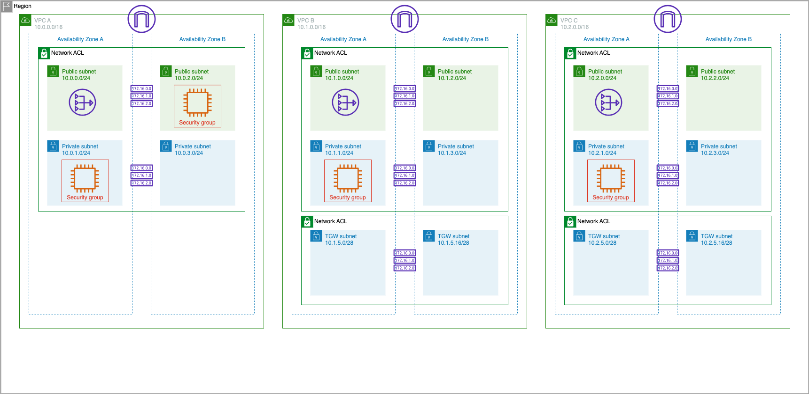

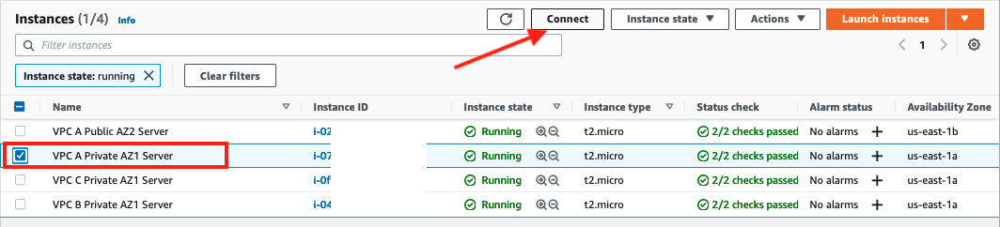 *(imagem ilustrativa)*

O ambiente inicial se assemelha ao diagrama abaixo. Note que a VPC A ainda não possui as subnets TGW – elas serão criadas posteriormente.

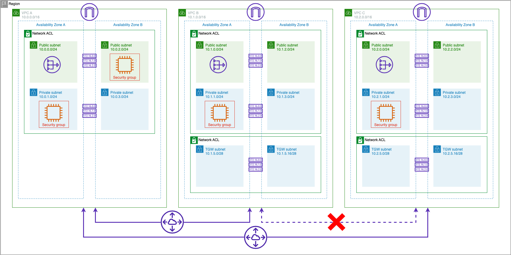

---

## VPC Peering

> **Nota:** Esta seção é opcional e não é necessária para prosseguir com o workshop. Você pode pular para a seção [Transit Gateway](#transit-gateway).

Uma conexão de peering entre VPCs é uma conexão de rede entre duas VPCs que permite rotear tráfego entre elas usando endereços IPv4 privados ou IPv6. Neste laboratório, estabeleceremos conexões de peering entre VPC A e VPC B, e entre VPC A e VPC C, e mostraremos que o tráfego flui apenas entre aquelas VPCs com links de peering diretos.

**Nota:** Todas as três VPCs têm CIDRs não sobrepostos. Você não pode criar uma conexão de peering entre VPCs com CIDRs correspondentes ou sobrepostos.

### Configurar o Peering entre VPC A e VPC B

#### Criar a Conexão de Peering Entre VPCs A e B

1. No painel VPC, clique em **Peering Connections**.
2. Clique em **Create peering connection** no canto superior direito.  
   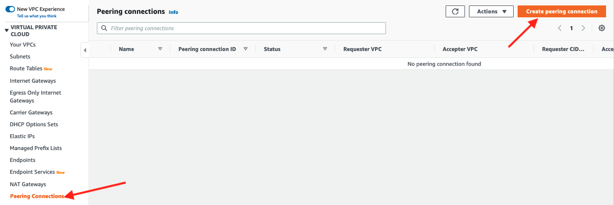
3. Especifique o nome da conexão de peering como **VPC A <> VPC B**.
4. Em **Select a local VPC to peer with**, selecione **VPC A** como VPC ID (Requester).  
   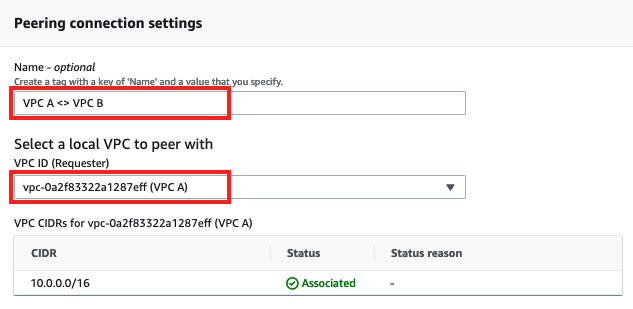
5. Em **Select another VPC to peer with**, certifique-se de que **My Account** está selecionado para **Account**.
6. Para **Region**, selecione a região deste workshop (por exemplo, **This Region (us-east-1)**).
7. Para **VPC ID (Accepter)**, selecione **VPC B**.  
   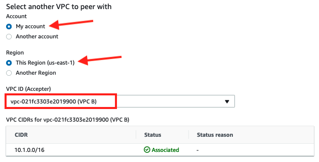
8. Clique em **Create peering connection**.  
   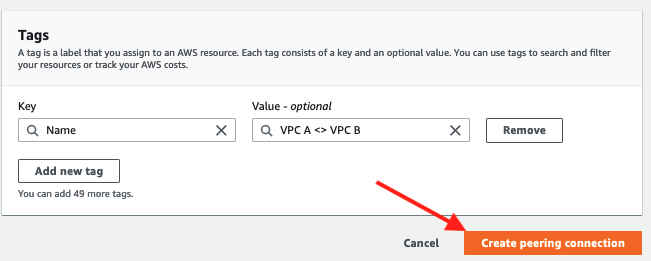

A nova conexão de peering ficará no estado **Pending Acceptance**.

9. Na tela resultante, em **Actions**, clique em **Accept request**.  
   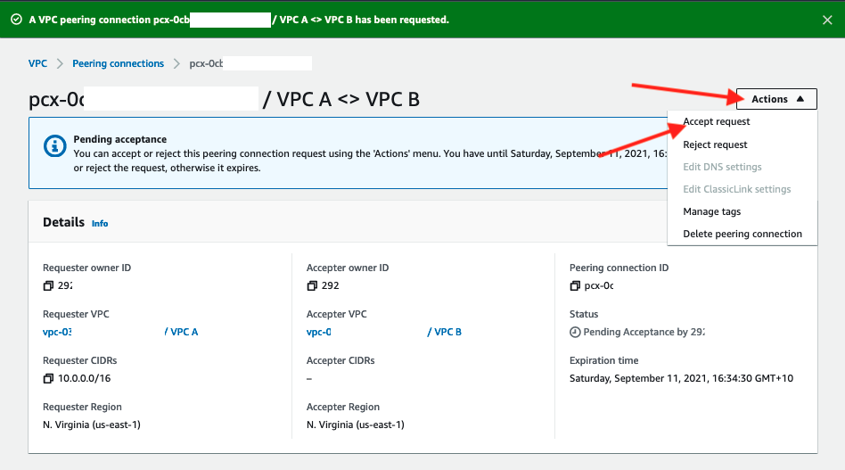
10. No pop-up seguinte, clique em **Accept request**.  
    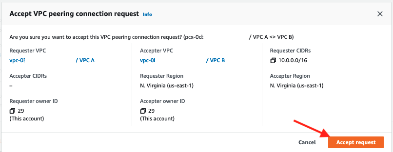
11. Clique em **Modify my route tables now** na tela resultante.  
    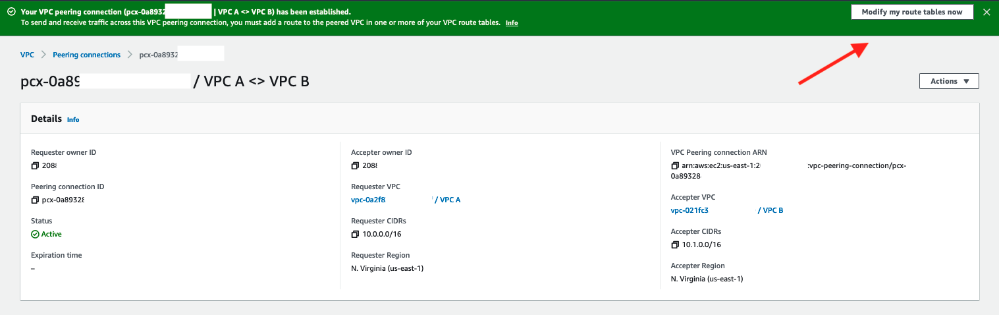

#### Atualizar a Tabela de Rotas na VPC A

1. Selecione a caixa de seleção para a **VPC A Private Route Table**.
2. Role para baixo e clique na aba **Routes**.
3. Clique em **Edit routes**.  
   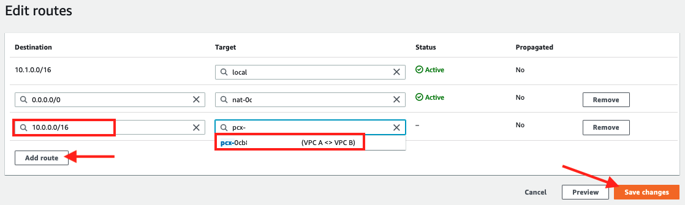
4. Adicione uma entrada de rota para "VPC B" usando o CIDR `10.1.0.0/16` e selecionando **Peering Connection** `VPC A <> VPC B` como alvo.  
   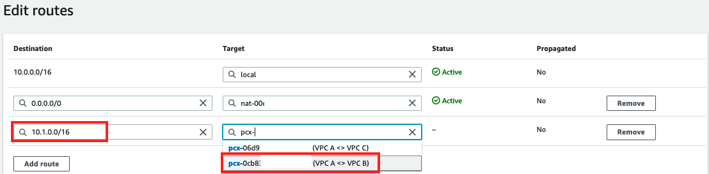
5. Clique em **Save changes**.
6. Confirme que a nova rota aparece na aba **Routes**.  
   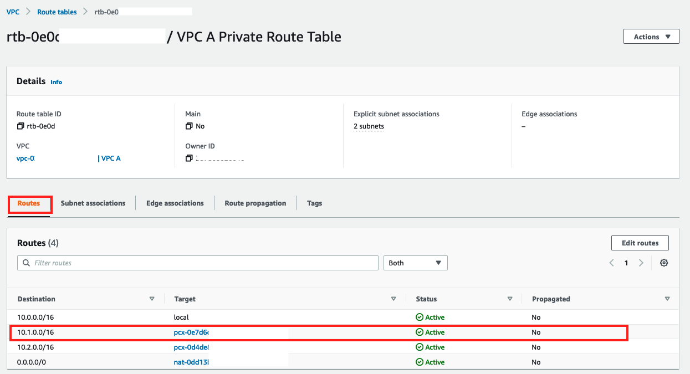

#### Atualizar a Tabela de Rotas na VPC B

1. Clique em **Route tables**.
2. Selecione a caixa de seleção para a **VPC B Private Route Table**.
3. Clique na aba **Routes**.
4. Clique em **Edit routes**.  
    *(imagem similar)*
5. Adicione uma entrada de rota para VPC A usando o CIDR `10.0.0.0/16` como destino e `VPC A <> VPC B` como alvo.  
   
6. Clique em **Save changes**.
7. A tabela de rotas será atualizada com as rotas para a conexão de peering.  
   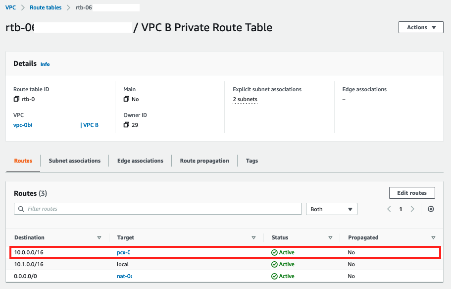

### Configurar o Peering entre VPC A e VPC C

#### Criar a Conexão de Peering Entre VPCs A e C

1. No painel VPC, clique em **Peering Connections**.
2. Clique em **Create peering connection** no canto superior direito.  
   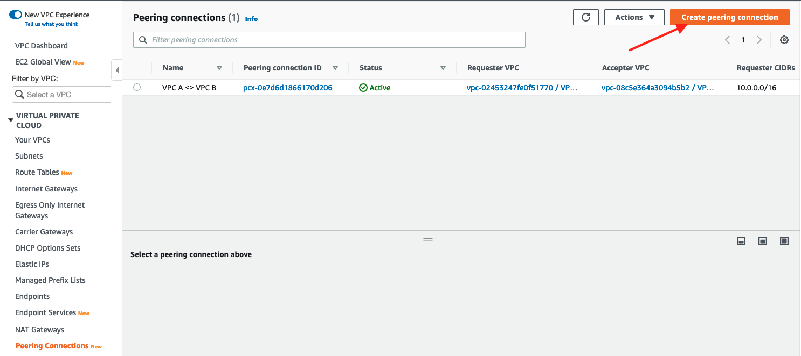
3. Especifique o nome da conexão de peering como **VPC A <> VPC C**.
4. Em **Select a local VPC to peer with**, selecione **VPC A** como VPC ID (Requester).
5. Em **Select another VPC to peer with**, certifique-se de que **My Account** está selecionado.
6. Para **Region**, selecione a região deste workshop.
7. Para **VPC ID (Accepter)**, selecione **VPC C**.  
   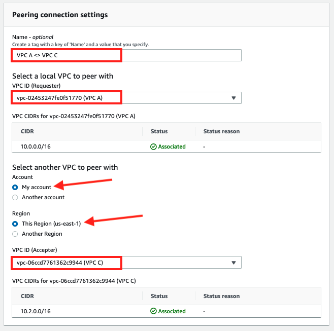
8. Clique em **Create peering connection**.  
   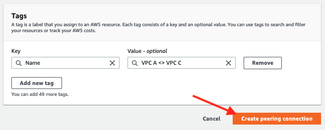

A nova conexão de peering ficará no estado **Pending Acceptance**.

9. Na tela resultante, em **Actions**, clique em **Accept request**.  
   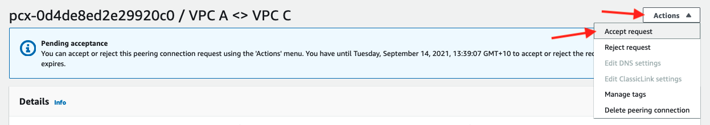
10. No pop-up seguinte, clique em **Accept request**.
11. Clique em **Modify my route tables now** na tela resultante.  
    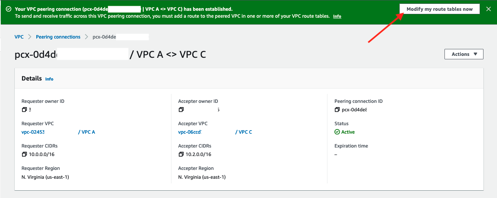

#### Atualizar a Tabela de Rotas na VPC A

1. Selecione a caixa de seleção para a **VPC A Private Route Table**.
2. Role para baixo e clique na aba **Routes**.
3. Clique em **Edit routes**.  
   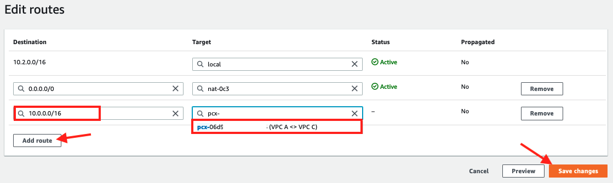
4. Adicione uma entrada de rota para "VPC C" usando o CIDR `10.2.0.0/16` e selecionando **Peering Connection** `VPC A <> VPC C` como alvo.  
   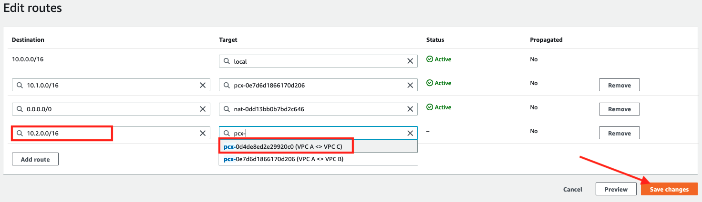
5. Clique em **Save changes**.  
   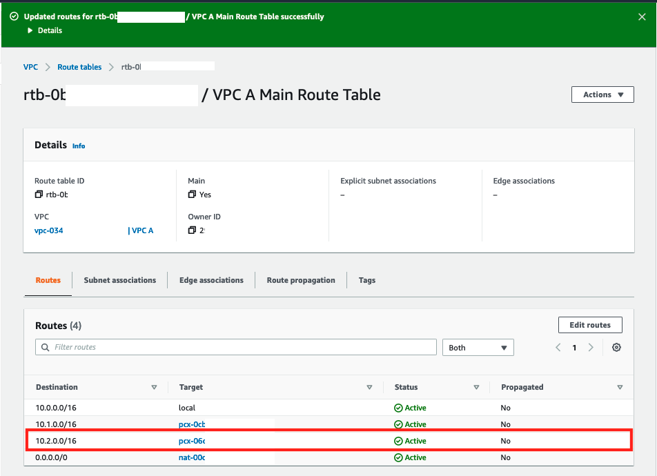
6. Confirme que a nova rota aparece na aba **Routes**.  
   

#### Atualizar a Tabela de Rotas na VPC C

1. Navegue de volta para **Route tables** e selecione a caixa de seleção para a **VPC C Private Route Table**.
2. Clique na aba **Routes**.
3. Clique em **Edit routes**.  
   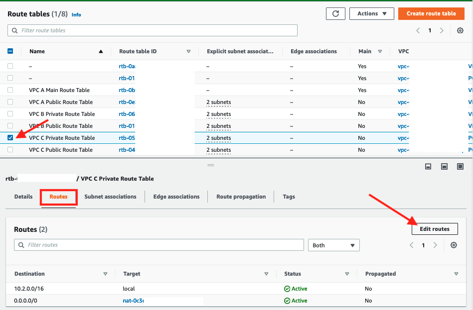
4. Adicione uma entrada de rota para VPC A usando o CIDR `10.0.0.0/16` como destino e `VPC A <> VPC C` como alvo.  
   
5. Clique em **Save changes**.
6. A tabela de rotas será atualizada com as rotas para a conexão de peering.  
   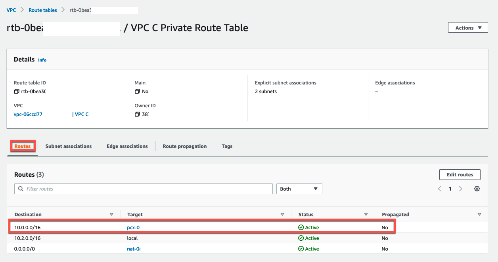

### Verificar a Conectividade

#### Verificar a Conectividade a partir da VPC A

1. Acesse o **Console EC2**.
2. Selecione a instância EC2 **VPC A Private AZ1 Server** e clique no botão **Connect** acima.  
   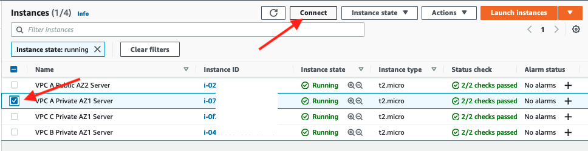
3. Clique em **Connect** na aba **Session Manager**.
4. Tente pingar as instâncias EC2 nas VPCs B e C usando os endereços privados das instâncias:
   ```bash
   ping 10.1.1.100 -c 5
   ping 10.2.1.100 -c 5
   ```
   Se o peering e o roteamento estiverem configurados corretamente, você poderá pingar ambas as instâncias.  
   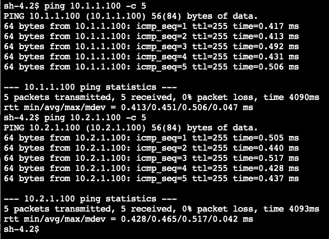

#### Verificar a Conectividade a partir da VPC B

1. Termine a conexão do Session Manager e, na tela resultante, clique em **Instances**.
2. Selecione a instância EC2 **VPC B Private AZ1 Server** e conecte-se usando Session Manager.  
   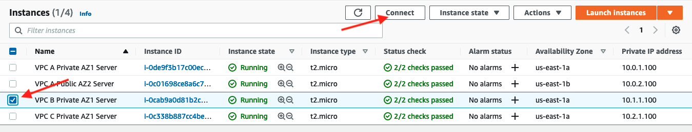
3. Pingue a instância EC2 na VPC A usando o endereço IP `10.0.1.100`:
   ```bash
   ping 10.0.1.100 -c 5
   ```
    *(imagem ilustrativa)*
4. Você consegue pingar a instância na VPC C usando o endereço IP `10.2.1.100`?
   ```bash
   ping 10.2.1.100 -c 5
   ```
   Não há peering direto entre VPC B e VPC C. VPC B e VPC C não podem se comunicar via VPC A porque o peering VPC não permite roteamento transitivo.
5. Termine a conexão do Session Manager e feche a aba do navegador.

**Parabéns!** Você configurou uma arquitetura de peering que conecta a VPC A às VPCs B e C, mas impede que VPC B e VPC C se comuniquem.

Embora essa abordagem possa ser usada para interconectar muitas VPCs, gerenciar muitas conexões ponto a ponto pode ser complicado em escala. Uma abordagem mais escalável é utilizar o AWS Transit Gateway. Portanto, removeremos agora as conexões de peering ponto a ponto entre as VPCs para preparar a configuração do Transit Gateway (TGW) e interconectar as três VPCs.

### Excluir as Conexões de Peering VPC

1. No painel VPC, navegue até **Peering Connections**.
2. Selecione a conexão de peering **VPC A <> VPC B** e exclua-a clicando em **Actions** e selecionando **Delete peering connection**.  
   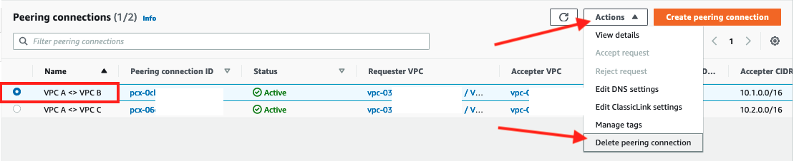
3. Marque a caixa de seleção para **Delete related route table entries** para evitar cenários de blackholing de tráfego.  
   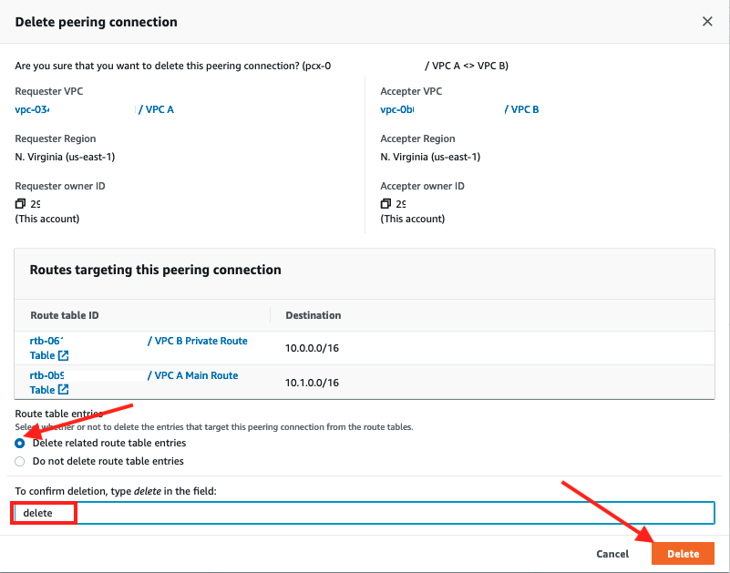
4. Digite **delete** na caixa de texto e clique em **Delete**.
5. Repita a exclusão da conexão de peering VPC para a conexão **VPC A <> VPC C**.

**Parabéns!** Você concluiu esta seção do laboratório.

---

## Transit Gateway

O AWS Transit Gateway conecta suas VPCs e redes on-premises por meio de um hub central. Isso simplifica sua rede e acaba com relacionamentos de peering complexos. Ele atua como um roteador em nuvem – cada nova conexão é feita apenas uma vez.

### Criar o Transit Gateway

1. No painel esquerdo do VPC Dashboard, role para baixo e clique em **Transit Gateways**.
2. Clique em **Create Transit Gateway**.  
   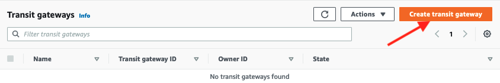
3. Adicione um nome para o novo Transit Gateway como **TGW** e uma descrição de **TGW for us-east-1**.  
   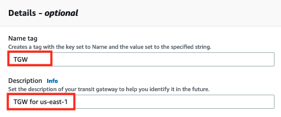
4. Selecione **Multicast support** e mantenha as demais configurações nos padrões. Você precisará desta opção ativada se avançar para o laboratório avançado de multicast. Clique em **Create transit gateway**.  
   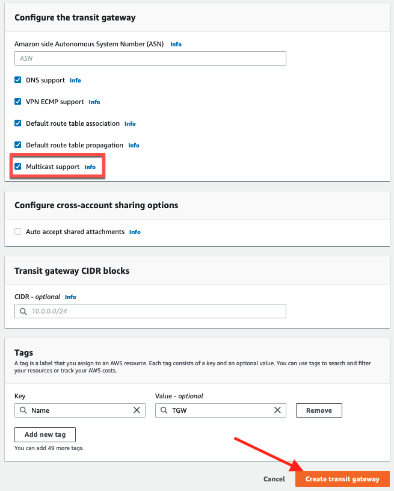
5. O estado do novo transit gateway mostrará **pending** por alguns minutos.  
   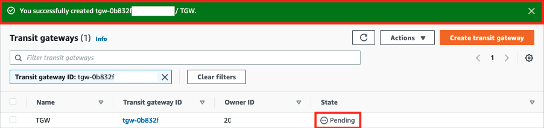

### Anexar VPCs ao Transit Gateway

A prática recomendada para conectar VPCs ao Transit Gateway é usar uma sub-rede dedicada `/28` em cada zona de disponibilidade. O CloudFormation executado anteriormente criou estas para VPC B e VPC C juntamente com duas sub-redes privadas e públicas /24 para hospedar workloads.

No entanto, o laboratório "VPC Fundamentals" criou apenas as duas sub-redes públicas e duas privadas /24 para a VPC A. Nosso ambiente AWS atualmente se parece com isto:

**VPC A após o CFN**

Portanto, antes de criarmos o anexo do transit gateway, precisamos adicionar uma sub-rede dedicada `/28` em cada zona de disponibilidade na VPC A para os anexos do transit gateway.

#### Criar Subnets do Transit Gateway na VPC A

1. No painel VPC, clique em **Subnets** e clique no botão **Create subnet**.  
   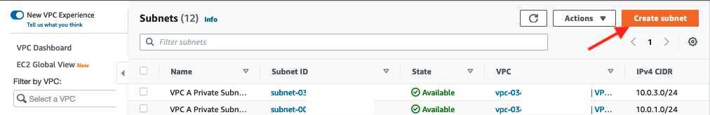
2. Crie uma subnet na VPC A com o nome **VPC A TGW Subnet AZ1** em `us-east-1a` com um bloco CIDR de `10.0.5.0/28`.  
   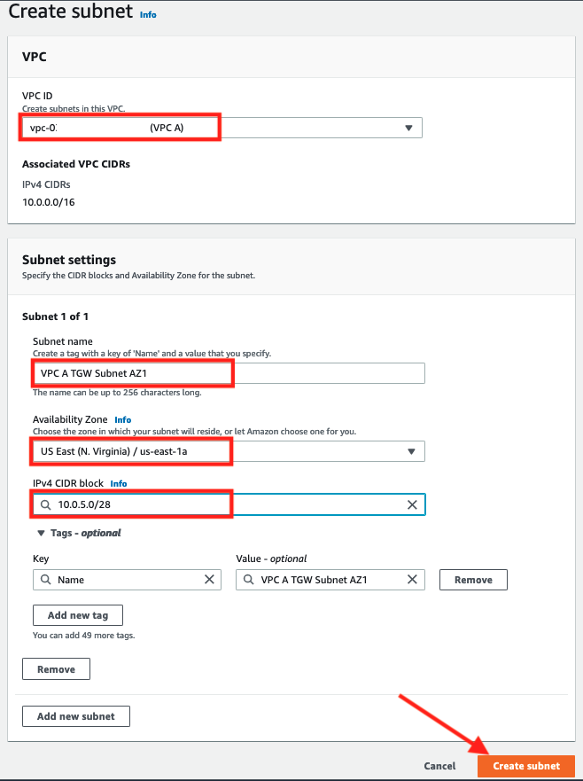
3. Crie outra subnet na VPC A com o nome **VPC A TGW Subnet AZ2** em `us-east-1b` com um bloco CIDR de `10.0.5.16/28`.  
   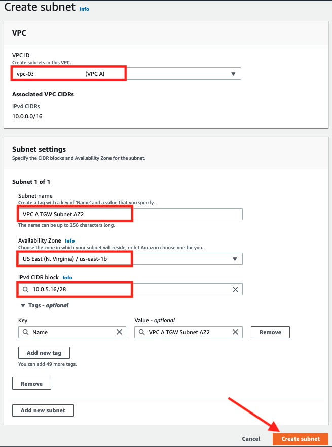

Agora que temos subnets para colocar os anexos do transit gateway, anexaremos VPC A, VPC B e VPC C ao transit gateway e testaremos a conectividade entre nossas instâncias EC2 em cada VPC.

**VPCs alinhadas**  
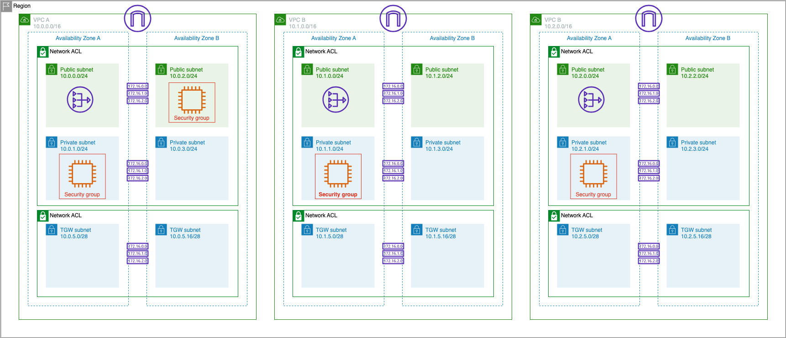

#### Criar Anexo do Transit Gateway para VPC A

1. No painel de navegação esquerdo, vá para **Transit Gateway Attachments**.
2. Clique em **Create Transit Gateway Attachment**.  
   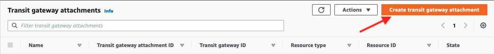
3. Insira **VPC A Attachment** como a tag Name.
4. Selecione o transit gateway no menu suspenso para **Transit Gateway ID**.
5. Mantenha o **Attachment Type** como **VPC**.  
   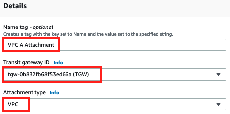
6. Selecione **VPC A** no menu suspenso **VPC ID**.
7. Selecione **VPC A TGW Subnet AZ1** e **VPC A TGW Subnet AZ2** para os IDs de Subnet.  
   
   **Nota:** As subnets TGW não serão selecionadas por padrão; verifique se as subnets são as TGW.
8. Clique em **Create transit gateway attachment** no canto inferior direito.
9. O anexo VPC deve ser criado com sucesso e ficará no estado **pending** inicialmente.  
   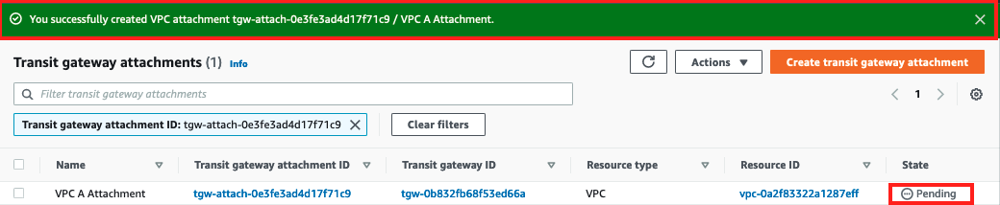

#### Criar Anexo do Transit Gateway para VPC B

1. Clique em **Create Transit Gateway Attachment**.
2. Insira **VPC B Attachment** como a tag Name.
3. Selecione o transit gateway no menu suspenso para **Transit Gateway ID**.
4. Mantenha o **Attachment Type** como **VPC**.  
   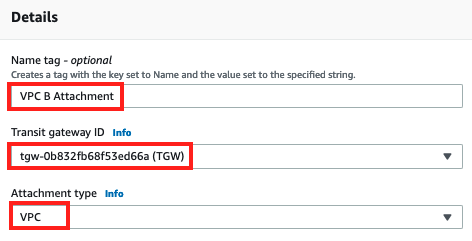
5. Selecione **VPC B** no menu suspenso **VPC ID**.
6. Selecione **VPC B TGW Subnet AZ1** e **VPC B TGW Subnet AZ2** para os IDs de Subnet.  
   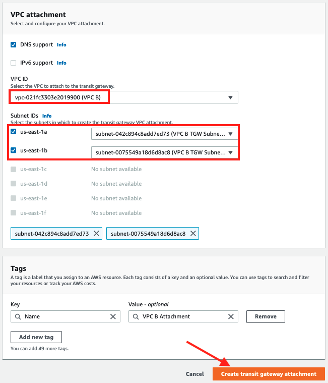
   **Nota:** As subnets TGW não serão selecionadas por padrão; verifique se as subnets são as TGW.
7. Clique em **Create transit gateway attachment** no canto inferior direito.
8. O anexo VPC deve ser criado com sucesso e ficará no estado **pending** inicialmente.  
   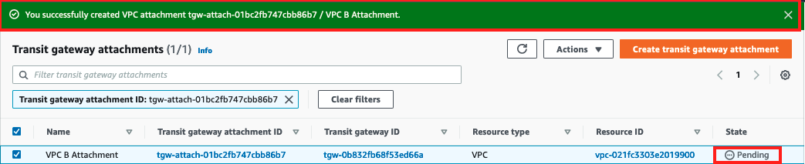

#### Criar Anexo do Transit Gateway para VPC C

1. Clique em **Create Transit Gateway Attachment**.
2. Nomeie o anexo como **VPC C Attachment**.
3. Selecione o transit gateway no menu suspenso para **Transit Gateway ID**.
4. Mantenha o **Attachment Type** como **VPC**.  
   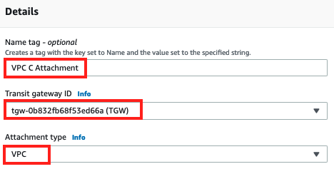
5. Selecione **VPC C** no menu suspenso **VPC ID**.
6. Selecione **VPC C TGW Subnet AZ1** e **VPC C TGW Subnet AZ2** para os IDs de Subnet.  
   
   **Nota:** As subnets TGW não serão selecionadas por padrão; verifique se as subnets são as TGW.
7. Clique em **Create transit gateway attachment** no canto inferior direito.
8. O anexo VPC deve ser criado com sucesso e ficará no estado **pending** inicialmente.  
   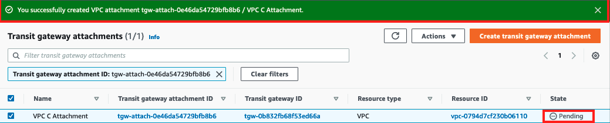

#### Visualizar as Interfaces de Rede

Vamos dar uma olhada em como o Transit Gateway se anexou à VPC.

1. No painel esquerdo do EC2 Dashboard, clique em **Network Interfaces**.
2. Existem agora seis interfaces com uma descrição começando com "Network Interface for Transit Gateway Attachment..." representando as Elastic Network Interfaces que foram colocadas em cada uma das duas subnets do Transit Gateway em cada uma das três VPCs.

Agora que temos anexos em todas as três VPCs, precisamos adicionar rotas às suas tabelas de rotas para apontar o tráfego para as interfaces.

### Adicionar Rotas ao TGW nas Tabelas de Rotas da VPC

#### VPC A (Tabela Privada)

1. No painel esquerdo do VPC Dashboard, clique em **Route Tables**.
2. Selecione a caixa de seleção para **VPC A Private Route Table**, role para baixo, selecione a aba **Routes** e clique em **Edit routes**.  
   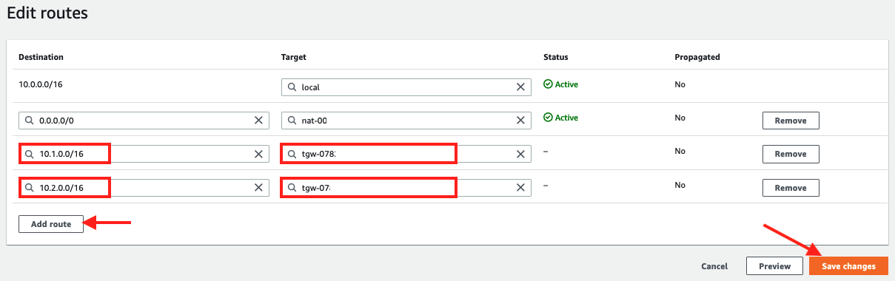
3. Adicione uma rota para VPC B na VPC A Private Route Table usando um destino de `10.1.0.0/16` com um alvo sendo o transit gateway.
4. Adicione uma rota para VPC C na VPC A Private Route Table usando um destino de `10.2.0.0/16` com um alvo sendo o transit gateway.  
   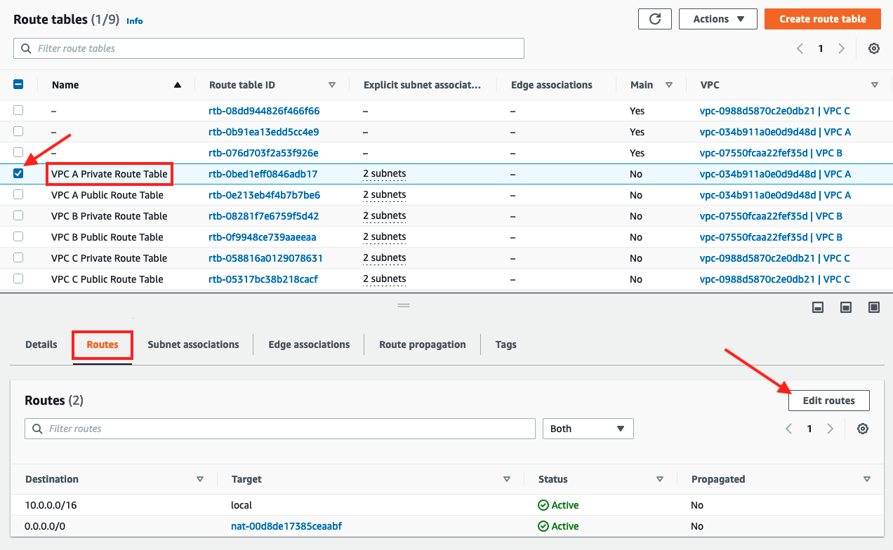
5. Clique em **Save changes**.
6. Confirme que as rotas foram adicionadas à tabela de rotas.  
   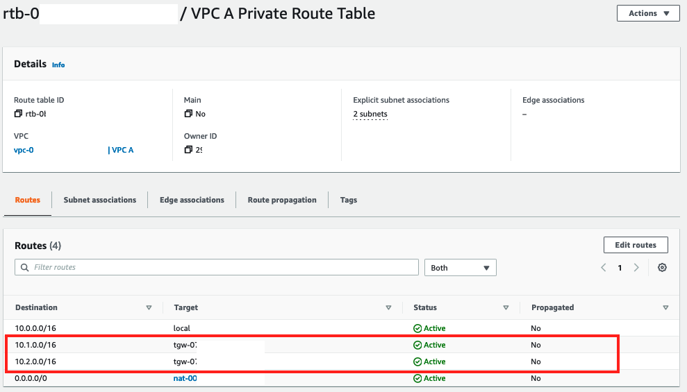

#### VPC B (Tabela Privada)

1. Clique em **Route tables**.
2. Selecione a caixa de seleção para **VPC B Private Route Table**, role para baixo, selecione a aba **Routes** e clique em **Edit routes**.  
   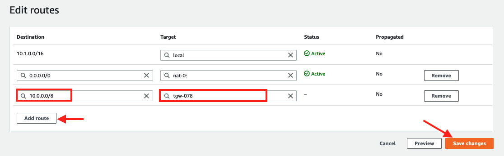
3. Adicione uma rota agregada com um destino de `10.0.0.0/8` com um alvo sendo o transit gateway. Clique em **Save routes**.  
   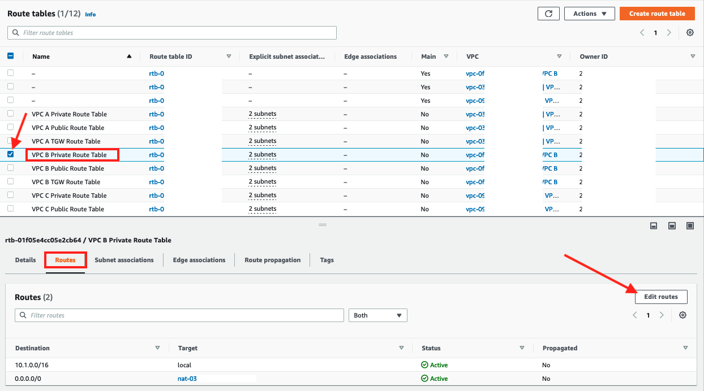
4. Confirme que a rota foi adicionada à VPC B Private Route Table.  
   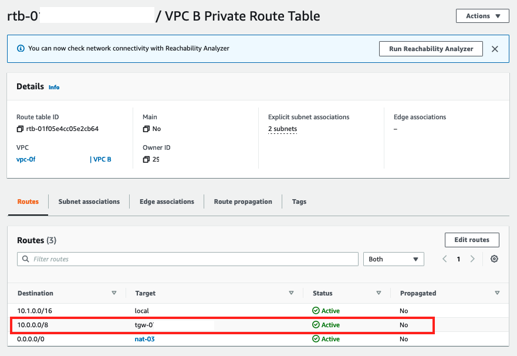

#### VPC C (Tabela Privada)

1. Clique em **Route tables**.
2. Selecione a caixa de seleção para **VPC C Private Route Table**, role para baixo, selecione a aba **Routes** e clique em **Edit routes**.  
   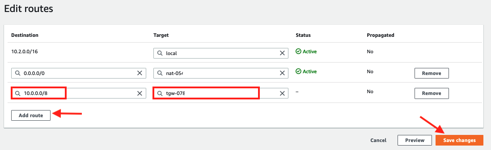
3. Adicione uma rota agregada com um destino de `10.0.0.0/8` com um alvo sendo o transit gateway. Clique em **Save routes**.  
   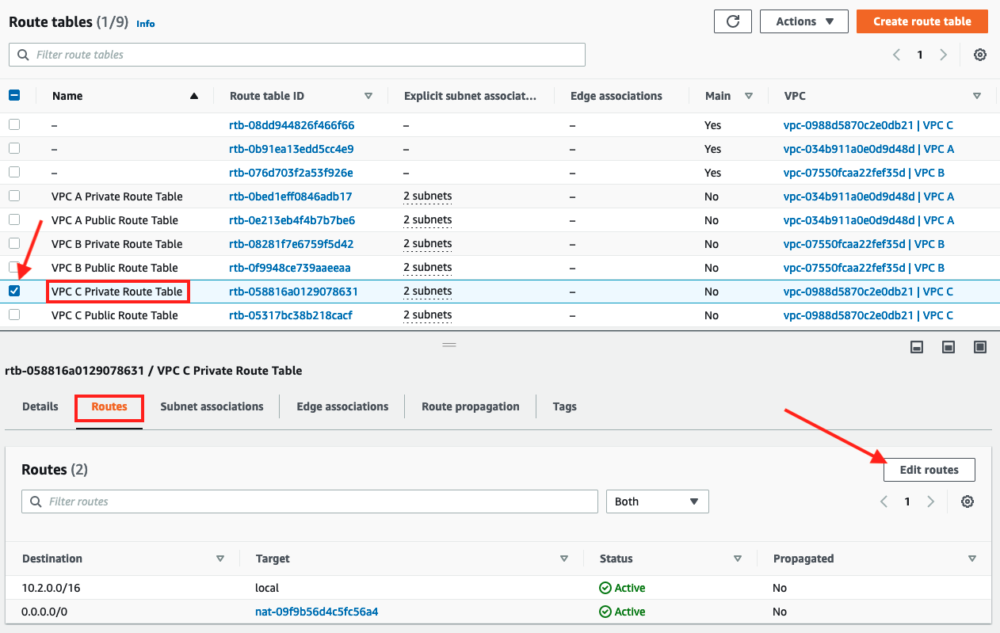
4. Confirme que a rota foi adicionada à VPC C Private Route Table.  
   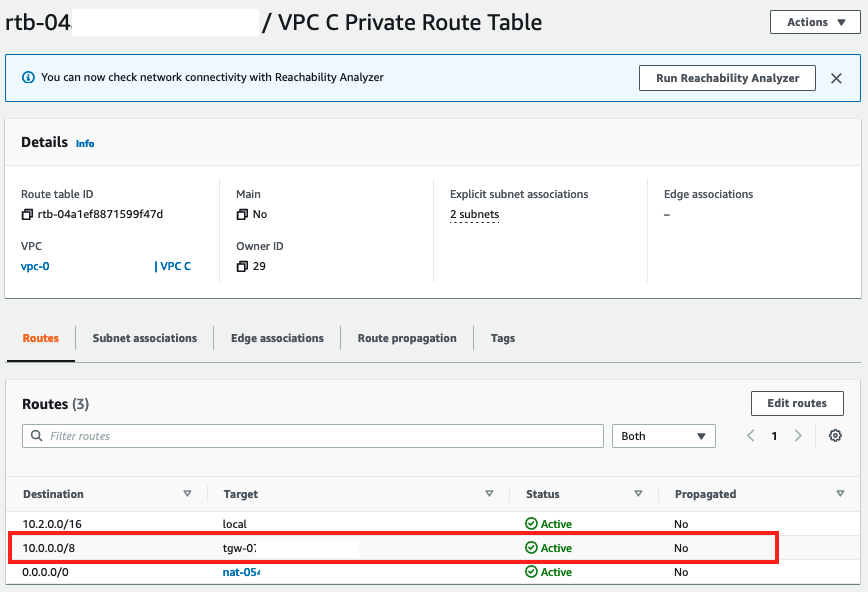

### Testar a Conectividade

Agora vamos testar a conectividade entre as instâncias nas subnets privadas nas VPCs A, B e C.

1. Navegue até **Instances** no EC2 Dashboard.
2. Selecione a caixa de seleção para **VPC A Private AZ1 Server** e clique em **Connect** para usar o Session Manager para conectar.
3. Confirme a conectividade entre as VPCs pingando o endereço IP das instâncias na VPC B e VPC C com os seguintes comandos:
   ```bash
   ping 10.1.1.100 -c 5
   ping 10.2.1.100 -c 5
   ```
   Você deve ver uma resposta de ambas as instâncias EC2.  
   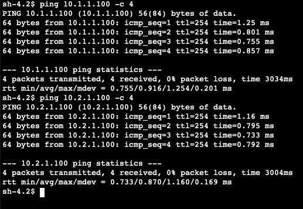

**Parabéns!** Agora você tem uma arquitetura multi-VPC com conectividade entre as VPCs fornecida pelo Transit Gateway.

### Tabelas de Rotas do Transit Gateway

Seu transit gateway roteia pacotes IPv4 e IPv6 entre anexos usando tabelas de rotas do transit gateway. Você pode configurar essas tabelas de rotas para propagar rotas das tabelas de rotas das VPCs anexadas, conexões VPN e gateways Direct Connect. Você também pode adicionar rotas estáticas às tabelas de rotas do transit gateway. Quando um pacote vem de um anexo, ele é roteado para outro anexo usando a rota que corresponde ao endereço IP de destino.

Nesta seção, exploraremos o uso de tabelas de rotas do transit gateway para fornecer segmentação de rede.

#### Inspecionar a Tabela de Rotas Padrão do Transit Gateway

1. No painel VPC, role para baixo e clique em **Transit Gateway Route Tables**.
2. Selecione a tabela de rotas do Transit Gateway, role para baixo e clique na aba **Associations**. Você verá os três anexos para as três VPCs.  
   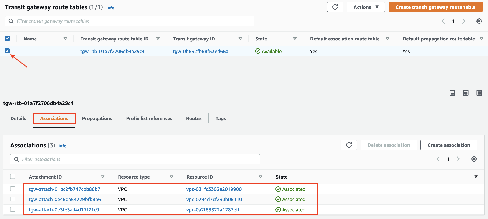
3. Em seguida, clique na aba **Propagations**. Você verá que todos os três anexos estão propagando os CIDRs das VPCs.  
   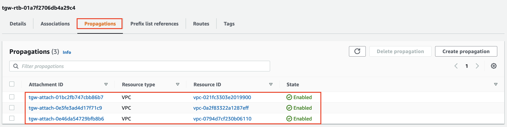
4. Finalmente, clique na aba **Routes**. Você verá as três rotas para as três VPCs.  
   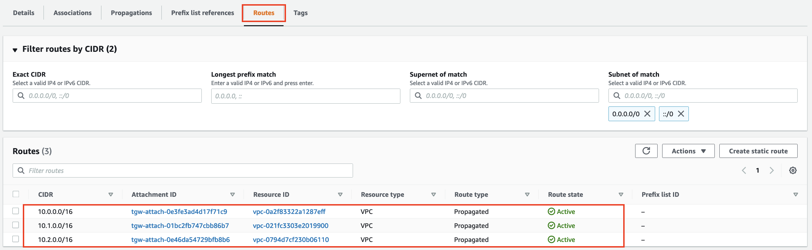

Como vimos, o Transit Gateway automaticamente associa VPCs recém-anexadas à tabela de rotas padrão e propaga rotas das VPCs na Tabela de Rotas do Transit Gateway. Isso torna muito fácil para as VPCs terem conectividade com outras VPCs.

**Diagrama da Tabela de Rotas do TGW**  
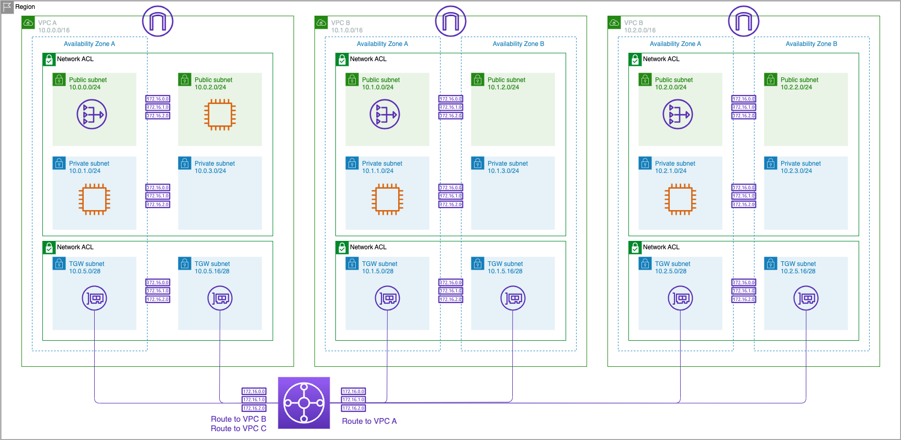

Mas há momentos em que não queremos que VPCs tenham conectividade com outras VPCs, exceto para uma VPC de Serviços Compartilhados. Para este laboratório, usaremos a VPC A como nossa VPC de Serviços Compartilhados e modificaremos as configurações padrão na tabela de rotas do Transit Gateway para que VPC B e VPC C não possam conversar entre si, mas ambas possam se comunicar com quaisquer serviços compartilhados na VPC A.

**Diagrama de Serviços Compartilhados**  
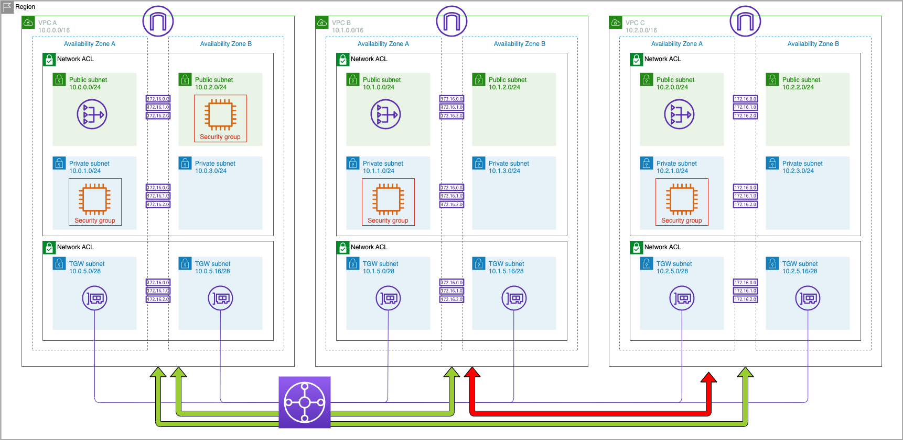

Esta é uma configuração típica de VPC de "serviços compartilhados" na qual a VPC A hospedaria serviços como LDAP, DNS ou outros recursos compartilhados.

#### Excluir o Anexo da VPC A da Tabela de Rotas do Transit Gateway

A primeira coisa que precisamos fazer é excluir a associação da VPC A da tabela de rotas original do Transit Gateway que você criou. Você precisa referenciar o **Resource ID** da VPC para garantir que está excluindo a VPC correta.

1. Navegue até **Your VPCs** e anote o ID da VPC para VPC A.  
   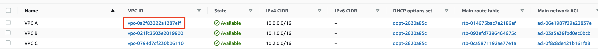
2. Navegue de volta para **Transit Gateway Route Tables**.
3. Selecione a caixa de seleção para a tabela de rotas do TGW e role para baixo até a aba **Associations**.
4. Selecione a associação com o **Resource ID** que corresponde ao ID da VPC A anotado anteriormente e clique em **Delete association**.  
   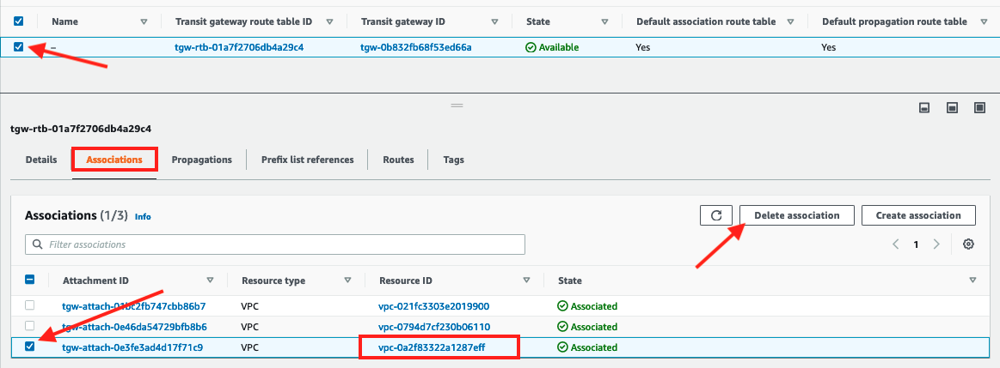 *(a imagem mostra VPC C, mas o procedimento é o mesmo)*
5. Confirme a exclusão clicando em **Delete Association** na tela seguinte.  
   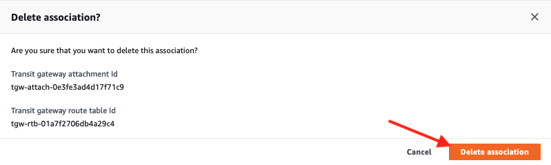
6. A associação entrará no estado **disassociating**.  
   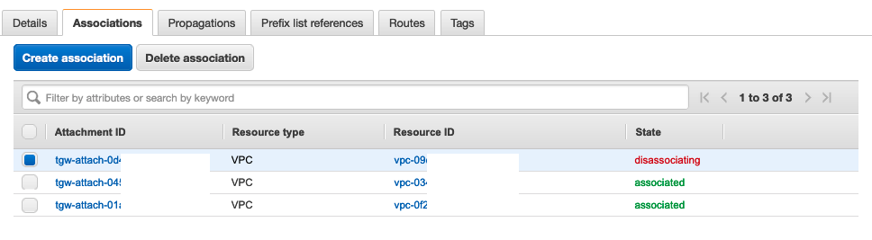

#### Excluir Propagação das VPCs B e C da Tabela de Rotas do Transit Gateway

Excluiremos agora as propagações que foram criadas automaticamente para VPC B e VPC C, uma de cada vez, da tabela de rotas, de modo que a única que permaneça seja aquela para o ID da VPC A. Isso removerá as rotas para VPC B e VPC C para que não possam alcançar uma à outra através desta tabela de rotas.

1. Navegue até a aba **Propagations**.
2. Selecione uma das propagações onde o **Resource ID** **NÃO** corresponde ao ID da VPC anotado para VPC A e clique em **Delete propagation**.  
   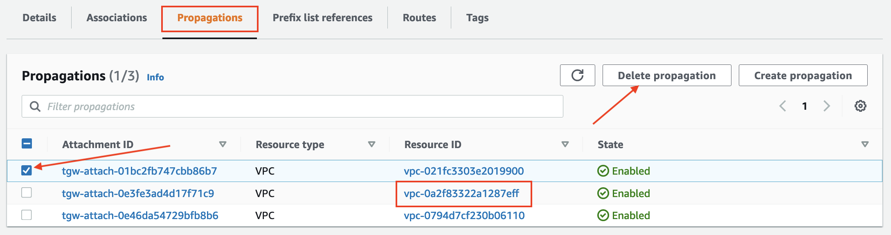
3. Confirme a exclusão clicando em **Delete propagation** no pop-up.  
   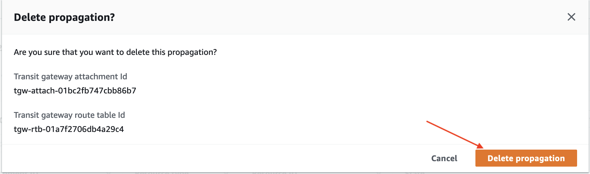
4. Selecione a outra propagação onde o **Resource ID** **NÃO** corresponde ao ID da VPC A e clique em **Delete propagation**.  
   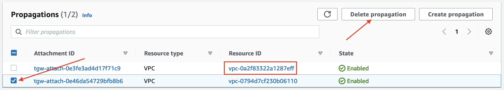
5. Confirme a exclusão clicando em **Delete propagation** no pop-up.  
   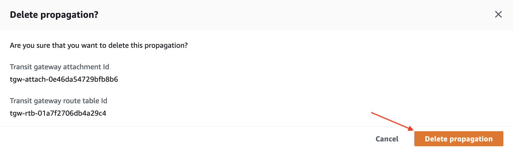
6. Navegue até a aba **Routes** para verificar o resultado (pode levar alguns segundos para atualizar).  
   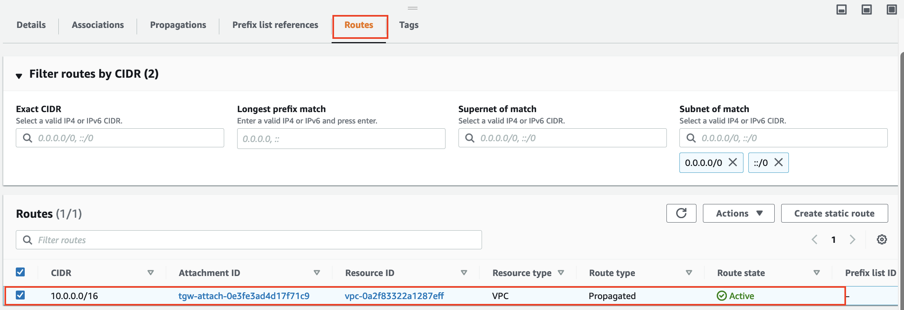

A única rota na tabela de rotas original do Transit Gateway deve ser uma rota propagada para `10.0.0.0/16` para a VPC A.

Os anexos para VPC B e VPC C ainda estão associados à tabela de rotas original, e isso significa que tanto VPC B quanto VPC C podem alcançar a VPC A através da tabela de rotas, pois há uma rota para `10.0.0.0/16` sendo propagada para ela pela VPC A.

No entanto, o anexo da VPC A não está mais associado a uma tabela de rotas no TGW e, portanto, não há informações de roteamento que permitiriam que o tráfego alcançasse VPC B e VPC C a partir da VPC A. Para adicionar essas rotas, criaremos agora outra tabela de rotas para a VPC A usar.

#### Criar Tabela de Rotas de Serviços Compartilhados

Para criar um caminho de retorno da VPC A, criaremos uma nova Tabela de Rotas de Serviços Compartilhados.

1. Clique em **Create Transit Gateway Route Table**.  
   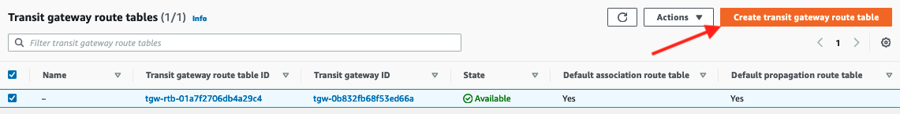
2. Insira **Shared Services TGW Route Table** como a tag Name e selecione o transit gateway no menu suspenso para **Transit Gateway ID**.  
   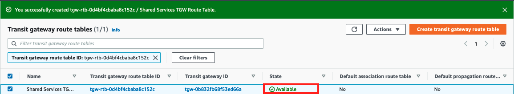 *(imagem ilustrativa)*
3. Clique em **Create transit gateway route table** e aguarde a nova tabela de rotas mudar o estado para **available**.  
   
4. Role para baixo até a aba **Associations** e clique em **Create association**.  
   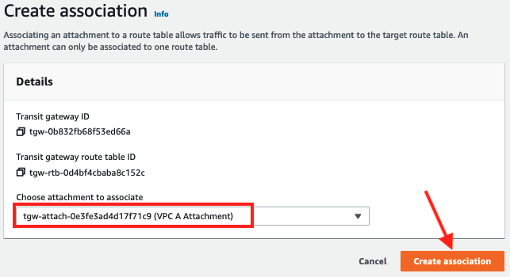
5. Associe o anexo da VPC A à tabela de rotas de Serviços Compartilhados selecionando-o no menu suspenso e clicando em **Create association**.  
    *(já usada)*

#### Criar Propagação para VPC B e VPC C

Agora que a VPC A está associada à nova Tabela de Rotas de Serviços Compartilhados no Transit Gateway, precisamos criar propagações para VPC B e VPC C para que esta tabela de rotas saiba como acessar `10.1.0.0/16` e `10.2.0.0/16`. Isso permite que a VPC A tenha um caminho de retorno para ambas as VPCs.

1. Navegue até a aba **Propagations** e clique em **Create propagation**.  
   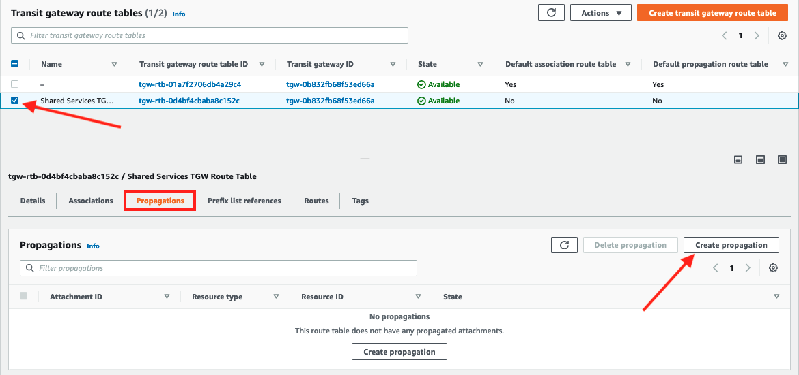
2. Selecione o anexo da VPC B no menu suspenso e clique em **Create propagation**.  
   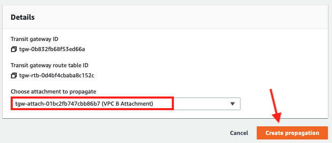
3. Repita o processo para adicionar uma propagação para a VPC C, de modo que haja duas propagações na aba **Propagations**.  
   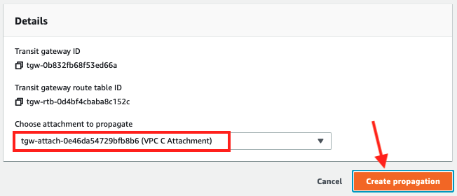
4. Agora deve haver duas propagações na aba **Propagations**.  
   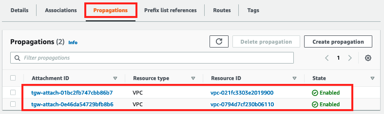
5. Dê uma olhada na aba **Routes** da tabela de rotas de serviços compartilhados.  
   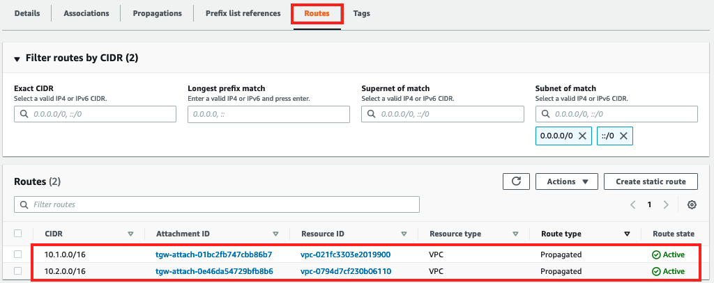
   Deve haver rotas para VPC B (`10.1.0.0/16`) e VPC C (`10.2.0.0/16`).

**Diagrama de Domínios de Roteamento de Serviços Compartilhados**  


#### Testar a Conectividade

Agora vamos usar o Session Manager para conectar à instância EC2 na VPC B e testar a conectividade com as instâncias na VPC A e VPC C.

1. No EC2 Dashboard, clique em **EC2 Instances**.
2. Selecione **VPC B Private AZ1 Server** e clique em **Connect**.
3. Na aba **Session Manager**, clique em **Connect**.
4. Pingue os servidores na VPC A (`10.0.1.100`) e na VPC C (`10.2.1.100`):
   ```bash
   ping 10.0.1.100 -c 5
   ping 10.2.1.100 -c 5
   ```
   Resultado esperado:
   ```
   sh-4.2$ ping 10.0.1.100 -c 5
   PING 10.0.1.100 (10.0.1.100) 56(84) bytes of data.
   64 bytes from 10.0.1.100: icmp_seq=1 ttl=254 time=1.002 ms
   64 bytes from 10.0.1.100: icmp_seq=2 ttl=254 time=0.909 ms
   ...
   --- 10.0.1.100 ping statistics ---
   5 packets transmitted, 5 received, 0% packet loss, time 4004ms
   
   sh-4.2$ ping 10.2.1.100 -c 5
   PING 10.2.1.100 (10.2.1.100) 56(84) bytes of data.
   --- 10.2.1.100 ping statistics ---
   5 packets transmitted, 0 received, 100% packet loss, time 4072ms
   ```

Agora, porque excluímos a associação na tabela de rotas principal, VPC B pode conversar com VPC A, mas VPC B não pode conversar com VPC C.

**Parabéns!** Você estabeleceu a segmentação de rede usando as tabelas de rotas do Transit Gateway e completou o laboratório.

---

## Clean Up (Limpeza)

Se você está usando sua própria conta AWS para conduzir este workshop e terminou, siga as etapas abaixo para limpar os recursos.

**Aviso:** Você só deve completar esta seção de limpeza se não planeja continuar com este workshop. Certifique-se de encerrar/excluir os recursos abaixo para evitar cobranças desnecessárias.

### Excluir o Transit Gateway e seus anexos

Siga as etapas para excluir o TGW e os três anexos de VPC.

### Excluir os recursos restantes

- **Opção 1:** Você começou este laboratório do início (com o template CloudFormation) – execute a exclusão da stack do CloudFormation.
- **Opção 2:** Você começou o laboratório na seção Multi VPCs implantando o template CloudFormation – exclua a stack.

**Finalizado:** Após completar as etapas acima, você terminou. Se quiser continuar o workshop mais tarde, pode pular esta etapa e usar o template CloudFormation na próxima etapa para construir os pré‑requisitos.

---

## Execução com Terraform (Opcional)

Este laboratório pode ser automatizado com Terraform usando os módulos mencionados na seção "Estrutura de Módulos". A implementação completa será fornecida em arquivos separados (`main.tf`, `variables.tf`, `outputs.tf`) dentro do diretório `labs/02-multiple-vpcs`. Por enquanto, o foco deste README é o passo a passo conceitual e manual.

Para executar com Terraform, aguarde o desenvolvimento dos módulos correspondentes.
```

