# 🧪 Laboratório 03: Security Controls

> ⚠️ **Nota:** Este módulo é **opcional** e não é necessário para prosseguir com o workshop. Você pode pular para o próximo laboratório [Connecting to On-Premises](../04-connecting-to-on-premises/README.md).

Se você está executando este laboratório no **AWS Workshop Studio**, a região foi definida pelo seu facilitador. A região que você vê nas capturas de tela pode não corresponder ao seu ambiente. Isso não causará problemas.

Se você está executando este laboratório em sua própria conta AWS, é recomendado que todos os recursos sejam criados na região **us-east-1** para que as capturas de tela correspondam ao seu ambiente. Isso não é obrigatório.

---

## ✅ Pré‑requisitos

### Se você **não** concluiu a seção **Multiple VPCs**:

1. Complete os pré‑requisitos da seção anterior.
2. Utilize o modelo CloudFormation abaixo para criar três VPCs conectadas por um Transit Gateway.  
   <details>
   <summary><strong>Clique para expandir o template CloudFormation</strong></summary>

   ```yaml
   AWSTemplateFormatVersion: "2010-09-09"
   Description: "Create VPC A, VPC B and VPC C each with an IGW, NATGW and public and private subnets in 2AZs using 10.0.0.0/16, 10.1.0.0/16 and 10.2.0.0/16"

   Metadata:
     "AWS::CloudFormation::Interface":
       ParameterGroups:
         - Label:
             default: "VPC Parameters"
           Parameters:
             - AvailabilityZoneA
             - AvailabilityZoneB

   Parameters:
     AvailabilityZoneA:
       Description: Availability Zone 1
       Type: AWS::EC2::AvailabilityZone::Name
       Default: us-east-1a
     AvailabilityZoneB:
       Description: Availability Zone 2
       Type: AWS::EC2::AvailabilityZone::Name
       Default: us-east-1b
     AMI:
       Type: AWS::SSM::Parameter::Value<AWS::EC2::Image::Id>
       Description: 'The ID of the AMI.'
       Default: /aws/service/ami-amazon-linux-latest/al2023-ami-kernel-6.1-x86_64
     ParticipantIPAddress:
       Type: String
       Description: 'What is your external IP address in the format x.x.x.x/32? This entry will be added to certain Security Groups. Find out at https://checkip.amazonaws.com/'
       AllowedPattern: "^(([0-9]|[1-9][0-9]|1[0-9]{2}|2[0-4][0-9]|25[0-5])\\.){3}([0-9]|[1-9][0-9]|1[0-9]{2}|2[0-4][0-9]|25[0-5])(\\/(32))$"
       ConstraintDescription: must be a valid IP address of the form x.x.x.x/32.

   Resources:
     # VPC A Resources
     VpcA:
       Type: AWS::EC2::VPC
       Properties:
         CidrBlock: "10.0.0.0/16"
         EnableDnsSupport: "true"
         EnableDnsHostnames: "true"
         InstanceTenancy: default
         Tags:
           - Key: Name
             Value: "VPC A"

     VpcAPublicSubnet1:
       Type: AWS::EC2::Subnet
       DependsOn: 
         - VpcA
       Properties:
         AvailabilityZone: !Ref AvailabilityZoneA
         CidrBlock: "10.0.0.0/24"
         MapPublicIpOnLaunch: true
         Tags:
           - Key: Name
             Value: "VPC A Public Subnet AZ1"
         VpcId: !Ref VpcA

     VpcAPublicSubnet2:
       Type: AWS::EC2::Subnet
       DependsOn: 
         - VpcA
       Properties:
         AvailabilityZone: !Ref AvailabilityZoneB
         CidrBlock: "10.0.2.0/24"
         MapPublicIpOnLaunch: true
         Tags:
           - Key: Name
             Value: "VPC A Public Subnet AZ2"
         VpcId: !Ref VpcA

     VpcAPublicSubnetRouteTable:
       Type: AWS::EC2::RouteTable
       DependsOn: VpcA
       Properties:
         VpcId: !Ref VpcA
         Tags:
           - Key: Name
             Value: "VPC A Public Route Table"

     VpcAPublicSubnet1RouteTableAssociation:
       Type: AWS::EC2::SubnetRouteTableAssociation
       DependsOn: 
         - VpcAPublicSubnetRouteTable
         - VpcAPublicSubnet1
       Properties:
         RouteTableId: !Ref VpcAPublicSubnetRouteTable
         SubnetId: !Ref VpcAPublicSubnet1

     VpcAPublicSubnet2RouteTableAssociation:
       Type: AWS::EC2::SubnetRouteTableAssociation
       DependsOn: 
         - VpcAPublicSubnetRouteTable
         - VpcAPublicSubnet2
       Properties:
         RouteTableId: !Ref VpcAPublicSubnetRouteTable
         SubnetId: !Ref VpcAPublicSubnet2

     VpcAPrivateSubnet1:
       Type: AWS::EC2::Subnet
       DependsOn: 
         - VpcA
       Properties:
         AvailabilityZone: !Ref AvailabilityZoneA
         CidrBlock: "10.0.1.0/24"
         MapPublicIpOnLaunch: false
         Tags:
           - Key: Name
             Value: "VPC A Private Subnet AZ1"
         VpcId: !Ref VpcA

     VpcAPrivateSubnet2:
       Type: AWS::EC2::Subnet
       DependsOn: 
         - VpcA
       Properties:
         AvailabilityZone: !Ref AvailabilityZoneB
         CidrBlock: "10.0.3.0/24"
         MapPublicIpOnLaunch: false
         Tags:
           - Key: Name
             Value: "VPC A Private Subnet AZ2"
         VpcId: !Ref VpcA

     VpcAPrivateSubnetRouteTable:
       Type: AWS::EC2::RouteTable
       DependsOn: VpcA
       Properties:
         VpcId: !Ref VpcA
         Tags:
           - Key: Name
             Value: "VPC A Private Route Table"

     VpcAPrivateSubnet1RouteTableAssociation:
       Type: AWS::EC2::SubnetRouteTableAssociation
       DependsOn:
         - VpcAPrivateSubnetRouteTable
         - VpcAPrivateSubnet1
       Properties:
         RouteTableId: !Ref VpcAPrivateSubnetRouteTable
         SubnetId: !Ref VpcAPrivateSubnet1

     VpcAPrivateSubnet2RouteTableAssociation:
       Type: AWS::EC2::SubnetRouteTableAssociation
       DependsOn:
         - VpcAPrivateSubnetRouteTable
         - VpcAPrivateSubnet2
       Properties:
         RouteTableId: !Ref VpcAPrivateSubnetRouteTable
         SubnetId: !Ref VpcAPrivateSubnet2

     VpcAWorkloadSubnetsNacl:
       Type: AWS::EC2::NetworkAcl
       DependsOn: VpcA
       Properties:
         VpcId: !Ref VpcA
         Tags:
           - Key: Name
             Value: "VPC A Workload Subnets NACL"

     VpcAWorkloadSubnetsNaclInboundRule:
       Type: AWS::EC2::NetworkAclEntry
       Properties:
         NetworkAclId: !Ref VpcAWorkloadSubnetsNacl
         RuleNumber: 100
         Protocol: -1
         RuleAction: allow
         CidrBlock: 0.0.0.0/0

     VpcAWorkloadSubnetsNaclOutboundRule:
       Type: AWS::EC2::NetworkAclEntry
       Properties:
         NetworkAclId: !Ref VpcAWorkloadSubnetsNacl
         RuleNumber: 100
         Protocol: -1
         Egress: true
         RuleAction: allow
         CidrBlock: 0.0.0.0/0

     VpcANetworkAclAssociationPublicSubnet1:
       Type: AWS::EC2::SubnetNetworkAclAssociation
       DependsOn: 
         - VpcAPublicSubnet1
         - VpcAWorkloadSubnetsNacl
       Properties:
         SubnetId: !Ref VpcAPublicSubnet1
         NetworkAclId: !Ref VpcAWorkloadSubnetsNacl

     VpcANetworkAclAssociationPublicSubnet2:
       Type: AWS::EC2::SubnetNetworkAclAssociation
       DependsOn: 
         - VpcAPublicSubnet2
         - VpcAWorkloadSubnetsNacl
       Properties:
         SubnetId: !Ref VpcAPublicSubnet2
         NetworkAclId: !Ref VpcAWorkloadSubnetsNacl

     VpcANetworkAclAssociationPrivateSubnet1:
       Type: AWS::EC2::SubnetNetworkAclAssociation
       DependsOn: 
         - VpcAPrivateSubnet1
         - VpcAWorkloadSubnetsNacl
       Properties:
         SubnetId: !Ref VpcAPrivateSubnet1
         NetworkAclId: !Ref VpcAWorkloadSubnetsNacl

     VpcANetworkAclAssociationPrivateSubnet2:
       Type: AWS::EC2::SubnetNetworkAclAssociation
       DependsOn: 
         - VpcAPrivateSubnet2
         - VpcAWorkloadSubnetsNacl
       Properties:
         SubnetId: !Ref VpcAPrivateSubnet2
         NetworkAclId: !Ref VpcAWorkloadSubnetsNacl

     VpcAInternetGateway:
       Type: AWS::EC2::InternetGateway
       Properties:
         Tags:
           - Key: Name
             Value: "VPC A IGW"

     VpcAInternetGatewayAttachment:
       Type: AWS::EC2::VPCGatewayAttachment
       DependsOn:
         - VpcA
         - VpcAInternetGateway
       Properties:
         VpcId: !Ref VpcA
         InternetGatewayId: !Ref VpcAInternetGateway

     VpcADirectInternetRoute:
       Type: AWS::EC2::Route
       DependsOn: 
         - VpcAInternetGatewayAttachment
         - VpcAPublicSubnetRouteTable
       Properties:
         DestinationCidrBlock: 0.0.0.0/0
         GatewayId: !Ref VpcAInternetGateway
         RouteTableId: !Ref VpcAPublicSubnetRouteTable

     VpcANatEip:
       Type: "AWS::EC2::EIP"
       Properties:
         Domain: vpc

     VpcANatGateway:
       Type: "AWS::EC2::NatGateway"
       DependsOn: 
         - VpcAPublicSubnet1
         - VpcANatEip
       Properties:
         AllocationId:
           Fn::GetAtt:
             - VpcANatEip
             - AllocationId
         SubnetId: !Ref VpcAPublicSubnet1
         Tags:
           - Key: Name
             Value: "VPC A NATGW"

     VpcANatInternetRoutePrivate:
       Type: AWS::EC2::Route
       DependsOn: 
         - VpcANatGateway
         - VpcAPrivateSubnetRouteTable
       Properties:
         DestinationCidrBlock: 0.0.0.0/0
         NatGatewayId: !Ref VpcANatGateway
         RouteTableId: !Ref VpcAPrivateSubnetRouteTable

     VpcAEc2SecGroup:
       Type: AWS::EC2::SecurityGroup
       DependsOn: VpcA
       Properties:
         GroupDescription: Open-up ports for ICMP
         GroupName: "VPC A Security Group"
         VpcId: !Ref VpcA
         SecurityGroupIngress:
           - IpProtocol: icmp
             CidrIp: 10.0.0.0/8
             FromPort: "-1"
             ToPort: "-1"
           - IpProtocol: icmp
             CidrIp: 172.16.0.0/16
             FromPort: "-1"
             ToPort: "-1"
           - IpProtocol: icmp
             CidrIp: !Ref ParticipantIPAddress
             FromPort: "-1"
             ToPort: "-1"

     VpcAPublicServerEc2:
       Type: AWS::EC2::Instance
       DependsOn: 
         - VpcAEc2SecGroup
         - VpcAPublicSubnet2
       Properties:
         IamInstanceProfile: "NetworkingWorkshopInstanceProfile"
         ImageId: !Ref AMI
         InstanceType: t2.micro
         NetworkInterfaces:
           - AssociatePublicIpAddress: true
             DeviceIndex: "0"
             GroupSet:
               - !Ref VpcAEc2SecGroup
             PrivateIpAddress: 10.0.2.100
             SubnetId: !Ref VpcAPublicSubnet2
         Tags:
           - Key: Name
             Value: "VPC A Public AZ2 Server"

     VpcAPrivateServerEc2:
       Type: AWS::EC2::Instance
       DependsOn: 
         - VpcAEc2SecGroup
         - VpcAPrivateSubnet1
       Properties:
         SubnetId: !Ref VpcAPrivateSubnet1
         ImageId: !Ref AMI
         InstanceType: t2.micro
         PrivateIpAddress: 10.0.1.100
         SecurityGroupIds:
           - Ref: VpcAEc2SecGroup
         IamInstanceProfile: "NetworkingWorkshopInstanceProfile"
         Tags:
           - Key: Name
             Value: "VPC A Private AZ1 Server"
     
     # VPC A Endpoints
     EndpointS3:
       Type: AWS::EC2::VPCEndpoint
       DependsOn: VpcAPrivateSubnetRouteTable
       Properties:
         RouteTableIds:
           - !Ref VpcAPrivateSubnetRouteTable
         ServiceName: !Sub 'com.amazonaws.${AWS::Region}.s3'
         VpcEndpointType: 'Gateway'
         VpcId: !Ref VpcA

     EndpointKMS:
       Type: AWS::EC2::VPCEndpoint
       DependsOn: 
         - VpcAPrivateSubnet1
         - VpcAPrivateSubnet2
       Properties: 
         PrivateDnsEnabled: True
         ServiceName: !Sub 'com.amazonaws.${AWS::Region}.kms'
         SubnetIds: 
           - !Ref VpcAPrivateSubnet1
           - !Ref VpcAPrivateSubnet2
         VpcEndpointType: 'Interface'
         VpcId: !Ref VpcA

     # VPC B Resources
     VPCB:
       Type: AWS::EC2::VPC
       Properties:
         CidrBlock: "10.1.0.0/16"
         EnableDnsSupport: "true"
         EnableDnsHostnames: "true"
         InstanceTenancy: default
         Tags:
           - Key: Name
             Value: "VPC B"

     PublicSubnet1VPCB:
       Type: AWS::EC2::Subnet
       DependsOn:
         - VPCB
       Properties:
         VpcId:
           Ref: VPCB
         CidrBlock: "10.1.0.0/24"
         AvailabilityZone:
           Ref: AvailabilityZoneA
         MapPublicIpOnLaunch: true
         Tags:
           - Key: Name
             Value: "VPC B Public Subnet AZ1"

     PublicSubnet2VPCB:
       Type: AWS::EC2::Subnet
       DependsOn:
         - VPCB
       Properties:
         VpcId:
           Ref: VPCB
         CidrBlock: "10.1.2.0/24"
         AvailabilityZone:
           Ref: AvailabilityZoneB
         MapPublicIpOnLaunch: true
         Tags:
           - Key: Name
             Value: "VPC B Public Subnet AZ2"

     PublicSubnetRouteTableVPCB:
       Type: AWS::EC2::RouteTable
       DependsOn: VPCB
       Properties:
         VpcId:
           Ref: VPCB
         Tags:
           - Key: Name
             Value: "VPC B Public Route Table"

     PublicASubnetRouteTableAssociation:
       Type: AWS::EC2::SubnetRouteTableAssociation
       DependsOn: 
         - PublicSubnetRouteTableVPCB
         - PublicSubnet1VPCB
       Properties:
         RouteTableId:
           Ref: PublicSubnetRouteTableVPCB
         SubnetId:
           Ref: PublicSubnet1VPCB

     PublicBSubnetRouteTableAssociationVPCB:
       Type: AWS::EC2::SubnetRouteTableAssociation
       DependsOn: 
         - PublicSubnetRouteTableVPCB
         - PublicSubnet2VPCB
       Properties:
         RouteTableId:
           Ref: PublicSubnetRouteTableVPCB
         SubnetId:
           Ref: PublicSubnet2VPCB

     PrivateSubnet1VPCB:
       Type: AWS::EC2::Subnet
       DependsOn: 
         - VPCB
       Properties:
         VpcId:
           Ref: VPCB
         CidrBlock: "10.1.1.0/24"
         AvailabilityZone:
           Ref: AvailabilityZoneA
         MapPublicIpOnLaunch: false
         Tags:
           - Key: Name
             Value: "VPC B Private Subnet AZ1"

     PrivateSubnet2VPCB:
       Type: AWS::EC2::Subnet
       DependsOn: 
         - VPCB
       Properties:
         VpcId:
           Ref: VPCB
         CidrBlock: "10.1.3.0/24"
         AvailabilityZone:
           Ref: AvailabilityZoneB
         MapPublicIpOnLaunch: false
         Tags:
           - Key: Name
             Value: "VPC B Private Subnet AZ2"

     PrivateSubnetRouteTableVPCB:
       Type: AWS::EC2::RouteTable
       DependsOn: VPCB
       Properties:
         VpcId:
           Ref: VPCB
         Tags:
           - Key: Name
             Value: "VPC B Private Route Table"

     PrivateASubnetRouteTableAssociationVPCB:
       Type: AWS::EC2::SubnetRouteTableAssociation
       DependsOn: 
         - PrivateSubnetRouteTableVPCB
         - PrivateSubnet1VPCB
       Properties:
         RouteTableId:
           Ref: PrivateSubnetRouteTableVPCB
         SubnetId:
           Ref: PrivateSubnet1VPCB

     PrivateBSubnetRouteTableAssociationVPCB:
       Type: AWS::EC2::SubnetRouteTableAssociation
       DependsOn: 
         - PrivateSubnetRouteTableVPCB
         - PrivateSubnet2VPCB
       Properties:
         RouteTableId:
           Ref: PrivateSubnetRouteTableVPCB
         SubnetId:
           Ref: PrivateSubnet2VPCB

     InternetGatewayVPCB:
       Type: AWS::EC2::InternetGateway
       Properties:
         Tags:
           - Key: Name
             Value: "VPC B IGW"

     AttachGatewayVPCB:
       Type: AWS::EC2::VPCGatewayAttachment
       DependsOn: 
         - InternetGatewayVPCB
         - VPCB
       Properties:
         VpcId:
           Ref: VPCB
         InternetGatewayId:
           Ref: InternetGatewayVPCB

     DirectInternetRouteVPCB:
       Type: AWS::EC2::Route
       DependsOn: 
         - AttachGatewayVPCB
         - PublicSubnetRouteTableVPCB
       Properties:
         DestinationCidrBlock: 0.0.0.0/0
         GatewayId:
           Ref: InternetGatewayVPCB
         RouteTableId:
           Ref: PublicSubnetRouteTableVPCB

     VPCBNATEIP:
       Type: "AWS::EC2::EIP"
       Properties:
         Domain: vpc

     VPCBNATGateway:
       DependsOn: 
         - AttachGatewayVPCB
         - PublicSubnet1VPCB
       Type: "AWS::EC2::NatGateway"
       Properties:
         AllocationId:
           Fn::GetAtt:
             - VPCBNATEIP
             - AllocationId
         SubnetId:
           Ref: PublicSubnet1VPCB
         Tags:
           - Key: Name
             Value: "VPC B NATGW"

     VPCBNATInternetRoutePrivate:
       Type: AWS::EC2::Route
       DependsOn:
         - VPCBNATGateway
         - PrivateSubnetRouteTableVPCB
       Properties:
         DestinationCidrBlock: 0.0.0.0/0
         NatGatewayId:
           Ref: VPCBNATGateway
         RouteTableId:
           Ref: PrivateSubnetRouteTableVPCB

     AttachmentSubnetAVPCB:
       Type: AWS::EC2::Subnet
       DependsOn: 
         - VPCB
       Properties:
         VpcId:
           Ref: VPCB
         CidrBlock: "10.1.5.0/28"
         AvailabilityZone:
           Ref: AvailabilityZoneA
         MapPublicIpOnLaunch: false
         Tags:
           - Key: Name
             Value: "VPC B TGW Subnet AZ1"

     AttachmentSubnetBVPCB:
       Type: AWS::EC2::Subnet
       DependsOn: 
         - VPCB
       Properties:
         VpcId:
           Ref: VPCB
         CidrBlock: "10.1.5.16/28"
         AvailabilityZone:
           Ref: AvailabilityZoneB
         MapPublicIpOnLaunch: false
         Tags:
           - Key: Name
             Value: "VPC B TGW Subnet AZ2"

     AttachmentSubnetRouteTableVPCB:
       Type: AWS::EC2::RouteTable
       DependsOn: VPCB
       Properties:
         VpcId:
           Ref: VPCB
         Tags:
           - Key: Name
             Value: "VPC B TGW Route Table"

     AttachmentASubnetRouteTableAssociationVPCB:
       Type: AWS::EC2::SubnetRouteTableAssociation
       DependsOn:
         - AttachmentSubnetRouteTableVPCB
         - AttachmentSubnetAVPCB
       Properties:
         RouteTableId:
           Ref: AttachmentSubnetRouteTableVPCB
         SubnetId:
           Ref: AttachmentSubnetAVPCB

     AttachmentBSubnetRouteTableAssociationVPCB:
       Type: AWS::EC2::SubnetRouteTableAssociation
       DependsOn:
         - AttachmentSubnetRouteTableVPCB
         - AttachmentSubnetBVPCB
       Properties:
         RouteTableId:
           Ref: AttachmentSubnetRouteTableVPCB
         SubnetId:
           Ref: AttachmentSubnetBVPCB

     NetworkAclAttachmentSubnetsVPCB:
       Type: AWS::EC2::NetworkAcl
       DependsOn: VPCB
       Properties:
         VpcId: !Ref VPCB
         Tags:
           - Key: Name
             Value: "VPC B TGW Subnet NACL"

     NetworkAclAttachmentSubnetsInboundRuleVPCB:
       Type: AWS::EC2::NetworkAclEntry
       DependsOn: NetworkAclAttachmentSubnetsVPCB
       Properties:
         NetworkAclId: !Ref NetworkAclAttachmentSubnetsVPCB
         RuleNumber: 100
         Protocol: -1
         RuleAction: allow
         CidrBlock: 0.0.0.0/0

     NetworkAclAttachmentSubnetsOutboundRuleVPCB:
       Type: AWS::EC2::NetworkAclEntry
       DependsOn: NetworkAclAttachmentSubnetsVPCB
       Properties:
         NetworkAclId: !Ref NetworkAclAttachmentSubnetsVPCB
         RuleNumber: 100
         Protocol: -1
         Egress: true
         RuleAction: allow
         CidrBlock: 0.0.0.0/0

     SubnetNetworkAclAssociationAttachmentSubnetAVPCB:
       Type: AWS::EC2::SubnetNetworkAclAssociation
       DependsOn:
         - AttachmentSubnetAVPCB
         - NetworkAclAttachmentSubnetsVPCB
       Properties:
         SubnetId: !Ref AttachmentSubnetAVPCB
         NetworkAclId: !Ref NetworkAclAttachmentSubnetsVPCB

     SubnetNetworkAclAssociationAttachmentSubnetBVPCB:
       Type: AWS::EC2::SubnetNetworkAclAssociation
       DependsOn:
         - AttachmentSubnetBVPCB
         - NetworkAclAttachmentSubnetsVPCB
       Properties:
         SubnetId: !Ref AttachmentSubnetBVPCB
         NetworkAclId: !Ref NetworkAclAttachmentSubnetsVPCB

     VPCBEc2SecGroup:
       Type: AWS::EC2::SecurityGroup
       Properties:
         GroupDescription: Open-up ports for ICMP from 10.x.x.x
         GroupName: "VPC B Security Group"
         VpcId:
           Ref: VPCB
         SecurityGroupIngress:
           - IpProtocol: icmp
             CidrIp: 10.0.0.0/8
             FromPort: "-1"
             ToPort: "-1"
           - IpProtocol: icmp
             CidrIp: 172.16.0.0/16
             FromPort: "-1"
             ToPort: "-1"          
           - IpProtocol: tcp
             FromPort: "5201"
             ToPort: "5201"
             CidrIp: 10.0.0.0/8
           - IpProtocol: icmp
             CidrIp: !Ref ParticipantIPAddress
             FromPort: "-1"
             ToPort: "-1"

     ServerEc2VPCB:
       Type: AWS::EC2::Instance
       DependsOn: 
         - PrivateSubnet1VPCB
         - VPCBEc2SecGroup
       Properties:
         SubnetId:
           Ref: PrivateSubnet1VPCB
         ImageId: !Ref AMI
         InstanceType: t2.micro
         PrivateIpAddress: 10.1.1.100
         SecurityGroupIds:
           - Ref: VPCBEc2SecGroup
         IamInstanceProfile: "NetworkingWorkshopInstanceProfile"
         Tags:
           - Key: Name
             Value: "VPC B Private AZ1 Server"

     # VPC C Resources
     VPCC:
       Type: AWS::EC2::VPC
       Properties:
         CidrBlock: "10.2.0.0/16"
         EnableDnsSupport: "true"
         EnableDnsHostnames: "true"
         InstanceTenancy: default
         Tags:
           - Key: Name
             Value: "VPC C"

     PublicSubnet1VPCC:
       Type: AWS::EC2::Subnet
       DependsOn: 
         - VPCC
       Properties:
         VpcId:
           Ref: VPCC
         CidrBlock: "10.2.0.0/24"
         AvailabilityZone:
           Ref: AvailabilityZoneA
         MapPublicIpOnLaunch: true
         Tags:
           - Key: Name
             Value: "VPC C Public Subnet AZ1"

     PublicSubnet2VPCC:
       Type: AWS::EC2::Subnet
       DependsOn: 
         - VPCC
       Properties:
         VpcId:
           Ref: VPCC
         CidrBlock: "10.2.2.0/24"
         AvailabilityZone:
           Ref: AvailabilityZoneB
         MapPublicIpOnLaunch: true
         Tags:
           - Key: Name
             Value: "VPC C Public Subnet AZ2"

     PublicSubnetRouteTableVPCC:
       Type: AWS::EC2::RouteTable
       DependsOn: VPCC
       Properties:
         VpcId:
           Ref: VPCC
         Tags:
           - Key: Name
             Value: "VPC C Public Route Table"

     PublicASubnetRouteTableAssociationVPCC:
       Type: AWS::EC2::SubnetRouteTableAssociation
       DependsOn: 
         - PublicSubnetRouteTableVPCC
         - PublicSubnet1VPCC
       Properties:
         RouteTableId:
           Ref: PublicSubnetRouteTableVPCC
         SubnetId:
           Ref: PublicSubnet1VPCC

     PublicBSubnetRouteTableAssociationVPCC:
       Type: AWS::EC2::SubnetRouteTableAssociation
       DependsOn: 
         - PublicSubnetRouteTableVPCC
         - PublicSubnet2VPCC
       Properties:
         RouteTableId:
           Ref: PublicSubnetRouteTableVPCC
         SubnetId:
           Ref: PublicSubnet2VPCC

     PrivateSubnet1VPCC:
       Type: AWS::EC2::Subnet
       DependsOn: 
         - VPCC
       Properties:
         VpcId:
           Ref: VPCC
         CidrBlock: "10.2.1.0/24"
         AvailabilityZone:
           Ref: AvailabilityZoneA
         MapPublicIpOnLaunch: false
         Tags:
           - Key: Name
             Value: "VPC C Private Subnet AZ1"

     PrivateSubnet2VPCC:
       Type: AWS::EC2::Subnet
       DependsOn: 
         - VPCC
       Properties:
         VpcId:
           Ref: VPCC
         CidrBlock: "10.2.3.0/24"
         AvailabilityZone:
           Ref: AvailabilityZoneB
         MapPublicIpOnLaunch: false
         Tags:
           - Key: Name
             Value: "VPC C Private Subnet AZ2"

     PrivateSubnetRouteTableVPCC:
       Type: AWS::EC2::RouteTable
       DependsOn: VPCC
       Properties:
         VpcId:
           Ref: VPCC
         Tags:
           - Key: Name
             Value: "VPC C Private Route Table"

     PrivateASubnetRouteTableAssociationVPCC:
       Type: AWS::EC2::SubnetRouteTableAssociation
       DependsOn: 
         - PrivateSubnetRouteTableVPCC
         - PrivateSubnet1VPCC
       Properties:
         RouteTableId:
           Ref: PrivateSubnetRouteTableVPCC
         SubnetId:
           Ref: PrivateSubnet1VPCC

     PrivateBSubnetRouteTableAssociationVPCC:
       Type: AWS::EC2::SubnetRouteTableAssociation
       DependsOn: 
         - PrivateSubnetRouteTableVPCC
         - PrivateSubnet2VPCC
       Properties:
         RouteTableId:
           Ref: PrivateSubnetRouteTableVPCC
         SubnetId:
           Ref: PrivateSubnet2VPCC

     VPCCInternetGateway:
       Type: AWS::EC2::InternetGateway
       Properties:
         Tags:
           - Key: Name
             Value: "VPC C IGW"

     AttachGateway:
       Type: AWS::EC2::VPCGatewayAttachment
       DependsOn: 
         - VPCC
         - VPCCInternetGateway
       Properties:
         VpcId:
           Ref: VPCC
         InternetGatewayId:
           Ref: VPCCInternetGateway

     VPCCDirectInternetRoute:
       Type: AWS::EC2::Route
       DependsOn: 
         - AttachGateway
         - PublicSubnetRouteTableVPCC
       Properties:
         DestinationCidrBlock: 0.0.0.0/0
         GatewayId:
           Ref: VPCCInternetGateway
         RouteTableId:
           Ref: PublicSubnetRouteTableVPCC

     VPCCNATEIP:
       Type: "AWS::EC2::EIP"
       Properties:
         Domain: vpc

     VPCCNATGateway:
       Type: "AWS::EC2::NatGateway"
       DependsOn:
         - AttachGateway
         - PublicSubnet1VPCC
       Properties:
         AllocationId:
           Fn::GetAtt:
             - VPCCNATEIP
             - AllocationId
         SubnetId:
           Ref: PublicSubnet1VPCC
         Tags:
           - Key: Name
             Value: "VPC C NATGW"

     VPCCNATInternetRoutePrivate:
       Type: AWS::EC2::Route
       DependsOn: 
         - VPCCNATGateway
         - PrivateSubnetRouteTableVPCC
       Properties:
         DestinationCidrBlock: 0.0.0.0/0
         NatGatewayId:
           Ref: VPCCNATGateway
         RouteTableId:
           Ref: PrivateSubnetRouteTableVPCC

     VpcATgwSubnet1:
       Type: AWS::EC2::Subnet
       Properties:
         VpcId: !Ref VpcA
         CidrBlock: "10.0.5.0/28"
         AvailabilityZone: !Ref AvailabilityZoneA
         MapPublicIpOnLaunch: false
         Tags:
           - Key: Name
             Value: "VPC A TGW Subnet AZ1"

     VpcATgwSubnet2:
       Type: AWS::EC2::Subnet
       Properties:
         VpcId:
           Ref: VpcA
         CidrBlock: "10.0.5.16/28"
         AvailabilityZone:
           Ref: AvailabilityZoneB
         MapPublicIpOnLaunch: false
         Tags:
           - Key: Name
             Value: "VPC A TGW Subnet AZ2"

     AttachmentSubnetAVPCC:
       Type: AWS::EC2::Subnet
       DependsOn:
         - VPCC
       Properties:
         VpcId:
           Ref: VPCC
         CidrBlock: "10.2.5.0/28"
         AvailabilityZone:
           Ref: AvailabilityZoneA
         MapPublicIpOnLaunch: false
         Tags:
           - Key: Name
             Value: "VPC C TGW Subnet AZ1"

     AttachmentSubnetBVPCC:
       Type: AWS::EC2::Subnet
       DependsOn:
         - VPCC
       Properties:
         VpcId:
           Ref: VPCC
         CidrBlock: "10.2.5.16/28"
         AvailabilityZone:
           Ref: AvailabilityZoneB
         MapPublicIpOnLaunch: false
         Tags:
           - Key: Name
             Value: "VPC C TGW Subnet AZ2"

     AttachmentSubnetRouteTableVPCC:
       Type: AWS::EC2::RouteTable
       DependsOn: VPCC
       Properties:
         VpcId:
           Ref: VPCC
         Tags:
           - Key: Name
             Value: "VPC C TGW Route Table"

     AttachmentASubnetRouteTableAssociationVPCC:
       Type: AWS::EC2::SubnetRouteTableAssociation
       DependsOn: 
         - AttachmentSubnetRouteTableVPCC
         - AttachmentSubnetAVPCC
       Properties:
         RouteTableId:
           Ref: AttachmentSubnetRouteTableVPCC
         SubnetId:
           Ref: AttachmentSubnetAVPCC

     AttachmentBSubnetRouteTableAssociationVPCC:
       Type: AWS::EC2::SubnetRouteTableAssociation
       DependsOn: 
         - AttachmentSubnetRouteTableVPCC
         - AttachmentSubnetBVPCC
       Properties:
         RouteTableId:
           Ref: AttachmentSubnetRouteTableVPCC
         SubnetId:
           Ref: AttachmentSubnetBVPCC

     NetworkAclAttachmentSubnetsVPCC:
       Type: AWS::EC2::NetworkAcl
       DependsOn: VPCC
       Properties:
         VpcId:
           Ref: VPCC
         Tags:
         - Key: Name
           Value: "VPC C TGW Subnet NACL"

     NetworkAclAttachmentSubnetsInboundRuleVPCC:
       Type: AWS::EC2::NetworkAclEntry
       DependsOn: NetworkAclAttachmentSubnetsVPCC
       Properties:
         NetworkAclId: !Ref NetworkAclAttachmentSubnetsVPCC
         RuleNumber: 100
         Protocol: -1
         RuleAction: allow
         CidrBlock: 0.0.0.0/0

     NetworkAclAttachmentSubnetsOutboundRuleVPCC:
       Type: AWS::EC2::NetworkAclEntry
       DependsOn: NetworkAclAttachmentSubnetsVPCC
       Properties:
          NetworkAclId: !Ref NetworkAclAttachmentSubnetsVPCC
          RuleNumber: 100
          Protocol: -1
          Egress: true
          RuleAction: allow
          CidrBlock: 0.0.0.0/0

     SubnetNetworkAclAssociationAttachmentSubnetAVPCC:
       Type: AWS::EC2::SubnetNetworkAclAssociation
       DependsOn: 
         - AttachmentSubnetAVPCC
         - NetworkAclAttachmentSubnetsVPCC
       Properties:
         SubnetId:
           Ref: AttachmentSubnetAVPCC
         NetworkAclId:
           Ref: NetworkAclAttachmentSubnetsVPCC

     SubnetNetworkAclAssociationAttachmentSubnetBVPCC:
       Type: AWS::EC2::SubnetNetworkAclAssociation
       DependsOn: 
         - AttachmentSubnetBVPCC
         - NetworkAclAttachmentSubnetsVPCC
       Properties:
         SubnetId:
           Ref: AttachmentSubnetBVPCC
         NetworkAclId:
           Ref: NetworkAclAttachmentSubnetsVPCC

     VPCCEc2SecGroup:
       Type: AWS::EC2::SecurityGroup
       DependsOn: VPCC
       Properties:
         GroupDescription: Open-up ports for ICMP from 10.x.x.x
         GroupName: "VPC C Security Group"
         VpcId:
           Ref: VPCC
         SecurityGroupIngress:
           - IpProtocol: icmp
             CidrIp: 10.0.0.0/8
             FromPort: "-1"
             ToPort: "-1"
           - IpProtocol: icmp
             CidrIp: 172.16.0.0/16
             FromPort: "-1"
             ToPort: "-1"          
           - IpProtocol: icmp
             CidrIp: !Ref ParticipantIPAddress
             FromPort: "-1"
             ToPort: "-1"

     ServerEc2VPCC:
       Type: AWS::EC2::Instance
       DependsOn: 
         - PrivateSubnet1VPCC
         - VPCCEc2SecGroup
       Properties:
         SubnetId:
           Ref: PrivateSubnet1VPCC
         ImageId: !Ref AMI
         InstanceType: t2.micro
         PrivateIpAddress: 10.2.1.100
         SecurityGroupIds:
           - Ref: VPCCEc2SecGroup
         IamInstanceProfile: "NetworkingWorkshopInstanceProfile"
         Tags:
           - Key: Name
             Value: "VPC C Private AZ1 Server"

   ###  Transit Gateway Resources
     TransitGateway:
       Type: AWS::EC2::TransitGateway
       Properties:
         Description: Immersion Day TGW
         AmazonSideAsn: 64512
         AutoAcceptSharedAttachments: disable
         DefaultRouteTableAssociation: disable
         DefaultRouteTablePropagation: disable
         MulticastSupport: enable
         DnsSupport: enable
         VpnEcmpSupport: enable
         Tags:
           - Key: Name
             Value: TGW

     TransitGatewayRouteTableDefault:  
       Type: AWS::EC2::TransitGatewayRouteTable
       DependsOn: TransitGateway
       Properties: 
         TransitGatewayId: !Ref TransitGateway

     TransitGatewayRouteTableSharedServices:  
       Type: AWS::EC2::TransitGatewayRouteTable
       DependsOn: TransitGateway
       Properties: 
         Tags: 
           - Key: Name
             Value: "Shared Services Route Table"
         TransitGatewayId: !Ref TransitGateway

     VpcATransitGatewayAttachment:
       Type: AWS::EC2::TransitGatewayAttachment
       DependsOn:
         - VpcATgwSubnet1
         - VpcATgwSubnet2
         - TransitGateway
       Properties:
         SubnetIds:
           - !Ref VpcATgwSubnet1
           - !Ref VpcATgwSubnet2
         TransitGatewayId: !Ref TransitGateway
         VpcId: !Ref VpcA
         Tags:
           - Key: Name
             Value: "VPC A Attachment"

     VpcBTransitGatewayAttachment:
       Type: AWS::EC2::TransitGatewayAttachment
       DependsOn:
         - AttachmentSubnetAVPCB
         - AttachmentSubnetBVPCB
         - TransitGateway
       Properties:
         SubnetIds:
           - !Ref AttachmentSubnetAVPCB
           - !Ref AttachmentSubnetBVPCB
         TransitGatewayId: !Ref TransitGateway
         VpcId: !Ref VPCB
         Tags:
           - Key: Name
             Value: "VPC B Attachment"

     VpcCTransitGatewayAttachment:
       Type: AWS::EC2::TransitGatewayAttachment
       DependsOn:
         - AttachmentSubnetAVPCC
         - AttachmentSubnetBVPCC
         - TransitGateway
       Properties:
         SubnetIds:
           - !Ref AttachmentSubnetAVPCC
           - !Ref AttachmentSubnetBVPCC
         TransitGatewayId: !Ref TransitGateway
         VpcId: !Ref VPCC
         Tags:
           - Key: Name
             Value:  "VPC C Attachment"

     TransitGatewayRouteTableAssociationVpcA:
       Type: AWS::EC2::TransitGatewayRouteTableAssociation
       DependsOn:
         - VpcATransitGatewayAttachment
         - TransitGatewayRouteTableSharedServices
       Properties: 
         TransitGatewayAttachmentId: !Ref VpcATransitGatewayAttachment
         TransitGatewayRouteTableId: !Ref TransitGatewayRouteTableSharedServices
     
     TransitGatewayRouteTableAssociationVpcB:
       Type: AWS::EC2::TransitGatewayRouteTableAssociation
       DependsOn:
         - VpcBTransitGatewayAttachment
         - TransitGatewayRouteTableDefault
       Properties: 
         TransitGatewayAttachmentId: !Ref VpcBTransitGatewayAttachment
         TransitGatewayRouteTableId: !Ref TransitGatewayRouteTableDefault

     TransitGatewayRouteTableAssociationVpcC:
       Type: AWS::EC2::TransitGatewayRouteTableAssociation
       DependsOn:
         - VpcCTransitGatewayAttachment
         - TransitGatewayRouteTableDefault
       Properties: 
         TransitGatewayAttachmentId: !Ref VpcCTransitGatewayAttachment
         TransitGatewayRouteTableId: !Ref TransitGatewayRouteTableDefault

     TransitGatewayRouteTablePropagationVpcA:
       Type: AWS::EC2::TransitGatewayRouteTablePropagation
       DependsOn:
         - VpcATransitGatewayAttachment
         - TransitGatewayRouteTableSharedServices
       Properties: 
         TransitGatewayAttachmentId: !Ref VpcATransitGatewayAttachment
         TransitGatewayRouteTableId: !Ref TransitGatewayRouteTableDefault

     TransitGatewayRouteTablePropagationVpcB:
       Type: AWS::EC2::TransitGatewayRouteTablePropagation
       DependsOn:
         - VpcBTransitGatewayAttachment
         - TransitGatewayRouteTableSharedServices
       Properties: 
         TransitGatewayAttachmentId: !Ref VpcBTransitGatewayAttachment
         TransitGatewayRouteTableId: !Ref TransitGatewayRouteTableSharedServices

     TransitGatewayRouteTablePropagationVpcC:
       Type: AWS::EC2::TransitGatewayRouteTablePropagation
       DependsOn:
         - VpcCTransitGatewayAttachment
         - TransitGatewayRouteTableSharedServices
       Properties: 
         TransitGatewayAttachmentId: !Ref VpcCTransitGatewayAttachment
         TransitGatewayRouteTableId: !Ref TransitGatewayRouteTableSharedServices

     # Update VPC Route Tables to point to TGW
     VpcATransitGatewayRoute:
       Type: 'AWS::EC2::Route'
       DependsOn: VpcATransitGatewayAttachment
       Properties:
         DestinationCidrBlock: 10.0.0.0/8
         RouteTableId: !Ref VpcAPrivateSubnetRouteTable
         TransitGatewayId: !Ref TransitGateway

     VpcBTransitGatewayRoute:
       Type: 'AWS::EC2::Route'
       DependsOn: VpcBTransitGatewayAttachment
       Properties:
         DestinationCidrBlock: 10.0.0.0/8
         RouteTableId: !Ref PrivateSubnetRouteTableVPCB
         TransitGatewayId: !Ref TransitGateway

     VpcCTransitGatewayRoute:
       Type: 'AWS::EC2::Route'
       DependsOn: VpcCTransitGatewayAttachment
       Properties:
         DestinationCidrBlock: 10.0.0.0/8
         RouteTableId: !Ref PrivateSubnetRouteTableVPCC
         TransitGatewayId: !Ref TransitGateway


   Outputs:
     # VPC A Outputs
     VpcA:
       Description: "The Created VPC"
       Value: !Ref VpcA
       Export:
         Name: !Sub "VpcAId"
     VpcAPublicServerPublicIp:
       Description: "VPC A Public EC2 Public IP address"
       Value: !GetAtt VpcAPublicServerEc2.PublicIp
       Export:
         Name: !Sub "VpcAPublicServerPublicIP"
     VpcAPublicServerPrivateIp:
       Description: "VPC A Public EC2 Private IP address"
       Value: !GetAtt VpcAPublicServerEc2.PrivateIp
       Export:
         Name: !Sub "VpcAPublicServerPrivateIP"
     VpcAPrivateServer:
       Description: "VPC A Private EC2 IP address"
       Value: !GetAtt ServerEc2VPCB.PrivateIp
       Export:
         Name: !Sub "VpcAServerIP"
     VpcAPublicSubnet1:
       Description: "VPC A Public Subnet AZ1"
       Value: !Ref VpcAPublicSubnet1
       Export:
         Name: !Sub "VpcAPublicSubnetAZ1"
     VpcAPublicSubnet2:
       Description: "VPC A Public Subnet AZ2"
       Value: !Ref VpcAPublicSubnet2
       Export:
         Name: !Sub "VpcAPublicSubnetAZ2"
     VpcAPrivateSubnet1:
       Description: "VPC A Private Subnet AZ1"
       Value: !Ref VpcAPrivateSubnet1
       Export:
         Name: !Sub "VpcAPrivateSubnetAZ1"
     VpcAPrivateSubnet2:
       Description: "VPC A Private Subnet AZ2"
       Value: !Ref VpcAPrivateSubnet2
       Export:
         Name: !Sub "VpcAPrivateSubnetAZ2"
     VpcAPrivateSubnetRouteTable:
       Description: "VPC A Private Route Table"
       Value: !Ref VpcAPrivateSubnetRouteTable
       Export:
         Name: !Sub "VpcAPrivateSubnetRouteTable"
     VpcAPublicSubnetRouteTable:
       Description: "VPC A Public Route Table"
       Value: !Ref VpcAPublicSubnetRouteTable
       Export:
         Name: !Sub "VpcAPublicRouteTable"

       # VPC B Outputs
     VPCB:
       Description: "The Created VPC"
       Value: !Ref VPCB
       Export:
         Name: !Sub "VPCB-${AWS::StackName}-VPC"

     VPCBServerSession:
       Description: session command for Server
       Value:
         Fn::Join:
           - " "
           - - "aws ssm start-session --target"
             - !Ref ServerEc2VPCB

     ServerVPCB:
       Description: "VPCB1 EC2 IP address"
       Value: !GetAtt ServerEc2VPCB.PrivateIp
       Export:
         Name: !Sub "VPCB-${AWS::StackName}-ServerIP"

     PublicSubnet1VPCB:
       Description: "VPCB Public Subnet A"
       Value: !Ref PublicSubnet1VPCB
       Export:
         Name: !Sub "VPCB-${AWS::StackName}-PublicSubnet1"
     PublicSubnet2VPCB:
       Description: "VPCB Public Subnet B"
       Value: !Ref PublicSubnet2VPCB
       Export:
         Name: !Sub "VPCB-${AWS::StackName}-PublicSubnet2"
     PrivateSubnet1VPCB:
       Description: "VPCB Private Subnet A"
       Value: !Ref PrivateSubnet1VPCB
       Export:
         Name: !Sub "VPCB-${AWS::StackName}-PrivateSubnet1"
     PrivateSubnet2VPCB:
       Description: "VPCB Private Subnet B"
       Value: !Ref PrivateSubnet2VPCB
       Export:
         Name: !Sub "VPCB-${AWS::StackName}-PrivateSubnet2"
     PrivateSubnetRouteTableVPCB:
       Description: "VPCB Private Route Table"
       Value: !Ref PrivateSubnetRouteTableVPCB
       Export:
         Name: !Sub "VPCB-${AWS::StackName}-PrivateRouteTable"
     PublicSubnetRouteTableVPCB:
       Description: "VPCB Public Route Table"
       Value: !Ref PublicSubnetRouteTableVPCB
       Export:
         Name: !Sub "VPCB-${AWS::StackName}-PublicRouteTable"

     # VPC C Outputs
     VPCC:
       Description: "Datacenter Services VPC"
       Value: !Ref VPCC
       Export:
         Name: !Sub "VPCC-${AWS::StackName}-VPC"

     ServerVPCC:
       Description: "VPCC EC2 IP address"
       Value: !GetAtt ServerEc2VPCC.PrivateIp
       Export:
         Name: !Sub "VPCC-${AWS::StackName}-ServerIP"

     PublicSubnet1VPCC:
       Description: "VPCC Public Subnet A"
       Value: !Ref PublicSubnet1VPCC
       Export:
         Name: !Sub "VPCC-${AWS::StackName}-PublicSubnet1"
     PublicSubnet2VPCC:
       Description: "VPCC Public Subnet B"
       Value: !Ref PublicSubnet2VPCC
       Export:
         Name: !Sub "VPCC-${AWS::StackName}-PublicSubnet2"
     PrivateSubnet1VPCC:
       Description: "VPCC Private Subnet A"
       Value: !Ref PrivateSubnet1VPCC
       Export:
         Name: !Sub "VPCC-${AWS::StackName}-PrivateSubnet1"
     PrivateSubnet2VPCC:
       Description: "VPCC Private Subnet B"
       Value: !Ref PrivateSubnet2VPCC
       Export:
         Name: !Sub "VPCC-${AWS::StackName}-PrivateSubnet2"
     PrivateSubnetRouteTableVPCC:
       Description: "VPCC Private Route Table"
       Value: !Ref PrivateSubnetRouteTableVPCC
       Export:
         Name: !Sub "VPCC-${AWS::StackName}-PrivateRouteTable"
     PublicSubnetRouteTableVPCC:
       Description: "VPCC Public Route Table"
       Value: !Ref PublicSubnetRouteTableVPCC
       Export:
         Name: !Sub "VPCC-${AWS::StackName}-PublicRouteTable"
   ```
   </details>

3. Navegue até o console **CloudFormation**.
4. Clique em **Create stack** e escolha **With new resources (standard)**.
5. Em **Specify template**, selecione **Upload a template file**, escolha o arquivo com o template acima (ou copie e cole no console) e clique em **Next**.
6. Defina o **Stack name** como `NetworkingWorkshopMultiVPCandTGW`.
7. Atualize o parâmetro **ParticipantIPAddress** com seu IP público. Mantenha os demais padrões (se estiver em `us-east-1`) e clique em **Next**. Se estiver em outra região, ajuste as zonas de disponibilidade conforme necessário.  
   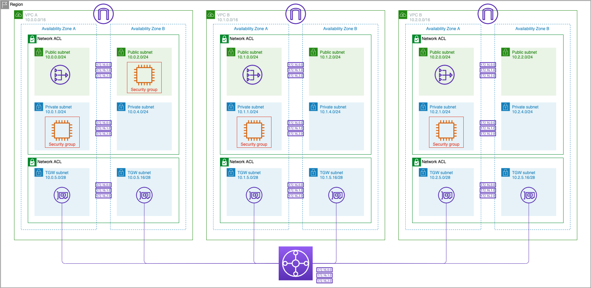
8. Role até o final da página **Configure stack options** e clique em **Next**.
9. Role até o final e clique em **Submit**.
10. Acompanhe a criação pelos eventos na aba **Events**. Aguarde até que o status da stack seja **CREATE_COMPLETE** (pode levar de 3 a 5 minutos).  
    

Este template criará:
- 3 VPCs (A, B, C), cada uma com duas subnets públicas e duas privadas.
- Um Transit Gateway conectando as VPCs.
- Instâncias EC2 em cada VPC (nas subnets privadas) para testes.

---

## 🛡️ Network ACLs

**Network ACLs** (NACLs) são controles de acesso **stateless** aplicados no nível da subnet. Elas permitem ou bloqueiam tráfego com base em regras numeradas, avaliadas em ordem crescente. Por padrão, as subnets são associadas à NACL padrão que permite **todo** o tráfego (inbound e outbound).

Nesta seção, modificaremos a NACL associada às **subnets de workload da VPC A** para permitir **apenas tráfego ICMP** proveniente do CIDR da VPC B. Em seguida, testaremos a conectividade:

- Da VPC B para VPC A → **deve funcionar**.
- Da VPC C para VPC A → **não deve funcionar**.

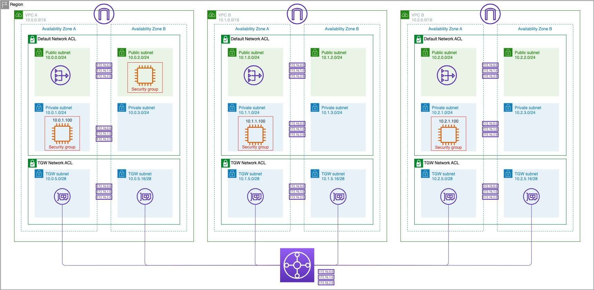

### 🔧 Modificar a NACL padrão da VPC A

1. No console VPC, clique em **Network ACLs**.
2. Selecione a NACL com nome **VPC A Workload Subnets NACL** (ou identifique pelo VPC ID).
3. Na aba **Inbound Rules**, visualize as regras existentes.  
   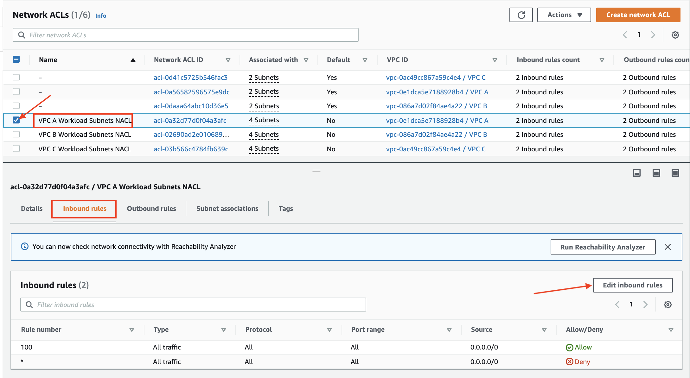
4. Clique em **Edit inbound rules**.
5. Altere a regra **100**:
   - **Type**: selecione **ALL ICMP - IPv4**
   - **Source**: informe o CIDR da VPC B: `10.1.0.0/16`
6. Clique em **Save changes**.  
   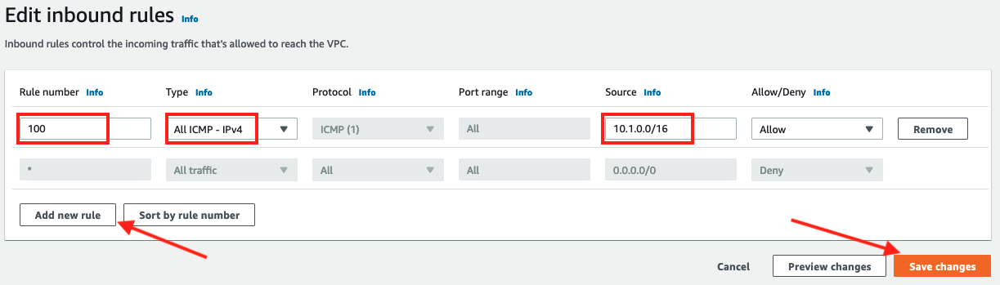
7. Confirme a regra atualizada na aba **Inbound rules**.  
   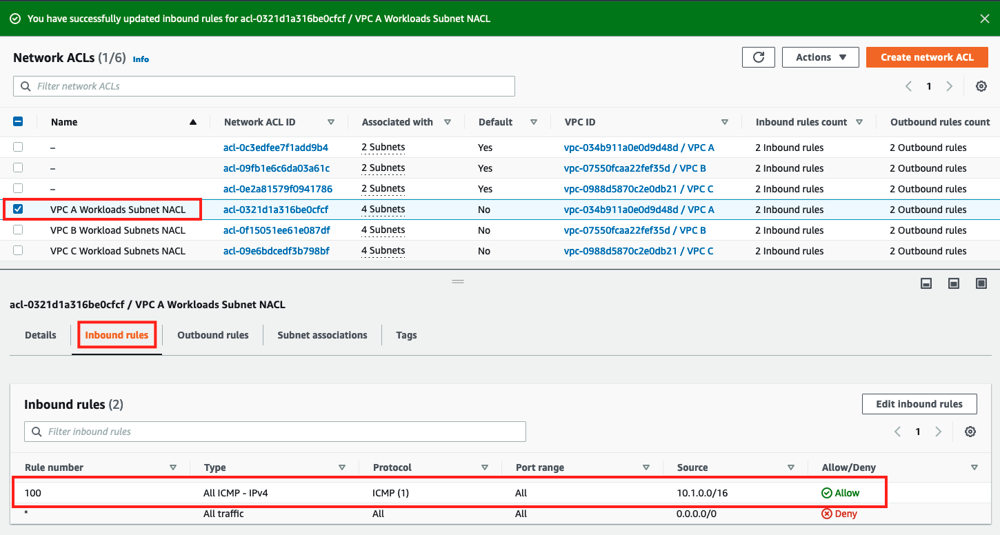

> ℹ️ Não alteramos as regras de saída, que permanecem com permissão total (padrão).

### 🧪 Testar conectividade

#### Teste da VPC B para VPC A (permitido)

1. No console EC2, clique em **Instances**.
2. Selecione a instância **VPC B Private AZ1 Server** e clique em **Connect**.  
   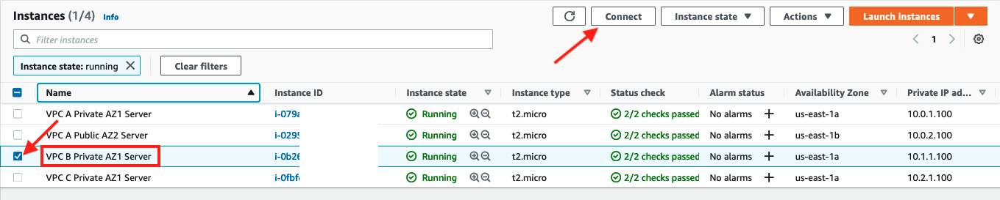
3. Na aba **Session Manager**, clique em **Connect**.
4. No terminal, execute:
   ```bash
   ping 10.0.1.100 -c 5
   ```
   O tráfego ICMP deve fluir e retornar com sucesso.  
   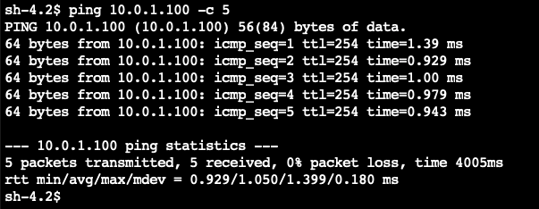

#### Teste da VPC C para VPC A (bloqueado)

1. Encerre a sessão do Session Manager e retorne à lista de instâncias.
2. Selecione a instância **VPC C Private AZ1 Server** e conecte‑se via Session Manager.  
   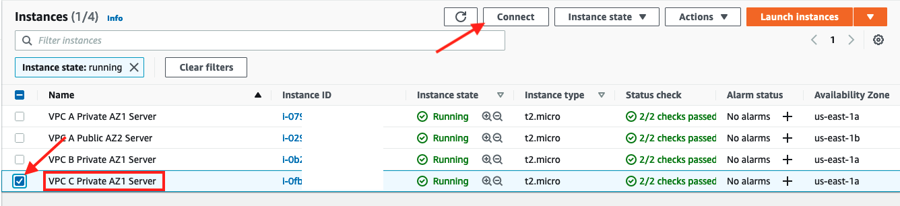
3. Execute o mesmo comando:
   ```bash
   ping 10.0.1.100 -c 5
   ```
   **Nenhuma resposta** deve ser recebida (timeout).  
   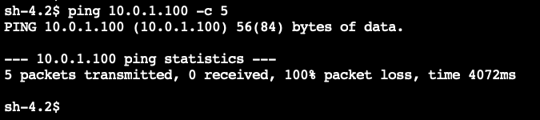
4. Encerre a sessão.

### 🔁 Reverter as alterações da NACL

1. No console VPC, acesse **Network ACLs** e selecione a mesma NACL.
2. Na aba **Inbound rules**, clique em **Edit inbound rules**.
3. Altere a regra **100** de volta para:
   - **Type**: **All traffic**
   - **Source**: `0.0.0.0/0`
4. Clique em **Save changes**.  
   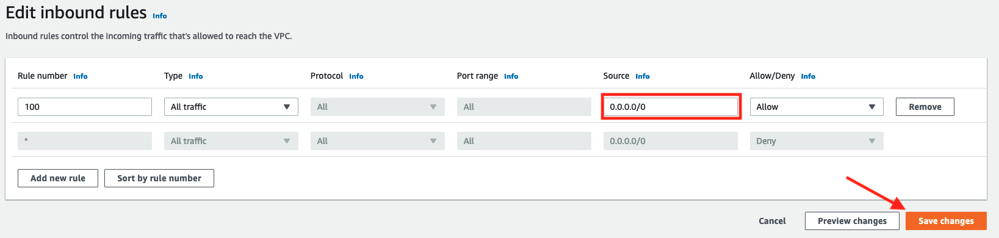
5. Verifique se a regra original foi restaurada.  
   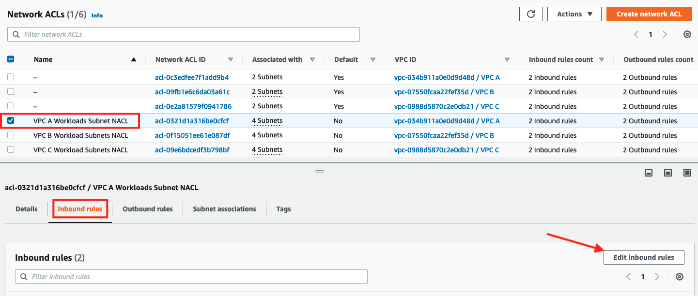

**Parabéns!** Você concluiu a seção sobre Network ACLs.

---

## 🔒 Security Groups

**Security Groups** são firewalls **stateful** associados a instâncias ou interfaces de rede. As regras são avaliadas em conjunto (não por ordem) e sempre permitem o tráfego de retorno automaticamente.

Neste exercício, modificaremos o security group da instância **VPC A Private AZ1 Server** para permitir ICMP **apenas** do CIDR da VPC C. Testaremos:

- Da VPC B para VPC A → **bloqueado**.
- Da VPC C para VPC A → **permitido**.

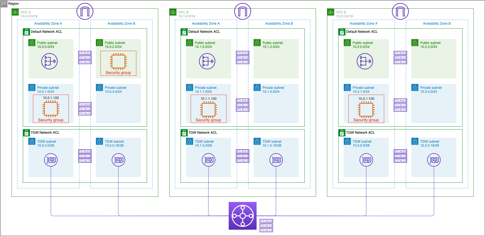

### 🔧 Modificar o Security Group da VPC A

1. No console EC2, clique em **Instances**.
2. Selecione a instância **VPC A Private AZ1 Server**.  
   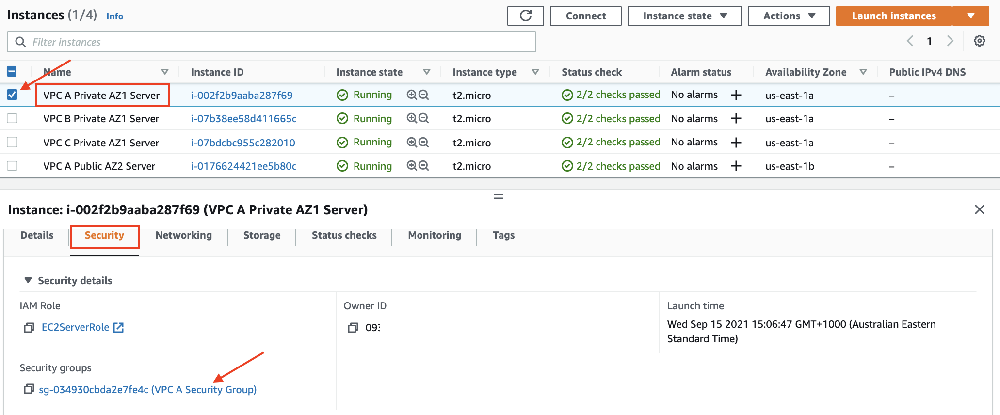
3. Role até a aba **Security** e clique no link do security group (ex: `sg-xxxxxx (VPC A Security Group)`).
4. Na página do security group, clique na aba **Inbound rules** e depois em **Edit inbound rules**.  
   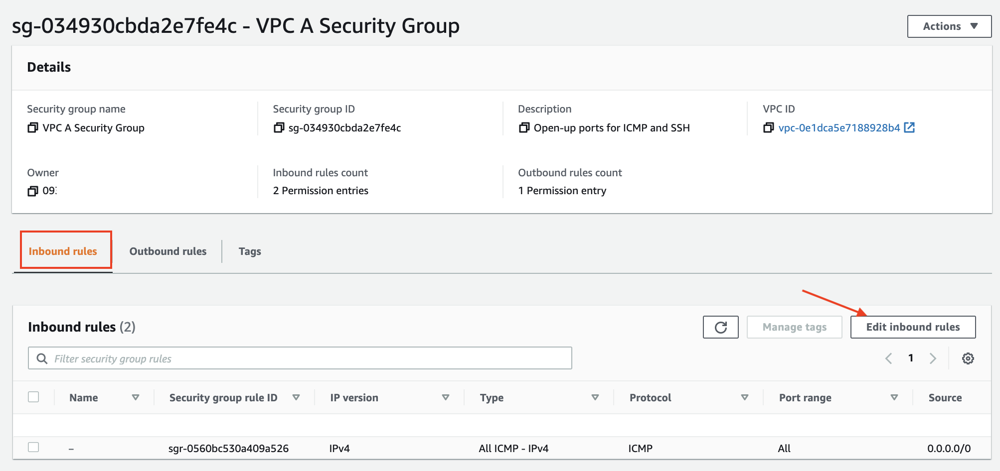
5. Localize a regra que permite ICMP de `0.0.0.0/0` e altere o **Source** para o CIDR da VPC C: `10.2.0.0/16`.
6. Clique em **Save rules**.

### 🧪 Testar conectividade

#### Teste da VPC B para VPC A (bloqueado)

1. Conecte‑se à instância **VPC B Private AZ1 Server** via Session Manager.  
   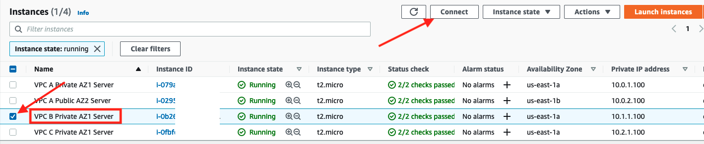
2. Tente pingar a VPC A:
   ```bash
   ping 10.0.1.100 -c 5
   ```
   O comando não deve receber resposta (timeout).  
   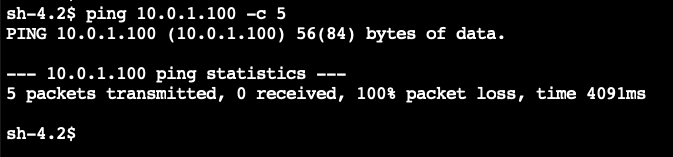

#### Teste da VPC C para VPC A (permitido)

1. Encerre a sessão anterior e conecte‑se à instância **VPC C Private AZ1 Server** (utilize a imagem de seleção similar à da VPC B, mas escolhendo a instância correta).
2. Execute o ping:
   ```bash
   ping 10.0.1.100 -c 5
   ```
   Desta vez, as respostas devem aparecer.  
   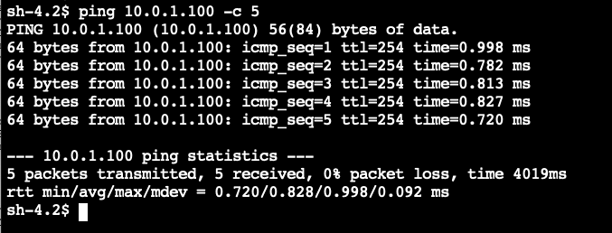
3. Encerre a sessão.

### 🔁 Reverter as alterações do Security Group

1. Retorne ao security group da VPC A (mesmo procedimento).
2. Na aba **Inbound rules**, clique em **Edit inbound rules**.  
   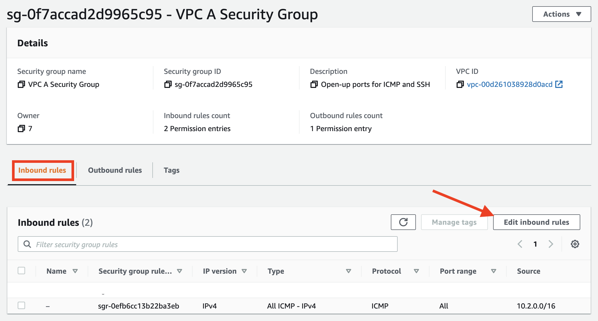
3. Altere o **Source** da regra ICMP de volta para `0.0.0.0/0`.  
   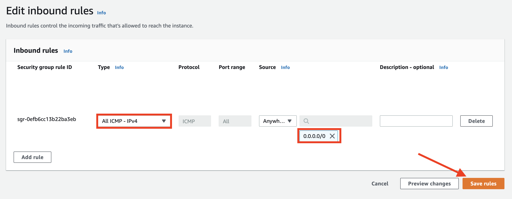
4. Clique em **Save rules**.

**Parabéns!** Você concluiu a seção sobre Security Groups.

---

## 📜 Endpoint Policies

**Endpoint policies** são documentos IAM associados a VPC Endpoints que restringem ou concedem permissões para chamadas de API do serviço. Por exemplo, com um endpoint do S3, é possível limitar o acesso a apenas leitura de determinados buckets.

Nesta seção, utilizaremos o **Gateway Endpoint para S3** criado no laboratório anterior (ou no template CloudFormation) e testaremos seu comportamento.

### ✅ Verificar permissões iniciais do endpoint

1. Conecte‑se à instância **VPC A Private AZ1 Server** via Session Manager.
2. Liste os buckets S3 disponíveis:
   ```bash
   aws s3 ls | grep networking-day
   ```
   Anote o nome do bucket que começa com `networking-day` (ex: `networking-day-123456`).
3. Liste o conteúdo do bucket (substitua pelo nome real):
   ```bash
   aws s3 ls s3://<seu-bucket-name>
   ```
   O bucket provavelmente está vazio, mas o comando não deve retornar erro.
4. Crie um arquivo de teste e tente enviá‑lo ao bucket:
   ```bash
   sudo touch /tmp/test.txt
   aws s3 cp /tmp/test.txt s3://<seu-bucket-name>
   ```
   O upload deve ser bem‑sucedido.
5. Confirme que o arquivo foi enviado:
   ```bash
   aws s3 ls s3://<seu-bucket-name>
   ```
   O arquivo `test.txt` deve aparecer na listagem.  
   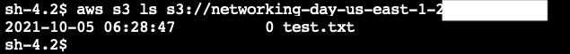

### 🔧 Atualizar a política do endpoint para remover permissões de escrita

1. No console VPC, clique em **Endpoints**.
2. Selecione o **Gateway Endpoint para S3** associado à VPC A (identifique pelo nome do serviço `com.amazonaws.<região>.s3` e pelo VPC ID).
3. Na parte inferior, clique na aba **Policy** e depois em **Edit Policy**.  
   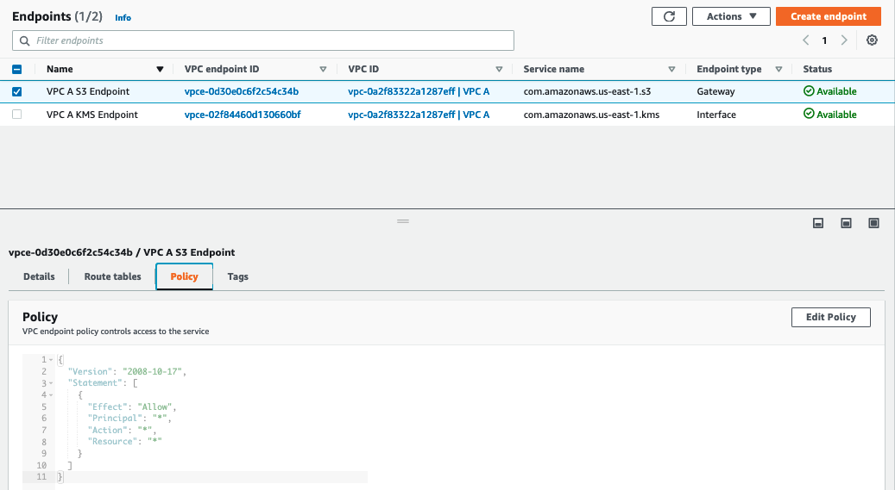
4. Escolha **Custom** e substitua o conteúdo pela política abaixo (que permite apenas `Get*` e `List*`):
   ```json
   {
     "Version": "2008-10-17",
     "Statement": [
       {
         "Sid": "ReadOnlyAccess",
         "Effect": "Allow",
         "Principal": "*",
         "Action": [
           "s3:Get*",
           "s3:List*"
         ],
         "Resource": "*"
       }
     ]
   }
   ```
5. Clique em **Save**.

### 🧪 Testar novamente o upload

1. Volte à sessão Session Manager da instância **VPC A Private AZ1 Server** (ou reconecte‑se).
2. Tente fazer upload do mesmo arquivo novamente:
   ```bash
   aws s3 cp /tmp/test.txt s3://<seu-bucket-name>
   ```
   Agora o comando deve retornar **Access Denied**.  
   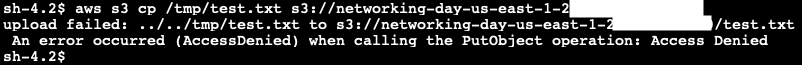
3. Tente listar o bucket:
   ```bash
   aws s3 ls s3://<seu-bucket-name>
   ```
   A listagem ainda funciona, pois a ação `List*` está permitida.

**Conclusão:** A política do endpoint restringiu com sucesso as operações de escrita, mantendo apenas leitura. As políticas de endpoint são um mecanismo eficaz para controlar o acesso a serviços AWS a partir da VPC.

---

## 🧹 Limpeza (Clean Up)

Se você está usando sua própria conta AWS e concluiu o workshop, siga as etapas abaixo para evitar cobranças desnecessárias.

> ⚠️ **Aviso:** Execute a limpeza **apenas se não pretende continuar** com os próximos laboratórios.

Escolha a opção que corresponde ao seu cenário:

### Opção 1: Você iniciou este laboratório do início (após o laboratório Multiple VPCs)
- Complete as etapas de reversão já descritas nas seções anteriores (NACL, Security Group, Endpoint Policy) – elas já foram feitas.
- Se desejar, pode excluir a stack do CloudFormation usada nos pré‑requisitos.

### Opção 2: Você iniciou o laboratório na seção Multiple VPCs implantando o template CloudFormation
1. Navegue até o console **CloudFormation**.
2. Selecione a stack `NetworkingWorkshopPrerequisites` e clique em **Delete**.
3. Confirme em **Yes, Delete**.
4. Selecione a stack `NetworkingWorkshopMultiVPCandTGW` e clique em **Delete**.
5. Confirme em **Yes, Delete**.

### Opção 3: Você iniciou o laboratório na seção Basic Security implantando o template CloudFormation
1. No console **CloudFormation**, exclua a stack `NetworkingWorkshopPrerequisites` (se existir).
2. Exclua a stack `NetworkingWorkshopMultiVPCandTGW`.
3. Confirme ambas as exclusões.

Após a conclusão, seus recursos serão removidos.

---

## 🚀 Execução com Terraform (Opcional)

Este laboratório pode ser totalmente automatizado com **Terraform** usando os módulos da estrutura do projeto. A implementação completa está disponível no diretório `labs/03-security-controls`.

### Pré‑requisitos para o Terraform
- Terraform >= 1.0 instalado.
- Credenciais AWS configuradas (variáveis de ambiente, perfil ou role).
- Bucket S3 para o estado remoto (opcional, mas recomendado).

### Passos para implantar

```bash
cd labs/03-security-controls
terraform init
terraform plan -var-file="envs/dev/terraform.tfvars"
terraform apply -var-file="envs/dev/terraform.tfvars" -auto-approve
```

O arquivo `envs/dev/terraform.tfvars` deve conter as variáveis adequadas para seu ambiente (CIDRs, zonas, etc.). Exemplo mínimo:

```hcl
region               = "us-east-1"
availability_zones   = ["us-east-1a", "us-east-1b"]
vpc_a_cidr           = "10.0.0.0/16"
vpc_b_cidr           = "10.1.0.0/16"
vpc_c_cidr           = "10.2.0.0/16"
vpc_a_public_subnet_cidrs  = ["10.0.0.0/24", "10.0.1.0/24"]
vpc_a_private_subnet_cidrs = ["10.0.2.0/24", "10.0.3.0/24"]
vpc_b_public_subnet_cidrs  = ["10.1.0.0/24", "10.1.1.0/24"]
vpc_b_private_subnet_cidrs = ["10.1.2.0/24", "10.1.3.0/24"]
vpc_c_public_subnet_cidrs  = ["10.2.0.0/24", "10.2.1.0/24"]
vpc_c_private_subnet_cidrs = ["10.2.2.0/24", "10.2.3.0/24"]
vpc_a_test_instance_ip      = "10.0.2.100"
vpc_b_test_instance_ip      = "10.1.2.100"
vpc_c_test_instance_ip      = "10.2.2.100"
my_ip_cidr                  = "0.0.0.0/0"   # Altere para seu IP se desejar restringir acesso SSH
instance_type               = "t3.micro"
environment                 = "dev"
tags                        = { Environment = "dev", Workshop = "networking" }
```

### Destruir os recursos

```bash
terraform destroy -var-file="envs/dev/terraform.tfvars" -auto-approve
```

---

## 🧪 Testes de Conectividade (com Terraform)

Após a implantação bem‑sucedida com Terraform, você deve validar os comportamentos de segurança configurados.

### Teste 1: Network ACL (VPC A permitindo ICMP apenas da VPC B)

1. Conecte‑se à instância **VPC B Private AZ1 Server** via Session Manager.
2. Pingue a instância da VPC A:
   ```bash
   ping 10.0.2.100 -c 5
   ```
   **Esperado:** Respostas bem‑sucedidas (0% perda).

3. Conecte‑se à instância **VPC C Private AZ1 Server** e pingue o mesmo IP:
   ```bash
   ping 10.0.2.100 -c 5
   ```
   **Esperado:** 100% de perda (timeout).

### Teste 2: Security Group (VPC A permitindo ICMP apenas da VPC C)

> ⚠️ **Nota:** Estes testes assumem que você reverteu as alterações da NACL antes de modificar o security group, ou que o Terraform já aplicou a configuração desejada.

1. Modifique o security group da instância VPC A (via console ou alterando o Terraform e reaplicando) para permitir ICMP apenas de `10.2.0.0/16`.
2. Da instância **VPC B**, tente pingar `10.0.2.100` – deve falhar.
3. Da instância **VPC C**, tente pingar – deve funcionar.

### Teste 3: Endpoint Policy (S3 apenas leitura)

1. Na instância **VPC A**, tente listar buckets:
   ```bash
   aws s3 ls
   ```
   Deve funcionar.
2. Crie um arquivo e tente copiar para o bucket:
   ```bash
   echo "teste" > /tmp/test.txt
   aws s3 cp /tmp/test.txt s3://<seu-bucket-name>
   ```
   **Esperado:** Access Denied (se a política restritiva estiver ativa).

### Verificação das tabelas de rotas e associações do TGW

- As rotas nas tabelas privadas de cada VPC devem apontar os CIDRs das outras VPCs para o Transit Gateway.
- As associações e propagações das tabelas de rotas do TGW devem refletir a segmentação desejada (por exemplo, VPC A pode alcançar B e C, mas B e C não se comunicam entre si).

---

**Parabéns por concluir o Laboratório 03 – Security Controls!** 🎉  

Agora você pode prosseguir para o próximo laboratório: [Connecting to On-Premises](../04-connecting-to-on-premises/README.md).